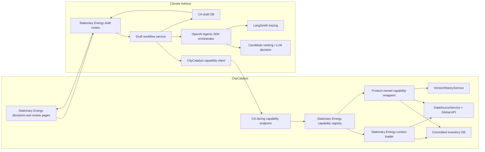
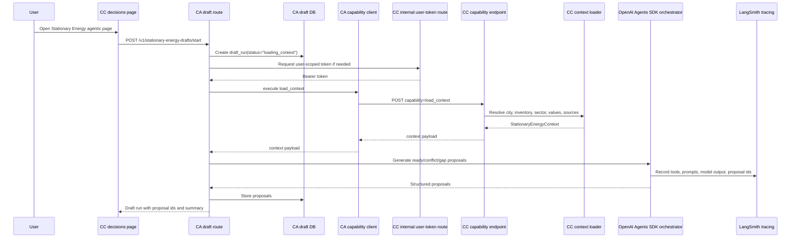
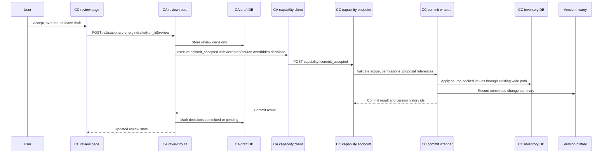
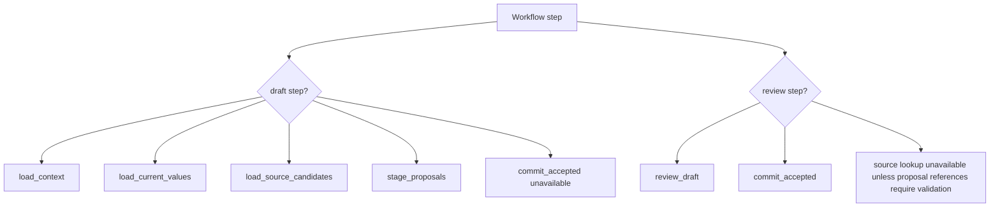
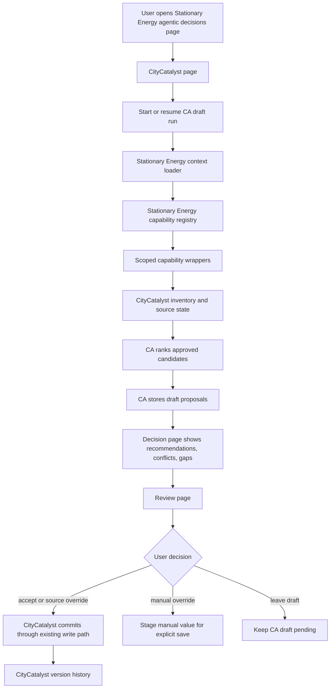
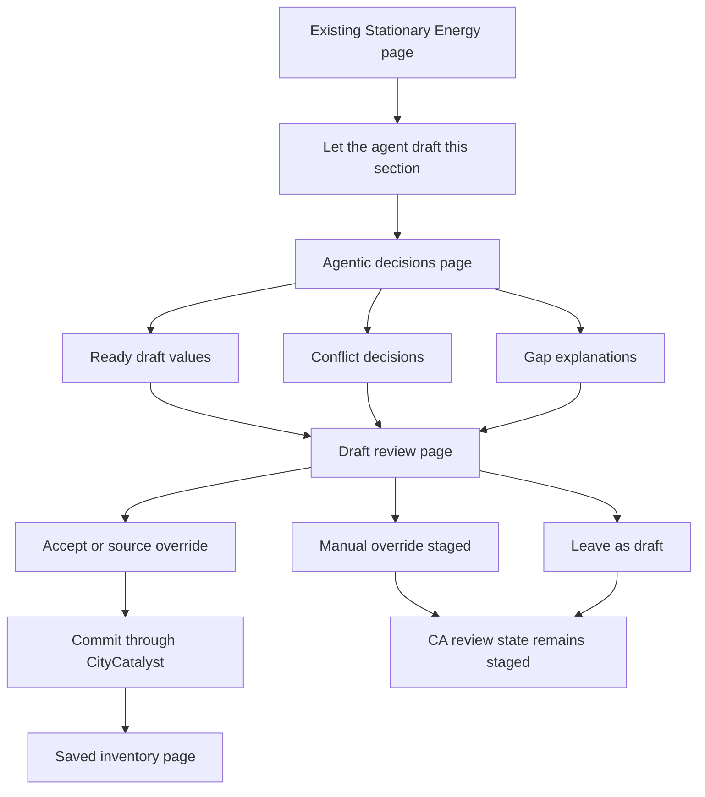

# Agentic Stationary Energy Plan

## Purpose

Build the first production-ready agentic inventory workflow for CityCatalyst:
a Stationary Energy drafting flow that helps a user complete one GHGI sector
faster, while keeping every data-changing action behind explicit review.

This plan merges the earlier inventory big-picture and current-flow notes into
one implementation overview. The broader architecture target remains in
`docs/AgenticModuleScope.md`; this document describes the first practical slice
of that architecture.

## Scope

In scope:

- GHGI inventories only.
- Stationary Energy only.
- One city, one inventory, one sector per run.
- Drafting values from approved, city-scoped source candidates.
- Showing provenance, conflicts, and gaps before anything is saved.
- User review before committing values to the inventory.

Out of scope for this slice:

- General Clima AI chat changes.
- Multi-module agent workspaces.
- Other GHGI sectors.
- HIAP, CCRA, organization, or project workflows.
- Autonomous writes to inventory data.
- Arbitrary source discovery by the model.

## Current Approach Architecture

The first implementation should reuse the systems that already exist instead
of introducing a broad new service boundary.

- Reuse the existing CityCatalyst to Climate Advisor connection.
- Reuse the Climate Advisor database to store draft runs, draft proposals, and
  user decisions before final save.
- Add an agentic decisions page aligned with the CityCatalyst visual style.
- Add a draft review page where the user reviews decisions before saving.
- Implement the first pieces of the ideal architecture, but limit them to
  Stationary Energy:
  - capability wrappers
  - capability registry
  - context loaders
  - confirmation and staging model

The source of truth for committed inventory data remains CityCatalyst. Climate
Advisor can stage drafts and explain decisions, but CityCatalyst applies final
accepted changes through existing inventory write paths.

## Product Shape

### Entry Point

Add a contextual CTA on the Stationary Energy sector page:

- Label: `Let the agent draft this section`
- Supporting copy: `Review every value before saving`

The entry point should appear inside the existing GHGI inventory experience,
not in a separate assistant workspace.

### Pages

Use a scoped route under the current city and inventory:

- Agentic decisions page:
  `/{lng}/cities/{cityId}/GHGI/{inventoryId}/draft/stationary-energy`
- Draft review page:
  `/{lng}/cities/{cityId}/GHGI/{inventoryId}/draft/stationary-energy/review`

The decisions page is where the user sees source coverage, recommendations,
conflicts, and gaps. The review page is where the user accepts, overrides, or
leaves draft proposals before anything is written to the inventory.

### Decisions Page

The page should show:

- The current Stationary Energy subsectors.
- Existing committed values, if any.
- Draftable rows.
- Source candidates and provenance.
- Recommendation rationale.
- Conflicts where sources disagree.
- Gaps where no approved source clears the minimum bar.
- A clear transition into review.

The page should feel like a CityCatalyst workflow page, not like a generic chat
panel. The agentic layer is a task-specific decision rail beside the inventory
canvas.

### Review Page

The review page should show a durable summary of the staged draft:

- recommended value
- unit
- source name
- source year
- method or tier when available
- confidence or quality indicator
- alternatives for conflicts
- gap explanation for missing data
- existing inventory value, if any
- final action selected by the user

Supported user decisions:

| Decision | Meaning | Commit behavior |
| --- | --- | --- |
| `accept` | Use the recommended draft. | Commit through CityCatalyst write paths. |
| `override_source` | Use another approved source from the alternatives. | Commit through CityCatalyst write paths. |
| `override_manual` | User enters a manual value and unit. | Stage for explicit save; do not let CA write directly. |
| `leave_draft` | Keep the proposal for later. | No inventory write. |

## System Ownership

### CityCatalyst Owns

- User-facing GHGI routes and visual style.
- Auth, permissions, and feature flags.
- Current city, inventory, and sector state.
- Existing inventory write behavior.
- Version history for committed changes.
- Final save after explicit user confirmation.

CityCatalyst should not ask the model to find arbitrary data or commit values.
It should expose only the Stationary Energy capabilities needed for this flow.

### Climate Advisor Owns

- Running the bounded Stationary Energy drafting workflow.
- Storing draft runs and proposal state in the CA database.
- Calling CityCatalyst through the existing CC-CA connection.
- Ranking approved candidates.
- Explaining recommendations, conflicts, and gaps.
- Returning structured draft proposals for review.

Climate Advisor does not become the inventory source of truth. It stages and
explains draft decisions; CityCatalyst commits accepted changes.

### Source And Data Layer Owns

- Fetching approved source candidates.
- Mapping raw source records to Stationary Energy subsectors.
- Normalizing units, methods, years, geography match, and provenance.
- Returning all eligible candidates, not only the presumed winner.

The model should choose among approved options. It should not discover sources
freely.

## Implementation Architecture Details

The Stationary Energy slice should make the ideal architecture concrete without
building a generic framework first. The implementation should use the existing
CC-CA connection, but move from manually exposed tools toward a registry-driven
workflow.

### Architecture Components

Each component has one narrow job. The goal is to make the workflow feel like
one CityCatalyst feature while keeping ownership clear between CC and CA.

| Component | What it is | Why it exists |
| --- | --- | --- |
| Stationary Energy decisions and review pages | CityCatalyst pages inside the GHGI inventory flow. | Give the user a task-specific UI for draft decisions, provenance, conflicts, gaps, and final review. |
| Stationary Energy draft routes | Climate Advisor HTTP routes for start/resume/review. | Keep draft workflow state in CA and expose a simple API to the CC pages. |
| Draft workflow service | CA service that coordinates context loading, proposal generation, staging, and review. | Keeps the CA route thin and makes the workflow testable without UI code. |
| CA draft DB | CA persistence for draft runs, proposals, and review decisions. | Allows drafts to survive refresh, support review before commit, and keep an audit trail of what CA proposed. |
| CityCatalyst capability client | CA client for executing CC capabilities through the existing CC-CA token pattern. | Stops CA from calling arbitrary CC routes directly and keeps all product access behind typed capabilities. |
| CA-facing capability endpoint | Internal CityCatalyst endpoint used only by CA. | Authenticates CA, validates user scope, resolves the requested capability, and returns a structured result. |
| Stationary Energy capability registry | CC registry of which Stationary Energy capabilities exist and which workflow step can use them. | Prevents a flat tool bag; the draft step can inspect and stage, while the review step can commit accepted changes. |
| Stationary Energy context loader | CC loader that builds the bounded context for one city, one inventory, and sector `I`. | Ensures CA sees only the current workflow state, not unrelated product data or routes. |
| Product-owned capability wrappers | CC functions around existing services such as inventory reads, source lookup, and committed writes. | Reuses existing domain logic while giving CA small, stable, model-safe operations. |
| OpenAI Agents SDK orchestrator | CA orchestration layer for agent execution, tool use, structured outputs, and model calls. | Keeps agent behavior inside the existing CA runtime instead of inventing a new orchestration service. |
| Candidate ranking or LLM decision | Agent step that evaluates supplied source candidates. | Chooses among approved candidates, explains conflicts and gaps, and returns structured proposals. |
| LangSmith tracing | Trace layer around draft runs, tool calls, model decisions, and proposal outputs. | Makes each recommendation reviewable during pilot debugging and later trust/audit work. |
| MCP documentation surface | Existing MCP docs/discovery context only, not part of this implementation. | Avoids adding protocol overhead and another tool surface to an already complex Stationary Energy slice. |
| DataSourceService and Global API | Existing CC source discovery, filtering, retrieval, and source-apply machinery. | Supplies approved source candidates and applies accepted source-backed values through existing paths. |
| Committed inventory DB | CityCatalyst inventory tables. | Remains the source of truth for saved inventory values. CA never writes here directly. |
| VersionHistoryService | Existing CC version history mechanism. | Records committed changes after the user approves accepted/source-overridden drafts. |

The core boundary is this: CA owns draft orchestration and draft persistence;
CC owns product capabilities, permissions, committed writes, and version
history.

MCP is intentionally not a runtime dependency for this slice. It can remain as
documentation and discovery context for what exists in the repo, but Stationary
Energy drafting should not add new MCP tools or route through MCP. The
capability registry is internal product architecture first; using MCP here
would add another transport, schema, auth, and testing surface without reducing
the core workflow complexity.

### Component Diagram



### Start-Draft Sequence



### Review-And-Commit Sequence



### CityCatalyst Capability Types

The capability layer should be plain TypeScript around existing services. Zod
schemas make the boundary explicit and reusable for API validation,
documentation, and tests.

```ts
// app/src/backend/agentic/types.ts
import { AppSession } from "@/lib/auth";
import { z } from "zod";

export type CapabilityOperation = "query" | "command" | "workflow";
export type ConfirmationBehavior = "none" | "stage" | "requires_review";

export type CapabilityContext = {
  session: AppSession;
  locale: "en" | "es" | "pt";
};

export type CapabilityDefinition<Input, Output> = {
  id: string;
  module: "ghgi";
  operation: CapabilityOperation;
  inputSchema: z.ZodType<Input>;
  outputSchema: z.ZodType<Output>;
  requiredScope: Array<"city" | "inventory" | "sector">;
  confirmation: ConfirmationBehavior;
  execute: (input: Input, context: CapabilityContext) => Promise<Output>;
};
```

The first version should not try to support every module. It only needs enough
type shape to make Stationary Energy strict.

```ts
// app/src/backend/agentic/ghgi/stationary-energy/schemas.ts
import { z } from "zod";

export const stationaryEnergyScopeSchema = z.object({
  cityId: z.string().uuid(),
  inventoryId: z.string().uuid(),
  sectorCode: z.literal("I"),
});

export const candidateSchema = z.object({
  subsectorCode: z.string(),
  sourceId: z.string(),
  sourceName: z.string(),
  value: z.number(),
  unit: z.string(),
  year: z.number().optional(),
  tier: z.number().optional(),
  method: z.string().optional(),
  geographyMatch: z.enum([
    "city_direct",
    "city_proxy",
    "regional_proxy",
    "country_proxy",
  ]),
  coverage: z.enum(["complete", "partial", "missing"]),
  confidence: z.number().min(0).max(1),
  citation: z.string().optional(),
});

export const stationaryEnergyContextSchema = z.object({
  scope: stationaryEnergyScopeSchema,
  inventory: z.object({
    year: z.number(),
    cityName: z.string(),
    locode: z.string().nullable(),
    countryCode: z.string().nullable(),
  }),
  currentState: z.array(
    z.object({
      subsectorCode: z.string(),
      existingValue: z.number().nullable(),
      existingUnit: z.string().nullable(),
      notationKey: z.string().nullable(),
      isLocked: z.boolean(),
    }),
  ),
  candidates: z.array(
    z.object({
      subsectorCode: z.string(),
      options: z.array(candidateSchema),
    }),
  ),
});
```

### CityCatalyst Registry Example

The registry controls which capabilities exist and which workflow step can use
them. This is the piece that prevents CA from seeing one flat tool bag.

```ts
// app/src/backend/agentic/ghgi/stationary-energy/registry.ts
import {
  loadStationaryEnergyContext,
  commitAcceptedStationaryEnergyDrafts,
} from "./capabilities";

export const stationaryEnergyCapabilityRegistry = {
  "ghgi.stationary_energy.load_context": {
    step: "draft",
    capability: loadStationaryEnergyContext,
    exposesTo: ["ca_internal"],
  },
  "ghgi.stationary_energy.commit_accepted": {
    step: "review",
    capability: commitAcceptedStationaryEnergyDrafts,
    exposesTo: ["ca_internal"],
  },
} as const;

export type StationaryEnergyCapabilityId =
  keyof typeof stationaryEnergyCapabilityRegistry;

export function getStationaryEnergyCapability(
  id: StationaryEnergyCapabilityId,
  step: "draft" | "review",
) {
  const entry = stationaryEnergyCapabilityRegistry[id];

  if (!entry || entry.step !== step) {
    throw new Error(`Capability ${id} is not enabled for ${step}`);
  }

  return entry.capability;
}
```

For this first slice, keep the registry local to Stationary Energy. Do not
generate MCP tools from this registry. The registry exists to keep the CC-CA
workflow scoped and typed; MCP can document what exists later, but should not be
part of the Stationary Energy runtime.

### CityCatalyst Context Loader Example

The context loader should assemble the bounded state that CA needs. It should
also be the place where scope validation happens: the `cityId` from the route
must match the inventory's city, and the sector must be `I`.

```ts
// app/src/backend/agentic/ghgi/stationary-energy/context.ts
import { db } from "@/models";
import { DataSourceService } from "@/backend/DataSourceService";
import { PermissionService } from "@/backend/permissions/PermissionService";
import { AppSession } from "@/lib/auth";

export async function loadStationaryEnergyContext(input: {
  cityId: string;
  inventoryId: string;
  sectorCode: "I";
  session: AppSession;
}) {
  await PermissionService.canEditInventory(input.session, input.inventoryId);

  const inventory = await db.models.Inventory.findByPk(input.inventoryId, {
    include: [
      { model: db.models.City, as: "city" },
      { model: db.models.InventoryValue, as: "inventoryValues" },
    ],
  });

  if (!inventory || inventory.cityId !== input.cityId) {
    throw new Error("Inventory does not belong to the requested city");
  }

  const allSources = await DataSourceService.findAllSources(input.inventoryId);
  const { applicableSources } = DataSourceService.filterSources(
    inventory,
    allSources,
  );

  const stationarySources = applicableSources.filter((source) => {
    const ref =
      source.subCategory?.referenceNumber ||
      source.subSector?.referenceNumber ||
      "";
    return ref.startsWith("I.");
  });

  const candidates = await normalizeStationaryEnergyCandidates(
    inventory,
    stationarySources,
  );

  return {
    scope: {
      cityId: input.cityId,
      inventoryId: input.inventoryId,
      sectorCode: input.sectorCode,
    },
    inventory: toInventoryContext(inventory),
    currentState: toStationaryEnergyCurrentState(inventory),
    candidates,
  };
}
```

This example intentionally delegates to existing services. The wrapper shapes
what CA sees; it should not duplicate inventory logic.

### CA Capability Client Example

Climate Advisor should call a small CC capability endpoint instead of manually
choosing arbitrary CC routes. This keeps the existing token exchange, but moves
tool availability into the registry.

```python
# climate-advisor/service/app/services/citycatalyst_capability_client.py
from typing import Any

from .citycatalyst_client import CityCatalystClient


class CityCatalystCapabilityClient:
    def __init__(self, cc_client: CityCatalystClient | None = None) -> None:
        self.cc_client = cc_client or CityCatalystClient()

    async def execute(
        self,
        *,
        capability_id: str,
        workflow_step: str,
        payload: dict[str, Any],
        token: str,
        user_id: str,
    ) -> dict[str, Any]:
        url = (
            f"{self.cc_client.base_url}"
            f"/api/v1/internal/ca/capabilities/ghgi/stationary-energy/"
            f"{capability_id}"
        )
        response = await self.cc_client.post_with_auto_refresh(
            url=url,
            token=token,
            user_id=user_id,
            thread_id="stationary-energy-draft",
            json_data={
                "workflow_step": workflow_step,
                "payload": payload,
            },
        )
        response.raise_for_status()
        return response.json()
```

### CA Draft Models Example

CA owns draft persistence. Pydantic models should match what the UI renders and
what the database stores.

```python
# climate-advisor/service/app/models/stationary_energy_draft.py
from enum import StrEnum
from pydantic import BaseModel, Field


class ProposalStatus(StrEnum):
    READY = "ready"
    CONFLICT = "conflict"
    GAP = "gap"


class ReviewAction(StrEnum):
    ACCEPT = "accept"
    OVERRIDE_SOURCE = "override_source"
    OVERRIDE_MANUAL = "override_manual"
    LEAVE_DRAFT = "leave_draft"


class DraftCandidate(BaseModel):
    source_id: str
    source_name: str
    value: float
    unit: str
    year: int | None = None
    method: str | None = None
    confidence: float = Field(ge=0, le=1)
    citation: str | None = None


class DraftProposal(BaseModel):
    proposal_id: str
    subsector_code: str
    status: ProposalStatus
    recommended: DraftCandidate | None = None
    alternatives: list[DraftCandidate] = Field(default_factory=list)
    rationale: str
    ui_message: str | None = None


class ReviewDecision(BaseModel):
    proposal_id: str
    action: ReviewAction
    selected_source_id: str | None = None
    manual_value: float | None = None
    manual_unit: str | None = None
    note: str | None = None
```

Validation rules should enforce that `ready` and `conflict` proposals have a
recommended candidate, `conflict` proposals have alternatives, and `gap`
proposals do not carry a recommended value.

### CA Workflow Service And Agent Orchestration Example

The CA workflow service should be procedural and explicit for this first slice.
The OpenAI Agents SDK is the orchestration layer inside CA. It receives only the
Stationary Energy context returned by CC, calls only the step-scoped tools CA
registers for this workflow, and returns the structured proposal model. LangSmith
tracing should wrap each draft run so we can inspect context, tool calls,
decision rationale, model output, and proposal ids.

```python
# climate-advisor/service/app/services/stationary_energy_draft_service.py
class StationaryEnergyDraftService:
    def __init__(self, capability_client, draft_repository, agent_runner) -> None:
        self.capability_client = capability_client
        self.draft_repository = draft_repository
        self.agent_runner = agent_runner

    async def start_draft(self, request, token: str) -> dict:
        run = await self.draft_repository.create_run(
            city_id=request.city_id,
            inventory_id=request.inventory_id,
            sector_code="I",
            user_id=request.user_id,
        )

        context = await self.capability_client.execute(
            capability_id="ghgi.stationary_energy.load_context",
            workflow_step="draft",
            payload={
                "cityId": request.city_id,
                "inventoryId": request.inventory_id,
                "sectorCode": "I",
            },
            token=token,
            user_id=request.user_id,
        )

        proposals = await self.agent_runner.generate_stationary_energy_proposals(
            context=context,
            trace_metadata={
                "draft_run_id": str(run.id),
                "city_id": request.city_id,
                "inventory_id": request.inventory_id,
                "sector_code": "I",
            },
        )
        await self.draft_repository.store_proposals(run.id, proposals)
        return await self.draft_repository.get_run_state(run.id)

    async def review(
        self,
        run_id: str,
        decisions,
        *,
        token: str,
        user_id: str,
    ) -> dict:
        await self.draft_repository.store_decisions(run_id, decisions)
        accepted = [d for d in decisions if d.action in {"accept", "override_source"}]

        if accepted:
            await self.capability_client.execute(
                capability_id="ghgi.stationary_energy.commit_accepted",
                workflow_step="review",
                payload={"runId": run_id, "decisions": [d.model_dump() for d in accepted]},
                token=token,
                user_id=user_id,
            )

        return await self.draft_repository.get_run_state(run_id)
```

The service can use deterministic ranking first and swap in an LLM later, as
long as the same proposal model remains the contract. When the LLM path is
enabled, the OpenAI Agents SDK should be the only orchestration layer. Do not
add MCP as an intermediate tool runtime for this workflow.

### CC Capability Endpoint Example

The endpoint should be internal to CA, authenticate the service, validate the
user-scoped token/session, resolve the capability from the registry, validate
input, and execute the wrapper.

```ts
// app/src/app/api/v1/internal/ca/capabilities/ghgi/stationary-energy/[capability]/route.ts
import { NextRequest, NextResponse } from "next/server";
import { apiHandler } from "@/util/api";
import { getStationaryEnergyCapability } from "@/backend/agentic/ghgi/stationary-energy/registry";

export const POST = apiHandler(
  async (req: NextRequest, { session, params }) => {
    const serviceKey = req.headers.get("X-Service-Key");
    if (serviceKey !== process.env.CC_SERVICE_API_KEY) {
      return NextResponse.json({ error: "Unauthorized service" }, { status: 401 });
    }

    if (!session?.user?.id) {
      return NextResponse.json({ error: "User token required" }, { status: 401 });
    }

    const { workflow_step, payload } = await req.json();
    const capability = getStationaryEnergyCapability(
      params.capability,
      workflow_step,
    );

    const input = capability.inputSchema.parse(payload);
    const output = await capability.execute(input, {
      session,
      locale: payload.locale ?? "en",
    });

    return NextResponse.json(capability.outputSchema.parse(output));
  },
);
```

The exact route wrapper may need to follow the repo's current `apiHandler`
signature, but the important implementation rule is that all execution goes
through the registry and wrapper, not direct arbitrary route calls.

### Step-Scoped Capability Exposure



The draft step can inspect and stage. The review step can commit accepted
source-backed decisions. No step gets broad inventory write access.

## Ideal Architecture Slice

The ideal architecture includes module-owned capabilities, a registry, scoped
context loaders, and a confirmation model. This plan implements those ideas only
for Stationary Energy.

### Capability Wrappers

Create narrow wrappers for the Stationary Energy workflow. They should delegate
to existing CityCatalyst routes and services through the existing CC-CA
connection.

Initial wrappers:

| Capability | Type | Purpose |
| --- | --- | --- |
| `ghgi.stationary_energy.load_context` | query | Load city, inventory, sector, locale, and permissions summary. |
| `ghgi.stationary_energy.load_current_values` | query | Load existing Stationary Energy values and locked rows. |
| `ghgi.stationary_energy.load_source_candidates` | query | Fetch approved candidates for the selected city, year, and subsector. |
| `ghgi.stationary_energy.create_draft_run` | workflow | Start and persist a CA draft run. |
| `ghgi.stationary_energy.stage_proposals` | command | Store draft proposals in the CA database. |
| `ghgi.stationary_energy.review_draft` | command | Record user decisions against staged proposals. |
| `ghgi.stationary_energy.commit_accepted` | command | Ask CityCatalyst to commit accepted source-backed values. |

These wrappers should return small, structured payloads. They should not expose
raw product internals or unrelated APIs to the model.

### Capability Registry

Create a small registry for this workflow before generalizing it. The registry
should describe:

- capability id
- operation type: query, command, or workflow
- input schema
- output schema
- required scope: city, inventory, sector
- whether confirmation is required
- whether the capability can write committed product data
- which workflow step can use it

The first registry should only include Stationary Energy capabilities. This
keeps the agent's tool set small and proves the pattern before it is expanded
to other modules or sectors.

### Context Loaders

Use scoped context loaders to build the data the agent can see for each step.

The Stationary Energy context loader should include:

- `cityId`
- `inventoryId`
- city name
- locode
- country code
- inventory year
- locale
- user permission summary
- Stationary Energy subsector list
- existing values and notation keys
- source candidate summary
- current draft run status, if one exists

It should exclude:

- unrelated sectors
- unrelated cities
- credentials or tokens
- raw permission internals
- unrelated module state
- arbitrary user files

### Confirmation And Staging Model

Use a human-in-the-loop staging model:

1. CA creates a draft run.
2. CA stages proposals in its database.
3. The user reviews staged proposals.
4. The user chooses accept, override, or leave draft.
5. CityCatalyst commits only accepted source-backed changes.
6. CityCatalyst records version history for committed changes.
7. CA keeps the draft/audit trail for the run and decisions.

No draft should mutate committed inventory data before the review step.

## Draft Data Model

The CA database should store enough information to resume review and explain
why each draft exists.

### Draft Run

Suggested fields:

- `draft_run_id`
- `city_id`
- `inventory_id`
- `sector_code`
- `status`
- `locale`
- `created_by_user_id`
- `created_at`
- `updated_at`
- `ca_trace_id`

### Draft Proposal

Suggested fields:

- `proposal_id`
- `draft_run_id`
- `subsector_code`
- `status`: `ready`, `conflict`, or `gap`
- `recommended_value`
- `recommended_unit`
- `recommended_source_id`
- `recommended_source_name`
- `source_year`
- `source_method`
- `source_tier`
- `confidence`
- `rationale`
- `ui_message`
- `citation`
- `alternatives_json`
- `current_inventory_value`
- `current_inventory_unit`

### Review Decision

Suggested fields:

- `decision_id`
- `proposal_id`
- `action`: `accept`, `override_source`, `override_manual`, or `leave_draft`
- `selected_source_id`
- `manual_value`
- `manual_unit`
- `note`
- `decided_by_user_id`
- `decided_at`
- `commit_status`
- `cc_version_history_id`

## Runtime Flow



## Candidate Selection Policy

For each Stationary Energy subsector, CA should:

1. Ignore rows that are locked or intentionally completed by the user.
2. Only consider candidates supplied by scoped capabilities.
3. Only consider allow-listed sources.
4. Prefer exact city and inventory-year matches.
5. Prefer city-level data over regional or country proxies.
6. Prefer complete subsector coverage over broad approximations.
7. Prefer stronger method and quality metadata when geography and coverage are
   comparable.
8. Return a conflict when two usable candidates differ beyond the configured
   threshold or represent a real methodology tradeoff.
9. Return a gap when no candidate clears the minimum bar.

CA should return structured proposal states:

| State | Meaning | UI behavior |
| --- | --- | --- |
| `ready` | One candidate is clearly best. | Show inline draft and provenance. |
| `conflict` | Multiple usable candidates need user choice. | Show recommendation plus alternatives. |
| `gap` | No usable candidate exists. | Show gap reason and manual next steps. |

## Guardrails

- The workflow is always scoped to one city, inventory, and sector.
- CA never writes directly to committed inventory tables.
- CA never sees unrelated product state.
- CA never receives arbitrary credentials.
- MCP is not used as a runtime transport for this Stationary Energy workflow.
- Source candidates are allow-listed and normalized before ranking.
- Every committed change requires an explicit user decision.
- Drafts remain visually distinct from saved values.
- Version history is created only for committed CityCatalyst changes.
- Every draft run should carry a LangSmith trace reference when tracing is
  enabled.

## Implementation Plan

### Phase 1: Architecture Skeleton

- Add Stationary Energy capability wrappers.
- Add a Stationary Energy-only capability registry.
- Add context loaders for city, inventory, sector, existing values, and sources.
- Add CA database tables or models for draft runs, proposals, and decisions.
- Wire the flow through the existing CC-CA connection.

Exit condition:

An internal user can start a Stationary Energy draft run and see staged
proposals in CA without saving them to the inventory.

### Phase 2: Decisions Page

- Add the scoped decisions page.
- Render current Stationary Energy rows.
- Render draft states: ready, conflict, and gap.
- Show source tags and provenance.
- Show decision rationale in the agentic rail.
- Allow the user to continue to review.

Exit condition:

An internal user can inspect the draft recommendations and understand why each
value was suggested before review.

### Phase 3: Review And Commit

- Add the review page.
- Support accept, source override, manual override, and leave draft.
- Persist review decisions in CA.
- Commit accepted source-backed values through CityCatalyst.
- Record CityCatalyst version history for committed changes.
- Keep non-accepted drafts pending.

Exit condition:

An internal user can complete the full review loop and commit accepted
Stationary Energy values end to end.

### Phase 4: Pilot Hardening

- Add feature flagging.
- Add access-scope tests.
- Add schema validation tests for context, proposals, and review decisions.
- Add confirmation tests for accepted and overridden drafts.
- Add LangSmith trace links for draft runs.
- Add recovery behavior for interrupted draft runs.

Exit condition:

The workflow is ready for a controlled Stationary Energy pilot.

## Open Decisions

- Whether the decisions and review pages should be separate routes or two steps
  in one route.
- Whether manual override commits in the first release or stays staged for a
  later explicit save path.
- Which approved sources are in the first pilot source allow-list.
- Which conflict variance threshold is acceptable for Stationary Energy.
- How much of the CA draft/audit trail should be mirrored into CityCatalyst
  version history.

## Final Page And Functionality Outline

This is the intended end-state location map for the first Stationary Energy
agentic workflow.

### User-Facing Pages

| Page | Route | Owner | Purpose |
| --- | --- | --- | --- |
| Existing Stationary Energy sector page | `/{lng}/cities/{cityId}/GHGI/{inventoryId}` or the current inventory sector route | CityCatalyst | Entry point. Shows the normal Stationary Energy inventory UI and a CTA to start agentic drafting. |
| Agentic decisions page | `/{lng}/cities/{cityId}/GHGI/{inventoryId}/draft/stationary-energy` | CityCatalyst UI + Climate Advisor draft state | Shows current rows, source coverage, recommended drafts, conflicts, gaps, provenance, and progress. |
| Draft review page | `/{lng}/cities/{cityId}/GHGI/{inventoryId}/draft/stationary-energy/review` | CityCatalyst UI + Climate Advisor review state | Lets the user accept, override, manually stage, or leave each draft before save. |
| Saved inventory page | Existing inventory route after review | CityCatalyst | Shows committed values after accepted drafts are saved through the normal inventory write path. |

### Page 1: Existing Stationary Energy Sector Page

Location:

- Existing GHGI inventory UI.
- Add only a Stationary Energy-specific CTA near the sector header or sector
  action area.

What appears:

- Current Stationary Energy completion state.
- Existing sector rows and values.
- CTA: `Let the agent draft this section`.
- Supporting copy: `Review every value before saving`.
- Disabled or hidden CTA when the user does not have edit access.

What it calls:

- No new draft call until the user clicks the CTA.
- On click, navigate to the decisions page with `cityId` and `inventoryId`.

### Page 2: Agentic Decisions Page

Route:

`/{lng}/cities/{cityId}/GHGI/{inventoryId}/draft/stationary-energy`

Primary layout:

- Left: Stationary Energy inventory canvas.
- Right: agentic decision rail.

Canvas areas:

- Existing committed rows.
- Draftable subsector rows.
- Draft value cells with clear draft styling.
- Source tags attached to each draft value.
- Inline provenance drawer or expandable provenance row.

Agent rail areas:

- Draft run status.
- Source coverage summary.
- Recommendation rationale.
- Conflict cards.
- Gap cards.
- Link or button to continue to review.

Main behavior:

1. Page loads with city, inventory, and sector scope.
2. CityCatalyst UI asks CA to start or resume a Stationary Energy draft run.
3. CA uses the Stationary Energy context loader and capability registry.
4. CA stores draft proposals in the CA database.
5. The page renders proposals as ready, conflict, or gap states.
6. Nothing is committed to CityCatalyst inventory tables from this page.

Frontend implementation location:

- `app/src/app/[lng]/cities/[cityId]/GHGI/[inventory]/draft/stationary-energy/page.tsx`
- Supporting components under the same route folder or a nearby feature folder,
  for example:
  - `StationaryEnergyDraftCanvas`
  - `DraftValueCell`
  - `SourceProvenanceTag`
  - `ProvenanceDrawer`
  - `AgentDecisionRail`
  - `ConflictCard`
  - `GapCard`

Backend calls:

- CA route: `POST /v1/stationary-energy-drafts/start`
- CA route: `GET /v1/stationary-energy-drafts/{run_id}`
- CC internal capability used by CA:
  `ghgi.stationary_energy.load_context`

### Page 3: Draft Review Page

Route:

`/{lng}/cities/{cityId}/GHGI/{inventoryId}/draft/stationary-energy/review`

Primary layout:

- Review summary header.
- Table or grouped list of draft proposals.
- Per-row decision controls.
- Final save action.

Each row shows:

- subsector code and name
- current committed value, if any
- recommended value and unit
- recommended source
- confidence or source quality indicator
- rationale
- alternatives for conflicts
- gap reason when no source exists
- selected user decision

Allowed actions:

- `accept`: commit the recommended source-backed value.
- `override_source`: commit another approved source-backed value.
- `override_manual`: stage a manual value for explicit save.
- `leave_draft`: keep the proposal without committing.

Main behavior:

1. Page loads the CA draft run and proposal state.
2. User chooses decisions for proposals.
3. User confirms final save.
4. CA records decisions in the CA database.
5. CA calls the CC `commit_accepted` capability only for accepted or
   source-overridden proposals.
6. CC applies accepted source-backed values through existing inventory logic.
7. CC records version history for committed changes.
8. CA marks decisions as committed, staged, or still draft.

Frontend implementation location:

- `app/src/app/[lng]/cities/[cityId]/GHGI/[inventory]/draft/stationary-energy/review/page.tsx`
- Supporting components:
  - `DraftReviewSummary`
  - `DraftReviewTable`
  - `ReviewDecisionControl`
  - `ConflictSourcePicker`
  - `ManualOverrideFields`
  - `FinalSaveBar`

Backend calls:

- CA route: `GET /v1/stationary-energy-drafts/{run_id}`
- CA route: `POST /v1/stationary-energy-drafts/{run_id}/review`
- CC internal capability used by CA:
  `ghgi.stationary_energy.commit_accepted`

### Page 4: Saved Inventory Page

Location:

- Existing GHGI inventory route after review is complete.

What appears:

- Accepted values as normal committed inventory values.
- Existing source display behavior where available.
- Existing version history entry for the save.
- Draft-only or left-draft proposals remain outside committed inventory data.

What it calls:

- Existing CityCatalyst inventory read APIs.
- Existing version history APIs.
- No CA call is required to show committed values.

### Functionality Placement By Layer

| Layer | Location | Responsibility |
| --- | --- | --- |
| CityCatalyst UI | New Stationary Energy draft and review routes | User workflow, visual style, decision controls, and navigation back to inventory. |
| CityCatalyst capability endpoint | `app/src/app/api/v1/internal/ca/capabilities/ghgi/stationary-energy/[capability]/route.ts` | Internal CA-only execution surface for scoped capabilities. |
| CityCatalyst capability wrappers | `app/src/backend/agentic/ghgi/stationary-energy/capabilities.ts` | Stable wrappers around existing inventory/source/commit logic. |
| CityCatalyst registry | `app/src/backend/agentic/ghgi/stationary-energy/registry.ts` | Step-scoped list of capabilities available to CA. |
| CityCatalyst context loader | `app/src/backend/agentic/ghgi/stationary-energy/context.ts` | Loads bounded city, inventory, sector, current value, and source context. |
| CityCatalyst existing services | `DataSourceService`, `PermissionService`, `VersionHistoryService`, inventory models | Domain logic, permissions, source retrieval, committed writes, and version history. |
| Climate Advisor routes | `climate-advisor/service/app/routes/stationary_energy_drafts.py` | Start/resume draft runs, return review state, and record review decisions. |
| Climate Advisor workflow service | `climate-advisor/service/app/services/stationary_energy_draft_service.py` | Orchestrates context loading, proposal generation, staging, and review. |
| Climate Advisor CC client | `climate-advisor/service/app/services/citycatalyst_capability_client.py` | Calls CC capability endpoints using the existing token/client pattern. |
| OpenAI Agents SDK runner | CA agent orchestration code used by the workflow service | Runs model/tool orchestration and structured proposal generation. |
| LangSmith tracing | CA tracing configuration and draft-run trace references | Captures context, tool calls, model output, and proposal ids for debugging and audit review. |
| Climate Advisor database | CA draft run, proposal, and review decision tables | Stores draft state before and after user review. |
| MCP | Documentation/discovery context only | Not used for runtime calls in this Stationary Energy workflow. |

### End-State User Journey



The important boundary is that the user experiences this as one Stationary
Energy workflow in CityCatalyst, while the implementation remains split by
ownership: CA stages and explains draft decisions; CC owns scoped capabilities,
permissions, committed writes, and version history.
