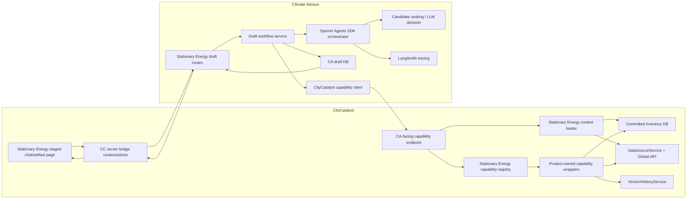
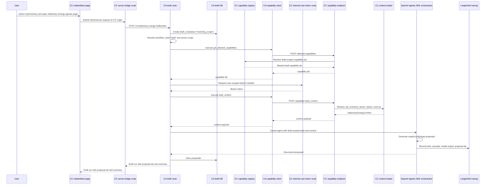
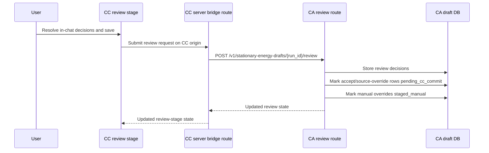
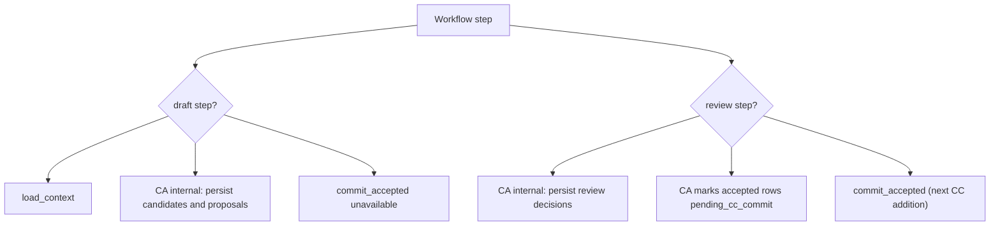
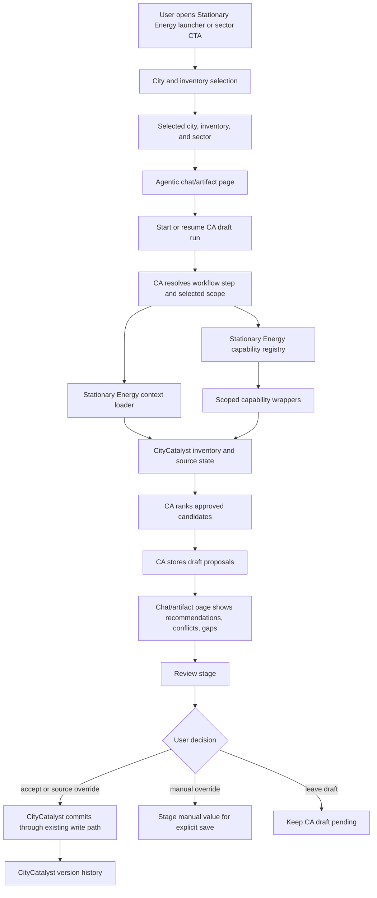
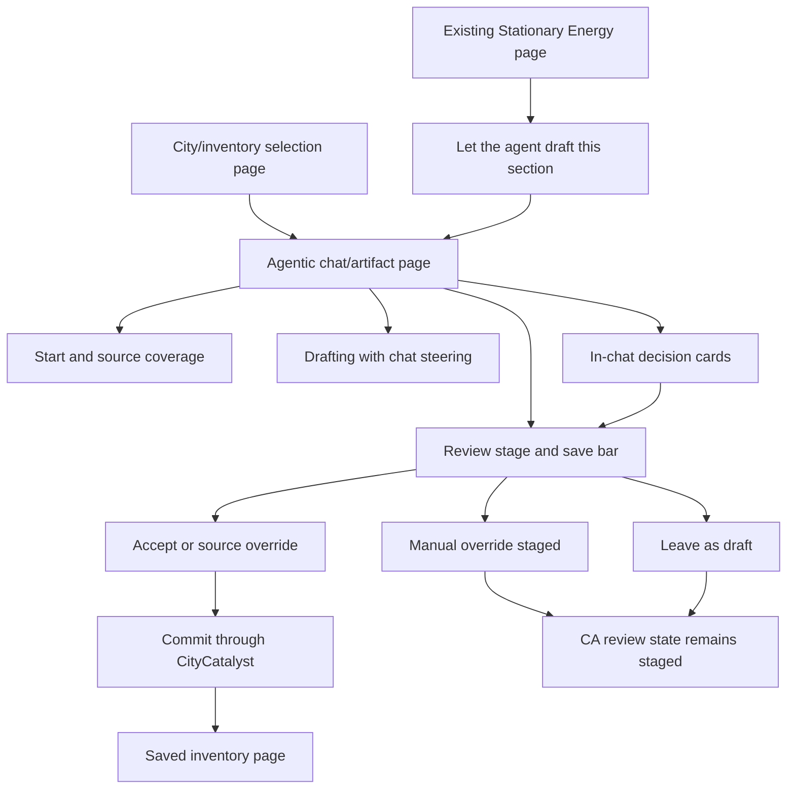

# Agentic Stationary Energy Plan

## Purpose

Build the first production-ready agentic inventory workflow for CityCatalyst:
a Stationary Energy drafting flow that helps a user complete one GHGI sector
faster, while keeping every data-changing action behind explicit review.

This plan merges the earlier inventory big-picture and current-flow notes into
one implementation overview. The broader architecture target remains in
`docs/AgenticModuleScope.md`; this document describes the first practical slice
of that architecture.

## Scope

In scope:

- GHGI inventories only.
- Stationary Energy only.
- Multi-city and multi-inventory selection before a run starts.
- One selected city, one selected inventory, and one sector per draft run.
- Drafting values from approved, city-scoped source candidates.
- Showing provenance, conflicts, and gaps before anything is saved.
- User review before committing values to the inventory.

Out of scope for this slice:

- General Clima AI chat changes.
- Multi-module agent workspaces.
- Other GHGI sectors.
- HIAP, CCRA, organization, or project workflows.
- Autonomous writes to inventory data.
- Arbitrary source discovery by the model.

## Current Approach Architecture

The first implementation should reuse the systems that already exist instead
of introducing a broad new service boundary.

- Reuse the existing CityCatalyst to Climate Advisor connection.
- Reuse the Climate Advisor database to store draft runs, draft proposals, and
  user decisions before final save.
- Add a city and inventory selection page so the user can choose the target
  workflow scope.
- Add one staged Stationary Energy chat/artifact page aligned with the HTML
  reference: Clima chat/action panel on the left, inventory draft artifact on
  the right.
- Keep the draft review route as a deep link into the final review stage of the
  same interaction model.
- Add feature flags in both CityCatalyst and Climate Advisor. The workflow
  should stay hidden and disabled by default so it does not interfere with the
  current product state while the pilot is being built.
- Implement the first pieces of the ideal architecture, but limit them to
  Stationary Energy:
  - capability wrappers
  - capability registry
  - context loaders
  - confirmation and staging model

The source of truth for committed inventory data remains CityCatalyst. Climate
Advisor can stage drafts and explain decisions, but CityCatalyst applies final
accepted changes through existing inventory write paths.

### Current Implementation Status

The repository is currently CA-heavy.

- Implemented now in Climate Advisor: feature-flag parsing, draft routes for
  start/status/retry/review, the draft workflow service, the draft repository,
  CA database models and migration, the Stationary Energy LLM proposal service,
  thread-context integration, and the CityCatalyst client methods for token
  refresh, allowed-capabilities lookup, and bounded context loading.
- Implemented now in CityCatalyst: the scoped Stationary Energy draft/review UI
  routes render the same staged chat/artifact surface, the CC draft bridge has
  start/status/review/save/resume coverage, and the chat message bridge forwards
  inventory scope, context, and options to CA.
- Not yet implemented in CityCatalyst: the CC capability registry/context-loader
  files, the CC capability routes under `/api/v1/internal/ca/capabilities/*`,
  and the final CC-side commit path for accepted rows.
- Because of that split, the current code can persist and review Stationary
  Energy drafts in CA, but the full CC-side commit flow is still the next
  addition.

## Product Shape

### Entry Point

Support two entry paths:

- a multi-city launcher page where the user chooses an accessible city and
  eligible inventory
- a contextual CTA on the Stationary Energy sector page when the user is
  already inside one inventory

Contextual CTA:

- Label: `Let the agent draft this section`
- Supporting copy: `Review every value before saving`

The workflow should still feel like CityCatalyst product navigation, not a
separate assistant workspace.

### Pages

Use one selector route plus scoped routes under the selected city and
inventory:

- City and inventory selection page:
  `/{lng}/GHGI/draft/stationary-energy`

- Agentic Stationary Energy page:
  `/{lng}/cities/{cityId}/GHGI/{inventoryId}/draft/stationary-energy`
- Draft review deep link:
  `/{lng}/cities/{cityId}/GHGI/{inventoryId}/draft/stationary-energy/review`

The selection page is where the user picks the target city and inventory. The
scoped Stationary Energy page is where the user moves through source coverage,
drafting, conflict decisions, and final review. The review URL renders the same
chat/artifact component with the final review stage selected.

### Staged Chat/Artifact Page

The page should show:

- On the left: the Clima chat/action panel with stage-specific messages, quick
  replies, free-text input, and in-chat decision cards.
- On the right: the Stationary Energy working draft artifact with current rows,
  draftable rows, source-backed values, provenance labels, conflicts, and
  gaps.
- Stage sequence: `start`, `drafting`, `decision`, and `review`.
- Every source-backed proposal as a typed in-chat decision-review card. Rows
  with one real source use a single-source card, rows with multiple real
  sources use a multi-source card, and gap rows stay summary-only. Multiple
  unresolved cards can stack in chat history, and users can interrupt the
  review with a free-text question, then scroll back to the earlier cards
  without losing the staged choices.
- Free-text LLM responses remain normal chat bubbles. The UI only renders a
  decision-review card from structured draft proposal state, while the chat
  request context forwards pending decision-review metadata so CA can explain
  those cards distinctly to the user.
- Ready proposals defaulted to accept and gap proposals defaulted to leave
  draft.
- A final save bar and matching chat action in the review stage.

The page should feel like a CityCatalyst workflow page, not a generic assistant
workspace. The chat guides and explains, but committed inventory changes remain
behind explicit user decisions and final save.

### Review Page

The review URL should show the final stage of the same staged chat/artifact
surface. It should keep the left-side Clima panel and right-side working draft,
then expose a durable summary of the staged draft:

- recommended value
- unit
- source name
- source year
- method or tier when available
- confidence or quality indicator
- alternatives for conflicts
- gap explanation for missing data
- existing inventory value, if any
- final action selected by the user

Supported user decisions:

| Decision          | Meaning                                            | Commit behavior                                                                                 |
| ----------------- | -------------------------------------------------- | ----------------------------------------------------------------------------------------------- |
| `accept`          | Use the recommended draft.                         | Mark `pending_cc_commit`; the future CC commit step writes through existing CityCatalyst paths. |
| `override_source` | Use another approved source from the alternatives. | Mark `pending_cc_commit`; the future CC commit step writes through existing CityCatalyst paths. |
| `override_manual` | User enters a manual value and unit.               | Stage for explicit save; do not let CA write directly.                                          |
| `leave_draft`     | Keep the proposal for later.                       | No inventory write.                                                                             |

## System Ownership

### CityCatalyst Owns

- User-facing GHGI routes and visual style.
- Auth, permissions, and feature flags.
- Accessible cities plus the selected city, inventory, and sector state.
- Existing inventory write behavior.
- Version history for committed changes.
- Final save after explicit user confirmation.

CityCatalyst should not ask the model to find arbitrary data or commit values.
It should expose only the Stationary Energy capabilities needed for this flow.

### Climate Advisor Owns

- Running the bounded Stationary Energy drafting workflow.
- Storing draft runs, source-candidate snapshots, proposals, review decisions,
  and commit statuses in the CA database.
- Calling CityCatalyst through the existing CC-CA connection.
- Ranking approved candidates.
- Explaining recommendations, conflicts, and gaps.
- Returning structured draft proposals for review.

Climate Advisor does not become the inventory source of truth. It stages and
explains draft decisions; CityCatalyst commits accepted changes.

### Source And Data Layer Owns

- Fetching approved source candidates.
- Mapping raw source records to Stationary Energy subsectors.
- Normalizing units, methods, years, geography match, and provenance.
- Returning all eligible candidates, not only the presumed winner.

The model should choose among approved options. It should not discover sources
freely.

For this pilot, `approved` and `allow-listed` mean source candidates already
present in the CityCatalyst datasource catalog and returned by the existing
CityCatalyst source/applicability pipeline for the selected city, inventory,
year, and Stationary Energy scope. CA should not maintain a separate pilot
source allow-list or rank sources that were not returned by the scoped CC
capabilities.

## Implementation Architecture Details

The Stationary Energy slice should make the ideal architecture concrete without
building a generic framework first. The implementation should use the existing
CC-CA connection, but move from manually exposed tools toward a registry-driven
workflow.

### Architecture Components

Each component has one narrow job. The goal is to make the workflow feel like
one CityCatalyst feature while keeping ownership clear between CC and CA.

| Component                                                 | What it is                                                                                                             | Why it exists                                                                                                                                                               |
| --------------------------------------------------------- | ---------------------------------------------------------------------------------------------------------------------- | --------------------------------------------------------------------------------------------------------------------------------------------------------------------------- |
| Stationary Energy selection and staged chat/artifact page | CityCatalyst pages inside the GHGI inventory flow.                                                                     | Let the user choose the target city/inventory, then move through draft start, drafting, in-chat decisions, provenance, gaps, and final review in one interaction model.     |
| Stationary Energy CA bridge routes                        | Planned CityCatalyst server routes or server actions, following the current `app/src/app/api/v1/chat/*` proxy pattern. | Keep browser auth and session handling on the CC side, then forward server-side requests into CA without making the browser call CA directly.                               |
| Stationary Energy draft routes                            | Climate Advisor HTTP routes for start/resume/review.                                                                   | Keep draft workflow state in CA and give the CC bridge a narrow server-to-server API.                                                                                       |
| Draft workflow service                                    | CA service that coordinates context loading, proposal generation, staging, and review.                                 | Keeps the CA route thin and makes the workflow testable without UI code.                                                                                                    |
| CA draft DB                                               | CA persistence for draft runs, source-candidate snapshots, proposals, review decisions, and commit statuses.           | Allows drafts to survive refresh, support review before commit, and keep an audit trail of what CA proposed and what still needs a CC commit.                               |
| CityCatalyst capability client                            | CA client for executing CC capabilities through the existing CC-CA token pattern.                                      | Stops CA from calling arbitrary CC routes directly and keeps all product access behind typed capabilities.                                                                  |
| CA-facing capability endpoint                             | Internal CityCatalyst endpoint used only by CA.                                                                        | Authenticates CA, validates user scope, resolves the requested capability, and returns a structured result.                                                                 |
| Stationary Energy capability registry                     | CC registry of which Stationary Energy capabilities exist and which workflow step can use them.                        | Prevents a flat tool bag; the draft step can inspect CC state while CA stages draft data internally, and the review step can later expose only the final commit capability. |
| Stationary Energy context loader                          | CC loader that builds the bounded context for one selected city, one selected inventory, and sector `I`.               | Ensures CA sees only the current workflow state for the chosen draft run, not unrelated product data or routes.                                                             |
| Product-owned capability wrappers                         | CC functions around existing services such as inventory reads, source lookup, and committed writes.                    | Reuses existing domain logic while giving CA small, stable, model-safe operations.                                                                                          |
| OpenAI Agents SDK orchestrator                            | CA orchestration layer for agent execution, tool use, structured outputs, and model calls.                             | Keeps agent behavior inside the existing CA runtime instead of inventing a new orchestration service.                                                                       |
| Candidate ranking or LLM decision                         | Agent step that evaluates supplied source candidates.                                                                  | Chooses among approved candidates, explains conflicts and gaps, and returns structured proposals.                                                                           |
| LangSmith tracing                                         | Trace layer around draft runs, tool calls, model decisions, and proposal outputs.                                      | Makes each recommendation reviewable during pilot debugging and later trust/audit work.                                                                                     |
| MCP documentation surface                                 | Existing MCP docs/discovery context only, not part of this implementation.                                             | Avoids adding protocol overhead and another tool surface to an already complex Stationary Energy slice.                                                                     |
| DataSourceService and Global API                          | Existing CC source discovery, filtering, retrieval, and source-apply machinery.                                        | Supplies approved source candidates and applies accepted source-backed values through existing paths.                                                                       |
| Committed inventory DB                                    | CityCatalyst inventory tables.                                                                                         | Remains the source of truth for saved inventory values. CA never writes here directly.                                                                                      |
| VersionHistoryService                                     | Existing CC version history mechanism.                                                                                 | Records committed changes after the user approves accepted/source-overridden drafts.                                                                                        |

The core boundary is this: CA owns draft orchestration and all pre-commit draft
persistence; CC owns product capabilities, permissions, committed writes, and
version history.

The orchestration rule is simple: CA decides what step the workflow is in and
what it needs next. The registry answers which capabilities are allowed for
that step. The context loader answers what bounded product context should be
loaded for that step. The loader does not orchestrate the registry.

MCP is intentionally not a runtime dependency for this slice. It can remain as
documentation and discovery context for what exists in the repo, but Stationary
Energy drafting should not add new MCP tools or route through MCP. The
capability registry is internal product architecture first; using MCP here
would add another transport, schema, auth, and testing surface without reducing
the core workflow complexity.

### Component Diagram



### Start-Draft Sequence



For this workflow, token readiness belongs after CA has resolved the workflow
step and allowed capability set, but before any CC context call or agent
creation. That keeps permission failure at the boundary where it belongs and
avoids starting an agent run that cannot execute product calls.

The important ownership point is that CA is still orchestrating this flow. It
asks CC for allowed capabilities and bounded context as separate operations. The
CC context loader does not look up the registry on its own or decide what the
agent may do.

The extra CC route hop is deliberate. Today the browser reaches CA through CC
server routes such as `app/src/app/api/v1/chat/threads/route.ts` and
`app/src/app/api/v1/chat/messages/route.ts`. The Stationary Energy UI should
follow that same boundary instead of teaching the browser to call CA directly.

### Observability And Audit Artifacts

This slice should treat observability as required implementation, not optional
hardening after the pilot. Every draft run should leave behind enough evidence
to debug the recommendation path and enough product context to review what the
system actually did.

Required identifiers across the flow:

- `request_id` for each HTTP request
- `draft_run_id` for the durable CA draft run
- `thread_id` or equivalent conversation/session id when the run is resumed
- `city_id`, `inventory_id`, and `sector_code`
- `workflow_step` such as `draft` or `review`

Required observability outputs:

- LangSmith trace for each proposal-generation run, tagged with the ids above
- structured CA logs for route entry, token refresh, context load, model run,
  proposal storage, and review handling
- structured CC logs for capability execution, permission validation, source
  selection, commit calls, and version-history writes
- durable draft artifact in CA persistence that stores:
  - bounded context summary sent into the model
  - candidate/source references considered for each proposal
  - proposal outputs, rationale, and conflict/gap explanations
  - user review decisions and final commit result

The goal is not to store every raw payload forever. The goal is to preserve the
decision path. That means support and product engineers should be able to
reconstruct:

- what the model saw
- which tools were available
- what it proposed
- what the user changed
- what CC finally committed

Do not persist raw Bearer tokens, service secrets, or unnecessary full product
payload dumps in traces or audit artifacts.

### Current Review Sequence



This is the current implemented behavior in CA. The next CC-side addition is a
`commit_accepted` capability that CA can call for rows already marked
`pending_cc_commit`.

### Minimal Implementation Snippets

The plan should keep only the smallest code anchors for what we actually intend
to build.

CC registry:

```ts
export const stationaryEnergyRegistry = {
  draft: ["ghgi.stationary_energy.load_context"],
  review: ["ghgi.stationary_energy.commit_accepted"],
};
```

CC context loader:

```ts
export async function loadStationaryEnergyContext(scope, session) {
  await PermissionService.canEditInventory(session, scope.inventoryId);
  return { scope, inventory, currentState, candidates };
}
```

CA orchestration:

```python
enabled = await capability_client.get_allowed_capabilities(step="draft", ...)
token = await token_service.ensure_user_token(user_id)
context = await capability_client.execute("ghgi.stationary_energy.load_context", ...)
proposals = await agent_runner.generate_stationary_energy_proposals(context, enabled)
```

CC internal execution:

```ts
const capability = getStationaryEnergyCapability(capabilityId, workflowStep);
const input = capability.inputSchema.parse(payload);
return NextResponse.json(await capability.execute(input, { session, locale }));
```

Feature flags:

```ts
if (!isEnabled("stationary_energy_agentic")) return notFound();
```

```python
if not settings.stationary_energy_agentic_enabled:
    raise HTTPException(status_code=404, detail="Feature disabled")
```

### Step-Scoped Capability Exposure



Only CC product reads and product writes should be exposed as capabilities.
Draft-run creation, proposal persistence, and review-decision persistence stay
inside CA service and repository code. No step gets broad inventory write
access.

## Ideal Architecture Slice

The ideal architecture includes module-owned capabilities, a registry, scoped
context loaders, and a confirmation model. This plan implements those ideas only
for Stationary Energy.

### Capability Wrappers

Create narrow wrappers for the Stationary Energy workflow. They should delegate
to existing CityCatalyst routes and services through the existing CC-CA
connection.

Current and next CC-facing wrappers:

| Capability                               | Type    | Purpose                                                                                                                  |
| ---------------------------------------- | ------- | ------------------------------------------------------------------------------------------------------------------------ |
| `ghgi.stationary_energy.load_context`    | query   | Load the bounded city, inventory, permissions, taxonomy, current values, and source-candidate context in one CC payload. |
| `ghgi.stationary_energy.commit_accepted` | command | Planned next CC addition to commit accepted or source-overridden rows through existing inventory write paths.            |

These wrappers should return small, structured payloads. They should not expose
raw product internals or unrelated APIs to the model.

CA-local operations such as creating draft runs, storing source-candidate
snapshots, replacing proposals, and persisting review decisions are not CC
capabilities. They live in CA service and repository code and are backed by the
CA database.

### Capability Registry

Create a small registry for this workflow before generalizing it. The registry
should describe:

- capability id
- operation type: query, command, or workflow
- input schema
- output schema
- required scope: city, inventory, sector
- whether confirmation is required
- whether the capability can write committed product data
- which workflow step can use it

The first registry should only include the CC-side Stationary Energy
capabilities that CA actually needs. It should not include CA-local persistence
operations. This keeps the agent's tool set small and proves the pattern before
it is expanded to other modules or sectors.

### Context Loaders

Use scoped context loaders to build the data the agent can see for each step.

The Stationary Energy context loader should include:

- `cityId`
- `inventoryId`
- city name
- locode
- country code
- inventory year
- locale
- user permission summary
- Stationary Energy subsector list
- existing values and notation keys
- source candidate summary
- current draft run status, if one exists

It should exclude:

- unrelated sectors
- unrelated cities
- credentials or tokens
- raw permission internals
- unrelated module state
- arbitrary user files

### Confirmation And Staging Model

Use a human-in-the-loop staging model:

1. CA creates a draft run.
2. CA stages proposals in its database.
3. The user reviews staged proposals.
4. The user chooses accept, override, or leave draft.
5. CityCatalyst commits only accepted source-backed changes.
6. CityCatalyst records version history for committed changes.
7. CA keeps the draft/audit trail for the run and decisions.

No draft should mutate committed inventory data before the review step.

## Draft Data Model

The CA database should store enough information to resume review and explain
why each draft exists.

### Draft Run

Suggested fields:

- `draft_run_id`
- `city_id`
- `inventory_id`
- `sector_code`
- `status`
- `locale`
- `created_by_user_id`
- `created_at`
- `updated_at`
- `ca_trace_id`

### Draft Proposal

Suggested fields:

- `proposal_id`
- `draft_run_id`
- `subsector_code`
- `status`: `ready`, `conflict`, or `gap`
- `recommended_value`
- `recommended_unit`
- `recommended_source_id`
- `recommended_source_name`
- `source_year`
- `source_method`
- `source_tier`
- `confidence`
- `rationale`
- `ui_message`
- `citation`
- `alternatives_json`
- `current_inventory_value`
- `current_inventory_unit`

### Stored Source Candidate Snapshot

The current CA implementation also persists the source candidate set used for a
draft run so review and retry can operate on the same bounded snapshot.

Suggested fields:

- `candidate_id`
- `draft_run_id`
- `datasource_id`
- `name`
- `dataset_year`
- `geography_match`
- `source_scope`
- `normalized_rows`
- `applicability_status`
- `applicability_issues`
- `quality_score`
- `confidence_notes`

### Review Decision

Suggested fields:

- `decision_id`
- `proposal_id`
- `action`: `accept`, `override_source`, `override_manual`, or `leave_draft`
- `selected_source_id`
- `manual_value`
- `manual_unit`
- `note`
- `decided_by_user_id`
- `decided_at`
- `commit_status`
- `cc_version_history_id`

## Runtime Flow



## Candidate Selection Policy

For each Stationary Energy subsector, CA should:

1. Ignore rows that are locked or intentionally completed by the user.
2. Only consider candidates supplied by scoped capabilities.
3. Only consider allow-listed sources, where the allow-list is the existing
   CityCatalyst datasource catalog after CC applicability filtering for the
   selected city, inventory, year, and Stationary Energy scope.
4. Prefer exact city and inventory-year matches.
5. Prefer city-level data over regional or country proxies.
6. Prefer complete subsector coverage over broad approximations.
7. Prefer stronger method and quality metadata when geography and coverage are
   comparable.
8. Return a conflict when two usable candidates differ beyond the configured
   threshold or represent a real methodology tradeoff.
9. Return a gap when no candidate clears the minimum bar.

CA should return structured proposal states:

| State      | Meaning                                      | UI behavior                            |
| ---------- | -------------------------------------------- | -------------------------------------- |
| `ready`    | One candidate is clearly best.               | Show inline draft and provenance.      |
| `conflict` | Multiple usable candidates need user choice. | Show recommendation plus alternatives. |
| `gap`      | No usable candidate exists.                  | Show gap reason and manual next steps. |

## Guardrails

- The product entry can expose multiple accessible cities and inventories, but
  each draft run is scoped to one selected city, one selected inventory, and
  one sector.
- CA never writes directly to committed inventory tables.
- CA never sees unrelated product state.
- CA never receives arbitrary credentials.
- MCP is not used as a runtime transport for this Stationary Energy workflow.
- Source candidates are allow-listed by CityCatalyst's existing datasource
  catalog and applicability filtering, then normalized before ranking.
- Every committed change requires an explicit user decision.
- Drafts remain visually distinct from saved values.
- Version history is created only for committed CityCatalyst changes.
- Feature flags in both CA and CC must default to off. CC should hide the UI
  entry points and pages, and CA should disable the draft workflow endpoints or
  return a feature-disabled response until the pilot is intentionally enabled.
- Every draft run should carry a LangSmith trace reference when tracing is
  enabled.

## Implementation Plan

### 1. CA Adjustments

Already implemented in CA:

- CA feature flag parsing for the Stationary Energy drafting workflow.
- CA draft routes for start, resume/status, retry, and review behind that
  feature flag.
- CA database models and migration for draft runs, source candidates,
  proposals, review decisions, trace references, and resume state.
- A CA workflow service that resolves scope, asks CC for allowed capabilities,
  ensures user token readiness, loads bounded Stationary Energy context, runs
  the proposal generator, and stores draft state.
- Recovery behavior for interrupted draft runs plus schema-oriented tests around
  CA context, proposals, and review decisions.

Remaining CA-side work:

- Expand LangSmith trace linkage and structured CA workflow logs as needed for
  pilot observability.
- Add the final handoff from `pending_cc_commit` review decisions into the
  future CC `commit_accepted` capability.

Exit condition:

With the CA flag enabled in a non-production environment, CA can stage, retry,
review, and resume Stationary Energy draft runs without writing committed
inventory values. With the CA flag disabled, the workflow routes stay
unavailable or return a feature-disabled response.

### 2. Landing Pages And UX Parts

- Add a CC feature flag for the Stationary Energy agentic workflow and keep it
  disabled by default.
- Hide the launcher page, sector CTA, and staged draft/review routes unless the
  CC flag is enabled.
- Add the city and inventory selection page.
- Add the scoped staged chat/artifact page.
- Keep the review route as a deep link into the final review stage.
- Render current Stationary Energy rows, draft states, provenance, conflicts,
  and gaps in a CC-native layout.
- Support the user decision controls: accept, source override, manual override,
  and leave draft.
- Keep draft values visually distinct from committed values.
- Add access and UX tests so the new surfaces do not appear or interfere with
  the existing GHGI flow while the feature flag is off.

Exit condition:

With the CC flag enabled, an internal user can choose a city and inventory,
inspect draft recommendations, review them, and move through the full UI flow.
With the CC flag disabled, the current GHGI experience remains unchanged.

### 3. Remaining CC Integration

- Add Stationary Energy capability wrappers.
- Add a Stationary Energy-only capability registry.
- Add context loaders for city selection, inventory, sector, existing values,
  and approved source candidates.
- Add or expose the CC internal endpoints needed by CA:
  - allowed capabilities lookup
  - bounded context loading
  - accepted draft commit
- Keep all CC integration behind the CC feature flag so the workflow cannot be
  triggered accidentally from production UI or CA.
- Validate permissions, scope ownership, and inventory-city consistency inside
  CC.
- Commit accepted source-backed values through existing inventory write paths.
- Record CityCatalyst version history for committed changes.
- Add access-scope tests and confirmation tests for accepted and overridden
  drafts.

Exit condition:

With both CC and CA flags enabled and the remaining CC capability routes added,
the full Stationary Energy workflow can run end to end through the existing
CC-CA connection. With either flag disabled, the agentic path stays hidden or
blocked and does not interfere with the current app behavior.

## Open Decisions

- Resolved: the decisions and review URLs render one staged chat/artifact
  component. The review route is a deep link into the final review stage.
- Whether manual override commits in the first release or stays staged for a
  later explicit save path.
- Whether a later pilot needs a narrower source allow-list on top of the
  existing CityCatalyst datasource catalog. The first pilot uses the existing CC
  catalog plus applicability filtering as the allow-list.
- Which conflict variance threshold is acceptable for Stationary Energy.
- How much of the CA draft/audit trail should be mirrored into CityCatalyst
  version history.

## Final Page And Functionality Outline

This is the intended end-state location map for the first Stationary Energy
agentic workflow.

### User-Facing Pages

| Page                                   | Route                                                                             | Owner                                          | Purpose                                                                                                                                                       |
| -------------------------------------- | --------------------------------------------------------------------------------- | ---------------------------------------------- | ------------------------------------------------------------------------------------------------------------------------------------------------------------- |
| City and inventory selection page      | `/{lng}/GHGI/draft/stationary-energy`                                             | CityCatalyst                                   | Lets the user choose among accessible cities and eligible inventories before starting a draft run.                                                            |
| Existing Stationary Energy sector page | `/{lng}/cities/{cityId}/GHGI/{inventoryId}` or the current inventory sector route | CityCatalyst                                   | Entry point. Shows the normal Stationary Energy inventory UI and a CTA to start agentic drafting.                                                             |
| Agentic Stationary Energy page         | `/{lng}/cities/{cityId}/GHGI/{inventoryId}/draft/stationary-energy`               | CityCatalyst UI + Climate Advisor draft state  | Shows the staged chat/artifact flow with working draft rows, source coverage, recommended drafts, in-chat conflict decisions, gaps, provenance, and progress. |
| Draft review deep link                 | `/{lng}/cities/{cityId}/GHGI/{inventoryId}/draft/stationary-energy/review`        | CityCatalyst UI + Climate Advisor review state | Opens the same staged chat/artifact surface in the final review state before save.                                                                            |
| Saved inventory page                   | Existing inventory route after review                                             | CityCatalyst                                   | Shows committed values after accepted drafts are saved through the normal inventory write path.                                                               |

### Page 1: City And Inventory Selection Page

Route:

`/{lng}/GHGI/draft/stationary-energy`

Primary layout:

- Search and filter bar.
- List or table of accessible cities.
- Nested or adjacent eligible inventory selection.
- Entry action to continue into Stationary Energy drafting.

What appears:

- Accessible cities for the current user.
- Inventory year, type, and status summary for eligible GHGI inventories.
- Clear selected state for city and inventory.
- Disabled continue action until both city and inventory are selected.

What it calls:

- Existing CityCatalyst city and inventory listing APIs.
- No CA draft run is created from this page until the user confirms the target
  scope.
- On continue, navigate to the staged chat/artifact page with `cityId` and
  `inventoryId`.

Frontend implementation location:

- `app/src/app/[lng]/GHGI/draft/stationary-energy/page.tsx`
- Supporting components, for example:
  - `CityInventorySelector`
  - `CitySearchInput`
  - `InventoryPickerTable`
  - `SelectedScopeSummary`

### Page 2: Existing Stationary Energy Sector Page

Location:

- Existing GHGI inventory UI.
- Add only a Stationary Energy-specific CTA near the sector header or sector
  action area.

What appears:

- Current Stationary Energy completion state.
- Existing sector rows and values.
- CTA: `Let the agent draft this section`.
- Supporting copy: `Review every value before saving`.
- Disabled or hidden CTA when the user does not have edit access.

What it calls:

- No new draft call until the user clicks the CTA.
- On click, navigate to the staged chat/artifact page with `cityId` and
  `inventoryId`.

### Page 3: Agentic Stationary Energy Chat/Artifact Page

Route:

`/{lng}/cities/{cityId}/GHGI/{inventoryId}/draft/stationary-energy`

Primary layout:

- Left: Stationary Energy working draft artifact.
- Right: Clima chat/action panel.
- On mobile: stack the artifact first and the chat second, with the chat input
  sticky inside the chat panel.

Artifact areas:

- Existing committed rows where available.
- Draftable subsector rows.
- Draft progress by row.
- Source-backed draft values with source labels.
- Conflict and gap row states.

Chat/action areas:

- `start`: Clima offers to draft and shows source coverage.
- `drafting`: Clima accepts steering text and quick replies while the artifact
  shows draft progress.
- `decision`: every source-backed row renders an in-chat decision card; the UI
  uses a single-source card or a multi-source card depending on the available
  real datasets.
- `review`: final working draft summary and a save action only when at least
  one source-backed row remains staged for commit.
- Free-text input for explanation and steering, backed by the existing CA
  messages stream.

Main behavior:

1. Page loads with the selected city, inventory, and sector scope.
2. CityCatalyst first tries the query `draftRunId`, then local storage as a
   cache, then the CA-backed resume bridge for the selected city and inventory.
3. CA uses the Stationary Energy context loader and capability registry.
4. CA stores draft proposals in the CA database.
5. The page derives artifact rows from `proposals`, `source_candidates`, and
   `review_decisions`.
6. Every source-backed proposal gets an explicit review widget. Single-source
   rows offer accept or leave-empty; multi-source rows offer the recommended
   source, alternative sources, or leave-empty.
7. Gap proposals do not create widgets and do not enable save.
8. `Save draft` appears after every source-backed proposal has an explicit user
   choice and persists that reviewed run in the CA database without committing
   inventory values.
9. `Save to inventory` appears only when at least one source-backed row remains
   staged for commit.
10. Nothing is committed to CityCatalyst inventory tables until final save.

Frontend implementation location:

- `app/src/app/[lng]/cities/[cityId]/GHGI/[inventory]/draft/stationary-energy/page.tsx`
- Supporting components under the same route folder or a nearby feature folder,
  for example:
  - `StationaryEnergyChatArtifactPage`
  - `ArtifactPanel`
  - `ClimaChatPanel`
  - `SingleSourceProposalCard`
  - `MultiSourceProposalCard`
  - `RunSummary`

Backend calls:

- Planned CC browser-facing bridge route or server action, following the
  existing `app/src/app/api/v1/chat/*` pattern.
- Underlying CA routes:
  - `GET /v1/stationary-energy-drafts`
  - `POST /v1/stationary-energy-drafts/start`
  - `GET /v1/stationary-energy-drafts/resume`
  - `GET /v1/stationary-energy-drafts/{run_id}`
  - `POST /v1/stationary-energy-drafts/{run_id}/review`
- Existing CA chat route:
  - `POST /v1/messages`
- CC internal capability used by CA:
  `ghgi.stationary_energy.load_context`

### Page 4: Draft Review Deep Link

Route:

`/{lng}/cities/{cityId}/GHGI/{inventoryId}/draft/stationary-energy/review`

Primary layout:

- Same staged chat/artifact layout as the Agentic Stationary Energy page.
- Left: final working draft artifact and save bar.
- Right: Clima review messages, run summary, save action, and free-text input.

The review stage shows:

- subsector code and name
- current committed value, if any
- recommended value and unit
- recommended source
- confidence or source quality indicator
- rationale
- alternatives for conflicts
- gap reason when no source exists
- selected user decision

Allowed actions:

- `accept`: mark the recommended source-backed value `pending_cc_commit`.
- `override_source`: mark another approved source-backed value `pending_cc_commit`.
- `override_manual`: stage a manual value for explicit save.
- `leave_draft`: keep the proposal without committing.

Main behavior:

1. Page loads the same CA draft run and proposal state as the main route.
2. In-chat decision cards remain available for unresolved conflict and
   needs-review proposals.
3. Save is disabled until blocking proposals are resolved.
4. User submits the complete review decision set through the CC bridge.
5. CA records decisions in the CA database.
6. Accepted and source-overridden proposals are marked `pending_cc_commit`.
7. Manual overrides are staged and left-draft rows remain uncommitted.
8. The future CC `commit_accepted` step can later consume the
   `pending_cc_commit` rows and perform the actual CityCatalyst write.

Frontend implementation location:

- `app/src/app/[lng]/cities/[cityId]/GHGI/[inventory]/draft/stationary-energy/review/page.tsx`
- Supporting components:
  - `StationaryEnergyChatArtifactPage`
  - `RunSummary`
  - `SingleSourceProposalCard`
  - `MultiSourceProposalCard`
  - `FinalSaveBar` or equivalent save section

Backend calls:

- CC browser-facing bridge routes following the existing
  `app/src/app/api/v1/chat/*` pattern.
- Underlying CA routes:
  - `GET /v1/stationary-energy-drafts`
  - `GET /v1/stationary-energy-drafts/{run_id}`
  - `GET /v1/stationary-energy-drafts/resume`
  - `POST /v1/stationary-energy-drafts/{run_id}/review`
  - `POST /v1/stationary-energy-drafts/{run_id}/save`
- Planned next CC internal capability for final save:
  `ghgi.stationary_energy.commit_accepted`

### Page 5: Saved Inventory Page

Location:

- Existing GHGI inventory route after review is complete.

What appears:

- Accepted values as normal committed inventory values.
- Existing source display behavior where available.
- Existing version history entry for the save.
- Draft-only or left-draft proposals remain outside committed inventory data.

What it calls:

- Existing CityCatalyst inventory read APIs.
- Existing version history APIs.
- No CA call is required to show committed values.

### Functionality Placement By Layer

| Layer                            | Location                                                                                                                                       | Responsibility                                                                                              |
| -------------------------------- | ---------------------------------------------------------------------------------------------------------------------------------------------- | ----------------------------------------------------------------------------------------------------------- |
| CityCatalyst UI                  | Planned new Stationary Energy selector, draft, and review routes                                                                               | User workflow, city/inventory selection, visual style, decision controls, and navigation back to inventory. |
| CityCatalyst CA bridge route     | Planned CC server route or server action, mirroring `app/src/app/api/v1/chat/threads/route.ts` and `app/src/app/api/v1/chat/messages/route.ts` | Authenticated browser-facing entrypoint that proxies draft workflow requests to CA.                         |
| CityCatalyst capability endpoint | Planned: `app/src/app/api/v1/internal/ca/capabilities/...`                                                                                     | Internal CA-only execution surface for scoped capabilities.                                                 |
| CityCatalyst capability wrappers | Planned: `app/src/backend/agentic/ghgi/stationary-energy/capabilities.ts`                                                                      | Stable wrappers around existing inventory/source/commit logic.                                              |
| CityCatalyst registry            | Planned: `app/src/backend/agentic/ghgi/stationary-energy/registry.ts`                                                                          | Step-scoped list of capabilities available to CA.                                                           |
| CityCatalyst context loader      | Planned: `app/src/backend/agentic/ghgi/stationary-energy/context.ts`                                                                           | Loads bounded city, inventory, sector, current value, and source context.                                   |
| CityCatalyst existing services   | `DataSourceService`, `PermissionService`, `VersionHistoryService`, inventory models                                                            | Domain logic, permissions, source retrieval, committed writes, and version history.                         |
| Climate Advisor routes           | `climate-advisor/service/app/routes/stationary_energy_drafts.py`                                                                               | Start/resume draft runs, return review state, and record review decisions.                                  |
| Climate Advisor workflow service | `climate-advisor/service/app/services/stationary_energy_draft_service.py`                                                                      | Orchestrates context loading, proposal generation, staging, and review.                                     |
| Climate Advisor draft repository | `climate-advisor/service/app/services/stationary_energy_draft_repository.py`                                                                   | Persists draft runs, source-candidate snapshots, proposals, and review decisions in the CA database.        |
| Climate Advisor CC client        | `climate-advisor/service/app/services/citycatalyst_client.py`                                                                                  | Calls CC token and capability endpoints using the existing token/client pattern.                            |
| Climate Advisor LLM runner       | `climate-advisor/service/app/services/stationary_energy_llm_service.py`                                                                        | Runs structured Stationary Energy proposal generation.                                                      |
| LangSmith tracing                | CA tracing configuration and draft-run trace references                                                                                        | Captures context, tool calls, model output, and proposal ids for debugging and audit review.                |
| Climate Advisor database models  | `climate-advisor/service/app/models/db/stationary_energy_draft.py`                                                                             | Defines CA-owned tables for draft runs, source candidates, proposals, and review decisions.                 |
| MCP                              | Documentation/discovery context only                                                                                                           | Not used for runtime calls in this Stationary Energy workflow.                                              |

### End-State User Journey



The important boundary is that the user experiences this as one Stationary
Energy workflow in CityCatalyst, while the implementation remains split by
ownership: CA stages and explains draft decisions; CC owns scoped capabilities,
permissions, committed writes, and version history.

## Issues

### Resolved: CA-persisted draft runs are discoverable by the frontend

The Stationary Energy frontend now treats browser local storage as a cache, not
as the durable source of truth.

Implemented behavior:

1. The page first loads a query `draftRunId` when present.
2. If absent, it tries `stationary-energy-draft:{inventory_id}` from local
   storage.
3. If that cache is missing, points to a terminal draft, or fails to refresh,
   it calls the CC resume bridge:
   `GET /api/v1/stationary-energy-drafts/resume`.
4. The bridge calls CA:
   `GET /v1/stationary-energy-drafts/resume`.
5. CA queries by authenticated user, `city_id`, `inventory_id`, and
   `sector_code="stationary_energy"`, then returns the latest active unsaved
   draft run with source candidates, proposals, review decisions, thread
   context, and connected-source staleness metadata.
6. In parallel, the CC draft list bridge calls
   `GET /api/v1/stationary-energy-drafts`, which forwards to
   `GET /v1/stationary-energy-drafts` so the user can reopen a different
   active CA draft from the scoped picker.
7. Saved, partially saved, and no-change runs are excluded from automatic
   resume and from the active picker list.
8. If the resumed draft is stale because connected sources changed, the UI
   warns first and offers `Continue existing draft` or `Start over`.

This preserves CA as the durable owner of pre-commit draft state and prevents a
missing browser cache from creating duplicate draft runs for the same scoped
inventory.
