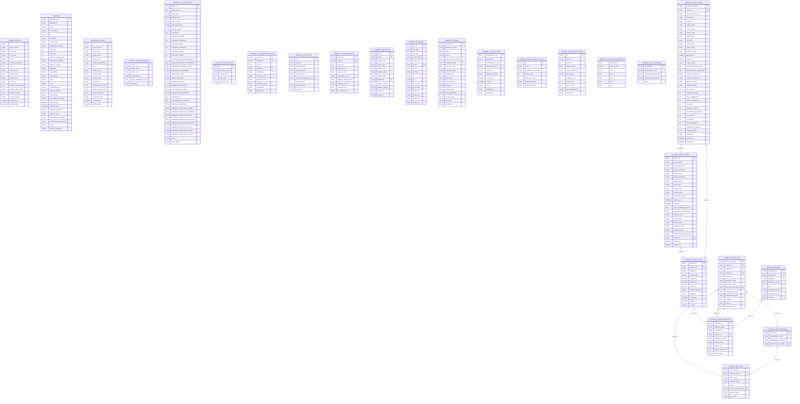

<!-- Generated by scripts/generate_schema.py — do not edit manually -->
# Database Schema

**Last generated:** 2026-04-13 09:09 UTC
**Alembic revision:** `5f3e9f2b1c7d`

```mermaid
erDiagram
    citywide_emissions {
        string id "PK"
        string source_name
        string GPC_refno
        string city_name
        string locode
        string temporal_granularity
        float year
        string activity_name
        float activity_value
        string activity_units
        string gas_name
        float emission_factor_value
        string emission_factor_units
        float emissions_value
        string emissions_units
        datetime created_date
        datetime modified_date
    }
    datasource {
        string datasource_id "PK"
        string publisher_id
        string name
        string source_type
        string url
        string description
        string access_type
        string geographical_location
        int start_year
        int end_year
        int latest_accounting_year
        string frequency_of_update
        string spatial_resolution
        string language
        string accessibility
        string data_quality
        string notes
        string units
        string methodology_url
        string retrieval_method
        string api_endpoint
        string gpc_reference_number
        datetime created_date
        datetime modified_date
        string datasource_name
        string dataset_name
        string methodology_description
        string transformation_description
        string scope
        string dataset_description
    }
    regionwide_emissions {
        string id "PK"
        string source_name
        string GPC_refno
        string region_name
        string region_code
        string temporal_granularity
        float year
        string activity_name
        float activity_value
        string activity_units
        string gas_name
        float emission_factor_value
        string emission_factor_units
        float emissions_value
        string emissions_units
        datetime created_date
        datetime modified_date
    }
    modelled__activity_subcategory {
        string activity_id "PK"
        string activity_name
        string activity_units
        string gpcmethod_id
        json activity_subcategory_type
        string method_id
    }
    modelled__cap_climate_action {
        string action_id "PK"
        json action_name
        string action_type
        string hazard_name
        string sector_names
        string subsector_names
        string primary_purpose
        json description
        int cobenefits_airquality
        int cobenefits_waterquality
        int cobenefits_habitat
        int cobenefits_costofliving
        int cobenefits_housing
        int cobenefits_mobility
        int cobenefits_stakeholderengagement
        json equity_and_inclusion_considerations
        string ghgreduction_stationary_energy
        string ghgreduction_transportation
        string ghgreduction_waste
        string ghgreduction_ippu
        string ghgreduction_afolu
        string adaptation_effectiveness
        string cost_investment_needed
        string timeline_for_implementation
        json dependencies
        json key_performance_indicators
        string powers_and_mandates
        string adaptation_effectiveness_droughts
        string adaptation_effectiveness_heatwaves
        string adaptation_effectiveness_floods
        string adaptation_effectiveness_sealevelrise
        string adaptation_effectiveness_landslides
        string adaptation_effectiveness_storms
        string adaptation_effectiveness_wildfires
        string adaptation_effectiveness_diseases
        string biome
        string key_impacts
    }
    modelled__ccra_impactchain {
        string id "PK"
        string keyimpact_name
        string hazard_name
        int latest_year
        string scenario_name
    }
    modelled__ccra_impactchain_indicator {
        string impact_id "PK"
        string indicator_id "PK"
        string actor_id
        string category "PK"
        string subcategory "PK"
        string indicator_name
        float indicator_score
        float indicator_weight
        string relationship
        string datasource
    }
    modelled__ccra_indicator {
        string id "PK"
        string actor_id
        string indicator_name
        float indicator_score
        string indicator_units
        float indicator_normalized_score
        int indicator_year
        string scenario_name
        string datasource
    }
    modelled__ccra_riskassessment {
        string impact_id "PK"
        string actor_id "PK"
        float risk_score
        float hazard_score
        float exposure_score
        float vulnerability_score
        float adaptive_capacity_score
        float sensitivity_score
        float risk_lower_limit
        float risk_upper_limit
    }
    modelled__city_attribute {
        string city_id "PK"
        string locode "PK"
        string country_code
        string region_name
        string attribute_type "PK"
        string attribute_value
        string attribute_units
        string datasource "PK"
        int datasource_date
        string attribute_category
        string dataset_id
        string release_id
    }
    modelled__city_polygon {
        string city_id
        string city_name
        string city_type
        string country_code
        string region_code
        string locode "PK"
        string osm_id
        string geometry
        string lat
        string lon
        string bbox_north
        string bbox_south
        string bbox_east
        string bbox_west
        string dataset_id
        string release_id
    }
    modelled__dataset_release {
        string release_id "PK"
        string publisher_id "FK"
        string dataset_id "FK"
        string version_label
        datetime released_at
        datetime retrieved_at
        string source_url
        string release_notes_url
        json metadata
        datetime created_at
        datetime updated_at
        boolean is_latest
    }
    modelled__emissions {
        string emissions_id "PK"
        string datasource_name
        string actor_id
        string city_id
        string gpc_reference_number
        float emissions_value
        float emissions_year
        string emissions_units
        string gpcmethod_id
        string gas_name
        string emissionfactor_id
        string activity_id
        string activity_value
        string spatial_granularity
        string geometry_type
        string geometry
        string geometry_id
    }
    modelled__emissions_factor {
        string emissionfactor_id "PK"
        string gas_name
        float emissionfactor_value
        string unit_denominator
        string activity_id
        string datasource_name
        datetime active_from
        datetime active_to
        string actor_id
        string publisher_id
        string dataset_id
    }
    modelled__formula_input {
        string formula_input_id "PK"
        string method_id "FK"
        string publisher_id "FK"
        string dataset_id "FK"
        string gas_name
        string parameter_code
        string parameter_name
        string gpc_reference_number "FK"
        float formula_input_value
        string formula_input_units
        json metadata
        string actor_id
        string formula_name
    }
    modelled__ghgi_city_facility_occurance {
        string id "PK"
        string locode
        string gpc_reference_number
        int facility_count
        int datasource_year
        string datasource_name
        string spatial_granularity
    }
    modelled__ghgi_emission_forecast {
        string id "PK"
        string actor_id
        int cluster_id
        json cluster_name
        json cluster_description
        string gpc_sector
        int forecast_year
        int future_year
        float growth_rate
        string spatial_granularity
        string datasource
    }
    modelled__ghgi_methodology {
        string method_id "PK"
        string methodology_name
        string methodology_description
        string gpc_reference_number "FK"
    }
    modelled__global_warming_potential {
        string gas_name
        string time_horizon
        float ar2
        float ar3
        float ar4
        float ar5
        float ar6
    }
    modelled__gpc_methodology {
        string gpcmethod_id "PK"
        string methodology_name
        string methodology_description
        string gpc_reference_number
        int scope
    }
    modelled__gpc_sector {
        string sector_name
        string subsector_name
        string sector_refno
        string subsector_refno
        int scope
        string gpc_reference_number "PK"
        string reporting_level
        string gpc_version
    }
    modelled__population {
        string population_id "PK"
        string publisher_id "FK"
        string dataset_id "FK"
        float population_value
        int year
        string population_source
        string geographical_level
        string actor_id
    }
    modelled__project_portfolio {
        string project_id "PK"
        string source_name
        string source_project_id
        string source_project_url
        string project_name
        string project_description
        string project_status
        string project_type
        string country_code
        string country_name
        string world_region_name
        datetime approval_at
        datetime closing_at
        float total_commitment_amount
        float total_project_cost_amount
        string currency_code
        string sector_name
        string theme_name
        string instrument_type
        string borrower_name
        string implementing_agency_name
        string release_id "FK"
        datetime created_at
        datetime updated_at
    }
    modelled__project_summary {
        string project_summary_id "PK"
        string project_id "FK"
        string source_project_id
        string project_title
        string funder_id
        string funder_name
        string country_name
        string country_code
        string region_name
        string city_name
        string project_type
        string sector_name
        string subsector_name
        datetime approval_at
        datetime closing_at
        string project_status
        float total_budget_amount_usd
        float primary_funder_amount_usd
        string financing_instrument
        string project_summary_text
        string lessons_learned
        string synthesis_notes
        json site_context
        json financing_structure
        json data_completeness
        json actions_implemented
        json key_risks
        json evidence_anchors
        json secondary_project_types
        json co_financiers
        json co_benefits
        json key_interventions
        json replicability_conditions
        json model_metadata
        string release_id "FK"
        datetime created_at
        datetime updated_at
    }
    modelled__publisher_datasource {
        string publisher_id "PK"
        string publisher_name
        string publisher_url
        string dataset_id "PK"
        string datasource_name
        string dataset_name
        string dataset_url
        json dataset_name_i18n
        string dataset_slug
    }

    modelled__dataset_release }o--|| modelled__publisher_datasource : references
    modelled__formula_input }o--|| modelled__ghgi_methodology : references
    modelled__formula_input }o--|| modelled__gpc_sector : references
    modelled__formula_input }o--|| modelled__publisher_datasource : references
    modelled__ghgi_methodology }o--|| modelled__gpc_sector : references
    modelled__population }o--|| modelled__publisher_datasource : references
    modelled__project_portfolio }o--|| modelled__dataset_release : references
    modelled__project_summary }o--|| modelled__dataset_release : references
    modelled__project_summary }o--|| modelled__project_portfolio : references
```
