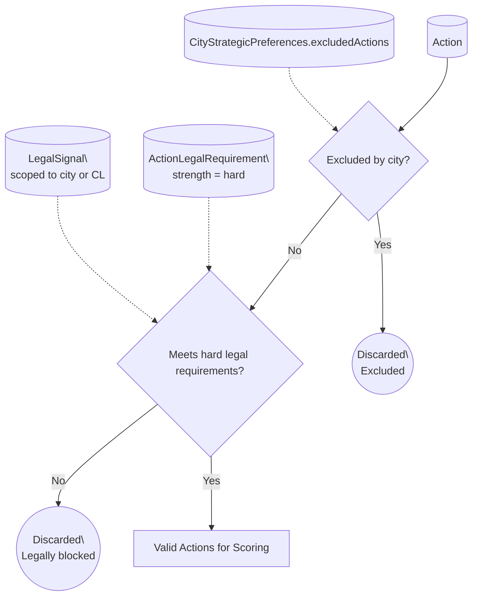
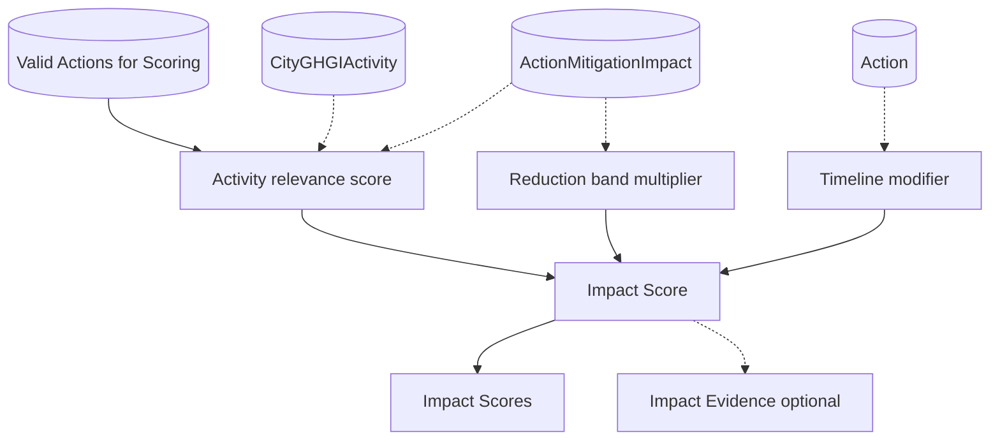
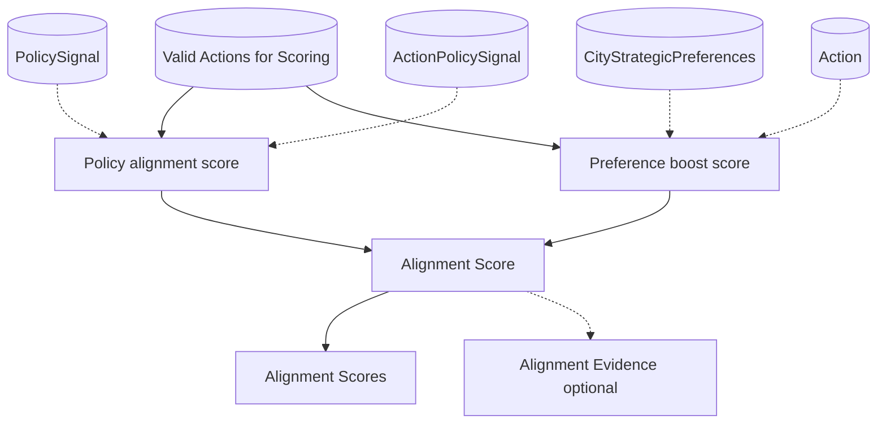
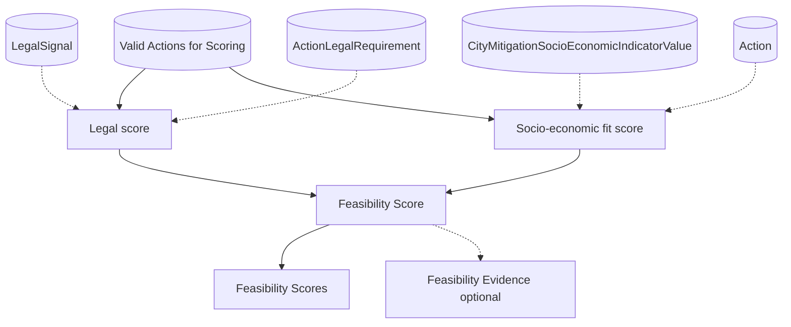
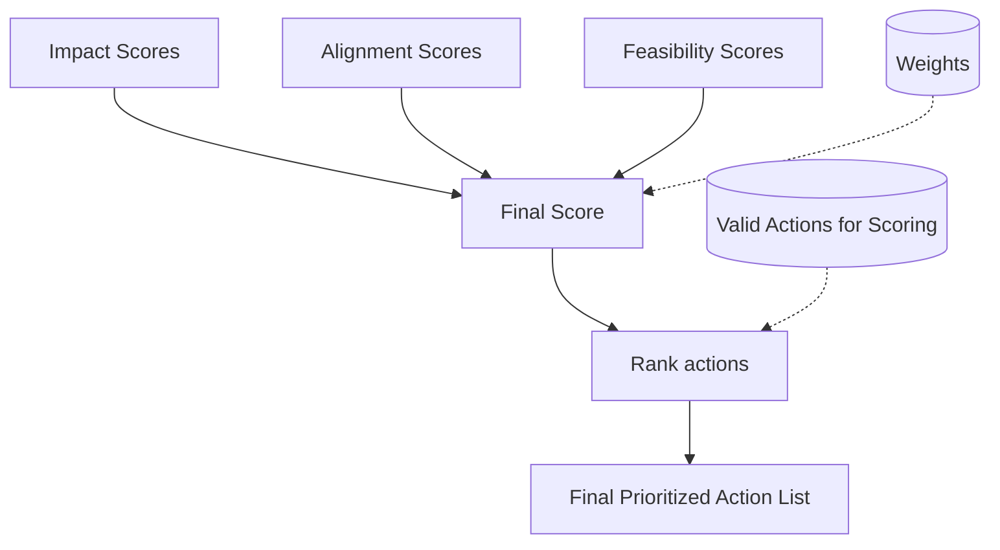

# Detailed block architecture

## Implementation status

| Block | Sub-feature | Status |
|---|---|---|
| Hard Filter | Exclusion by `action_id` | Implemented |
| Hard Filter | Legal requirement check | Not started |
| Impact | GPC reference evidence collection | Implemented (stub: score = 0.0) |
| Impact | Activity relevance × reduction band × timeline | Not started |
| Alignment | Attribute-presence evidence | Implemented (stub: score = 0.0) |
| Alignment | Policy signal matching + city preference boost | Not started |
| Feasibility | City context row-count evidence | Implemented (stub: score = 0.0) |
| Feasibility | Soft legal signals + socio-economic fit rules | Not started |
| Weighted Sum | Weighted aggregation, sort, rank, `top_n` | Implemented |

---

## Hard Filter Architecture

This block removes actions that are not eligible before any scoring happens. It applies two binary checks:

1. Explicit city exclusions
2. Hard legal requirements (must be satisfied, otherwise remove)

Biome filtering is intentionally not included yet.

### Inputs (and where they come from)

- **All mitigation actions**
  - Source: `Action` (core actions list)
- **City exclusions**
  - Source: `CityStrategicPreferences.excludedActions` (or your preference mapping tables, if split)
- **Hard legal requirements per action**
  - Source: `ActionLegalRequirement` filtered to `strength = hard`
- **Applicable legal signals for the city or scope**
  - Source: `LegalSignal` (scoped to `CL` national baseline and optionally region/city scope)

### Outputs

- **Filtered actions list**
  - Output: `Valid Actions for Scoring` (these proceed to Impact, Alignment, Feasibility)
- **Discarded actions**
  - Output: discarded due to exclusions or hard legal mismatch (useful for traceability and debugging)

## Impact Architecture

Impact answers: **How much emissions reduction potential does this action have in this specific city?**

It combines:

- Activity relevance (city emissions in the activities the action targets)
- Reduction potential band (band converted to a multiplier)
- Timeline modifier (optional small boost for quicker wins)

### Inputs (and where they come from)

- City emissions, activity-level
  - Source: `CityGHGIActivity`
- Action to activity targeting (GPC refno mapping)
  - Source: `ActionMitigationImpact`
- Reduction potential band
  - Source: `ActionMitigationImpact.reductionPotentialBand` with a standard band to multiplier mapping
- Timeline
  - Source: `Action.timelineForImplementation`
- Candidate actions (already hard-filtered)
  - Source: Hard Filter output: `Valid Actions for Scoring`

### Outputs

- Impact scores per action
  - Output: `Impact Scores` (one score per action, used in final ranking)
- Optional trace fields
  - Output: `Impact Evidence` (top contributing activities and multipliers)

---

## Alignment Architecture

Alignment answers: **Does this action align with what the city and policy environment are trying to achieve?**

It combines:

- Policy signals (supports, targets, funds, constrains)
- City strategic preferences (priority sectors and political priorities)

Exclusions are handled in the Hard Filter stage, so Alignment only scores eligible actions.

### Inputs (and where they come from)

- Policy facts extracted from plans, strategies, budgets
  - Source: `PolicySignal` (scoped to the city or region)
- Action to policy signal mapping
  - Source: `ActionPolicySignal` (relationType supports, targets, funds, constrains)
- City strategic preferences
  - Source: `CityStrategicPreferences` (priority sectors, political priorities)
- Action co-benefits (to match political priorities)
  - Source: `Action.coBenefits`
- Candidate actions (already hard-filtered)
  - Source: `Valid Actions for Scoring`

### Outputs

- Alignment scores per action
  - Output: `Alignment Scores` (one score per action, used in final ranking)
- Optional trace fields
  - Output: `Alignment Evidence` (matched signals and boosts)

---

## Feasibility Architecture

Feasibility answers: **Can this city realistically implement this action?**

It combines:

- Legal feasibility using soft signals for boosts and penalties
- Socio-economic fit via action-defined fit rules applied to city indicator buckets

Hard legal requirements are enforced in the Hard Filter stage.

### Inputs (and where they come from)

- Legal facts extracted from laws, mandates, regulations
  - Source: `LegalSignal` (national baseline CL plus optional local overlays)
- Action to legal requirement mapping
  - Source: `ActionLegalRequirement` filtered to strength soft or constraint
- Socio-economic indicator buckets for the city
  - Source: `CityMitigationSocioEconomicIndicatorValue` (very_low to very_high)
- Action socio-economic fit rules
  - Source: `Action.socioeconomicFitRules` (jsonb)
- Candidate actions (already hard-filtered)
  - Source: `Valid Actions for Scoring`

### Outputs

- Feasibility scores per action
  - Output: `Feasibility Scores` (one score per action, used in final ranking)
- Optional trace fields
  - Output: `Feasibility Evidence` (which legal and socio rules drove the score)

---

## Weighted Sum Architecture

This step combines the three pillar scores into a single ranking score and produces the prioritized list.

### Inputs (and where they come from)

- Impact scores
  - Source: Impact block output: `Impact Scores`
- Alignment scores
  - Source: Alignment block output: `Alignment Scores`
- Feasibility scores
  - Source: Feasibility block output: `Feasibility Scores`
- Weights
  - Source: configuration (recommended ranges: Impact 50 to 60 percent, Alignment 20 to 25 percent, Feasibility 20 to 30 percent)
- Candidate actions
  - Source: `Valid Actions for Scoring`

### Outputs

- Final prioritized action list
  - Output: ranked list of actions with pillar scores and final score

