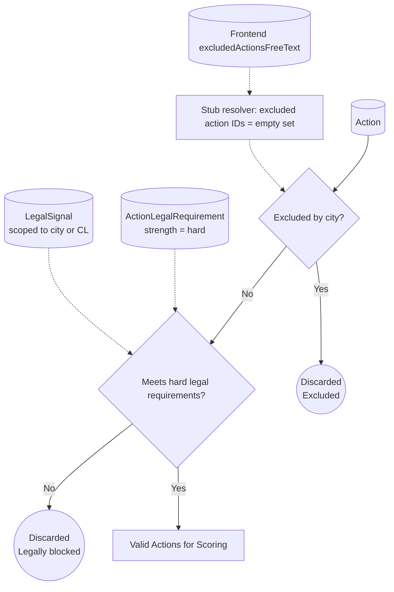
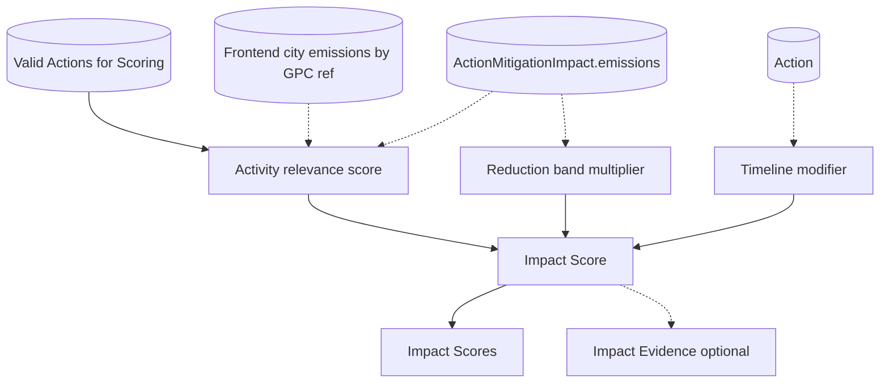
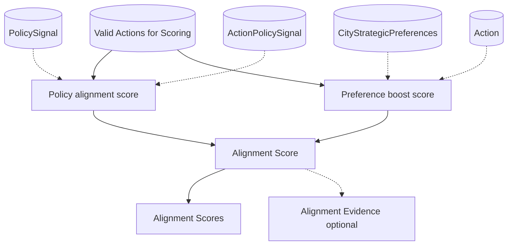
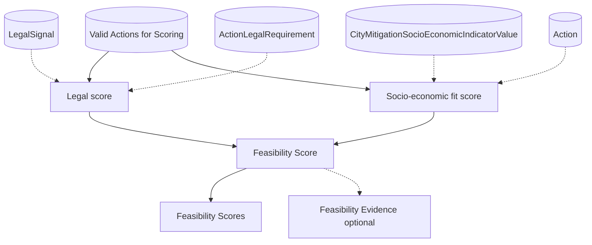
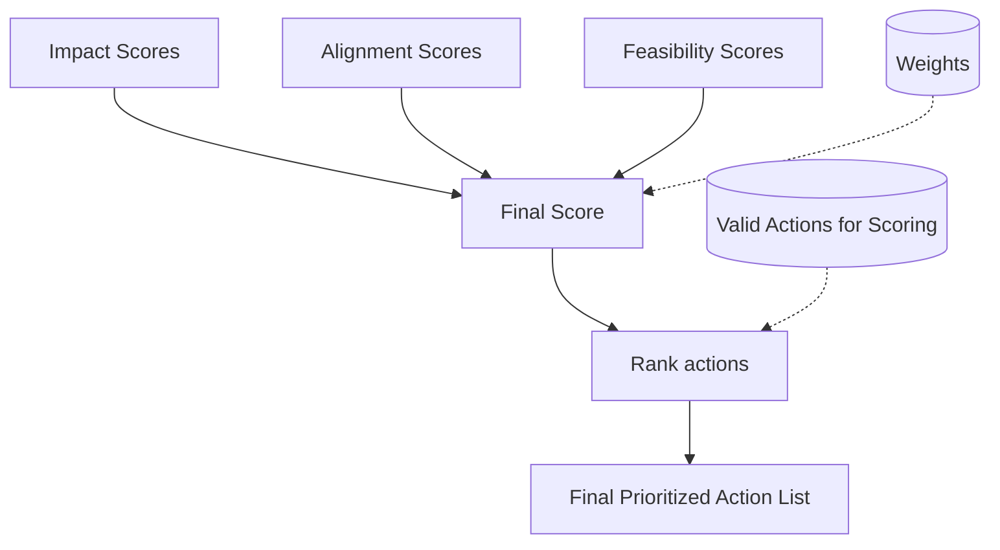

# Detailed block architecture

## Implementation status

| Block        | Sub-feature                                    | Status                                           |
| ------------ | ---------------------------------------------- | ------------------------------------------------ |
| Hard Filter  | Exclusion by `action_id`                       | Partially implemented (resolver is a stub, so no actions are excluded from free text yet) |
| Hard Filter  | Legal requirement check                        | Implemented                                      |
| Impact       | GPC reference evidence collection              | Implemented                                      |
| Impact       | Activity relevance × reduction band × timeline | Implemented                                      |
| Alignment    | Policy + sector + other components             | Implemented (`other` currently stubbed as `0.0`) |
| Feasibility  | Soft legal + socio-economic weighted component | Implemented                                      |
| Weighted Sum | Weighted aggregation, sort, rank, `top_n`      | Implemented                                      |

---

## Hard Filter Architecture

This block removes actions that are not eligible before any scoring happens. It applies two binary checks:

1. Explicit city exclusions
2. Hard legal requirements (must be satisfied, otherwise remove)

Biome filtering is intentionally not included yet.

### Inputs (and where they come from)

- **All mitigation actions**
  - Source: `Action` (core actions list)
- **City exclusions**
  - Source: frontend request `excludedActionsFreeText`
  - Current behavior: `_resolve_excluded_action_ids_from_text(...)` is a stub that always returns an empty set, so no action is excluded by free text yet
- **Hard legal requirements per action**
  - Source: legal requirements client payload (mock/API), filtered to hard strengths (`mandatory|required`)

### Outputs

- **Filtered actions list**
  - Output: `Valid Actions for Scoring` (these proceed to Impact, Alignment, Feasibility)
- **Discarded actions**
  - Output: discarded due to exclusions or hard legal mismatch (useful for traceability and debugging)

## Impact Architecture

Impact answers: **How much emissions reduction potential does this action have in this specific city?**

It combines:

- Activity relevance (city emissions in the activities the action targets)
- Reduction potential band (band converted to a multiplier)
- Timeline modifier (optional small boost for quicker wins)

### Inputs (and where they come from)

- City emissions, activity-level
  - Source: frontend request `requestData.cityDataList[].cityEmissionsData.gpcData[*].activities[*].totalEmissions`
- Action to activity targeting (`gpc_ref` mapping)
  - Source: `Action.emissions`
- Reduction potential band
  - Source: `Action.emissions["impact_text"]` with configurable mapping (`very low` to `very high`)
- Timeline
  - Source: `Action.timelineForImplementation`
- Candidate actions (already hard-filtered)
  - Source: Hard Filter output: `Valid Actions for Scoring`

### Outputs

- Impact scores per action
  - Output: `Impact Scores` (one score per action, used in final ranking)
- Optional trace fields
  - Output: `Impact Evidence` (top contributing activities and multipliers)

Canonical score policy:

- Impact uses weighted-sum components in `0..1`.
- Canonical score formula:
  - `IMPACT_SCORE = (IMPACT_WEIGHT_REDUCTION_SHARE * reduction_component) + (IMPACT_WEIGHT_TIMELINE * timeline_component)`
- No run-relative max-normalization is applied.

Current implementation detail:

- `impact_block_score = (0.80 × reduction_share_of_city_emissions) + (0.20 × timeline_score)`
- `reduction_share_of_city_emissions` is computed from matched action `gpc_reference_number` keys only.

---

## Alignment Architecture

Alignment answers: **Does this action align with what the city and policy environment are trying to achieve?**

It combines:

- Policy signals (supports, targets, funds, constrains)
- City strategic preferences (priority sectors and political priorities)

Exclusions are handled in the Hard Filter stage, so Alignment only scores eligible actions.

### Inputs (and where they come from)

- Policy support score and signals
  - Source: `actions_policy_signals_api_mock.json` (`policy_support_score`, `policy_signals[]`)
- City strategic preference sectors
  - Source: frontend request `cityStrategicPreferenceSectors`
- City strategic preference other text (currently stubbed as `0.0`)
  - Source: frontend request `cityStrategicPreferenceOther`
- Action sector mapping for city preference overlap
  - Source: `Action.emissions["sector_number"]`
- Candidate actions (already hard-filtered)
  - Source: `Valid Actions for Scoring`

### Outputs

- Alignment scores per action
  - Output: `Alignment Scores` (one score per action, used in final ranking)
- Optional trace fields
  - Output: `Alignment Evidence` (component values, weights, contributions, sector diagnostics, policy summaries)

---

## Feasibility Architecture

Feasibility answers: **Can this city realistically implement this action?**

It combines:

- Legal feasibility using soft signals for boosts and penalties
- Socio-economic fit via action-defined fit rules applied to city indicator buckets

Hard legal requirements are enforced in the Hard Filter stage.

### Inputs (and where they come from)

- Legal requirement rows by action
  - Source: `actions_legal_api_mock.json` grouped by `action_id`
- Soft legal strengths used in scoring
  - Source: legal requirements where `strength in {recommended, optional}`
- Informational legal constraints (evidence only)
  - Source: legal requirements where `strength == informational`
- Socio-economic indicator buckets for the city
  - Source: city indicators (`attribute_category`) from `city_api_mock.json`
- Action socio-economic fit rules
  - Source: `Action.socioeconomic_indicators` (`indicator_key`, `direction`, `weight`, `rationale`)
- Candidate actions (already hard-filtered)
  - Source: `Valid Actions for Scoring`

Known mock-data limitation:

- City indicators currently expose keys including `transport_logistics_employment` and `electricity_access`.
- Action socioeconomic rules in `actions_api_mock_v2.json` currently include `employment_in_transport_and_logistics` and `electricity_access_rate`.
- Without key aliasing/normalization, these rule keys miss city bucket lookup and produce zero contribution for those indicators.

### Outputs

- Feasibility scores per action
  - Output: `Feasibility Scores` (one score per action, used in final ranking)
- Optional trace fields
  - Output: `Feasibility Evidence` (counts by strength/status, component values, per-indicator contributions)

---

## Weighted Sum Architecture

This step combines the three pillar scores into a single ranking score and produces the prioritized list.

### Inputs (and where they come from)

- Impact scores
  - Source: Impact block output: `Impact Scores`
- Alignment scores
  - Source: Alignment block output: `Alignment Scores`
- Feasibility scores
  - Source: Feasibility block output: `Feasibility Scores`
- Weights
  - Source: configuration (recommended ranges: Impact 50 to 60 percent, Alignment 20 to 25 percent, Feasibility 20 to 30 percent)
- Candidate actions
  - Source: `Valid Actions for Scoring`

### Outputs

- Final prioritized action list
  - Output: `ranked_action_ids` plus `ranked_actions[]` payload items containing `rank`, pillar scores, final score, compact `evidence_summary`, and `explanation` placeholder

