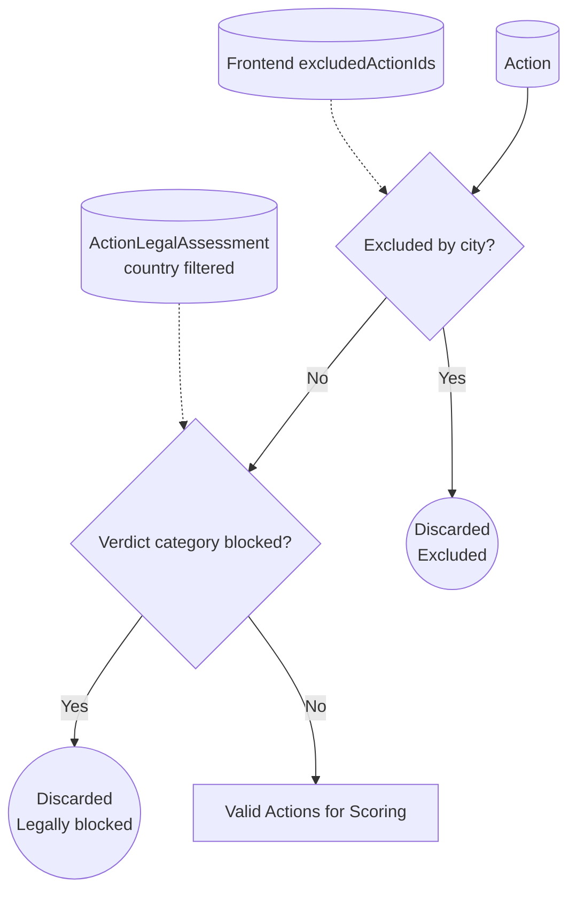
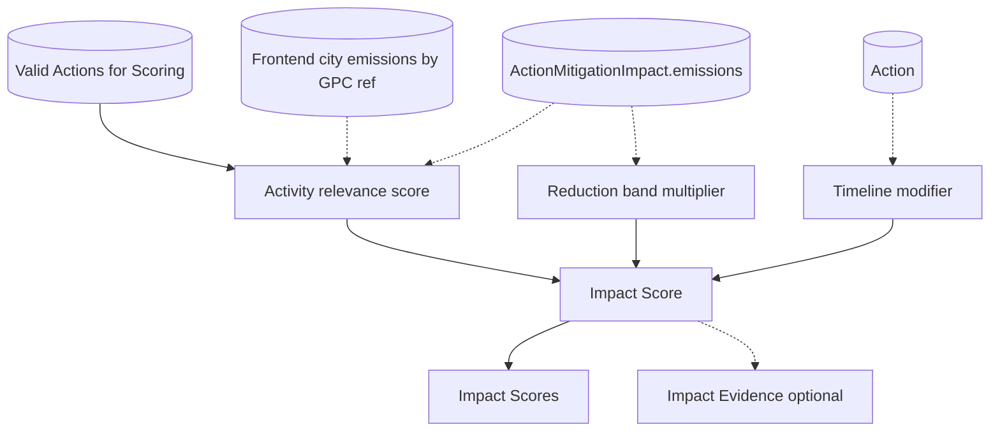
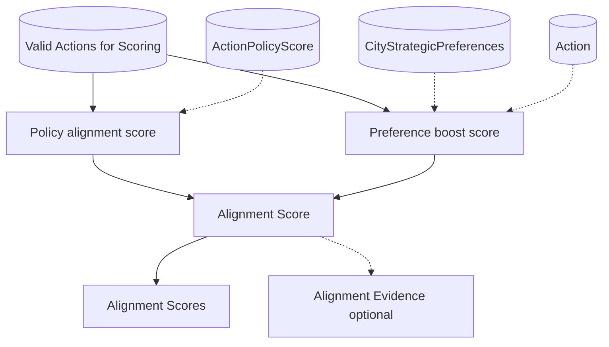
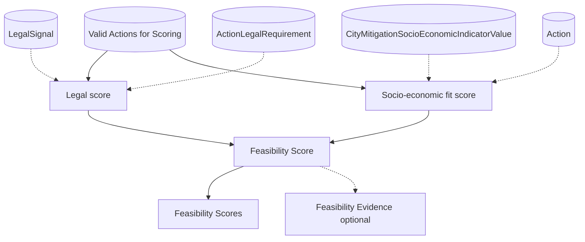
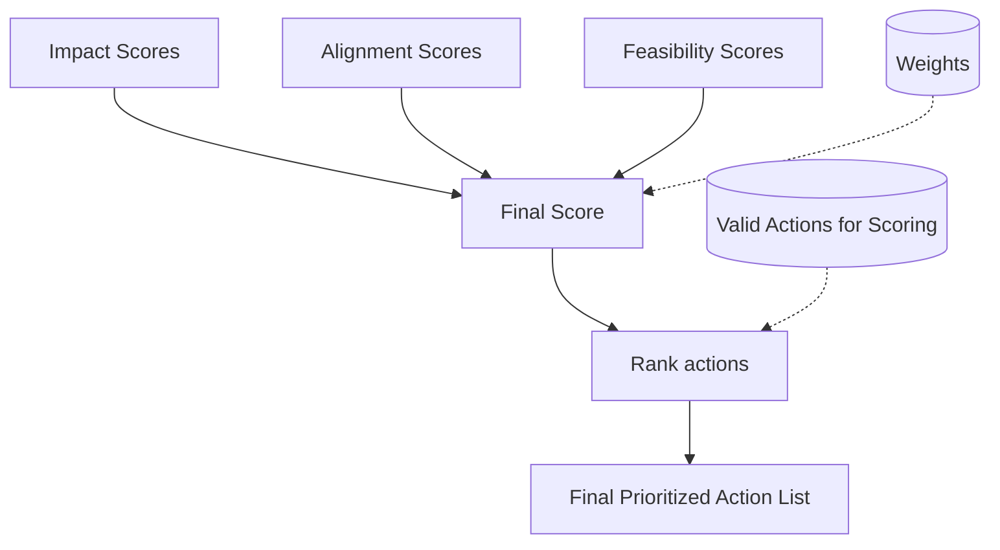

# Detailed block architecture

## Implementation status

| Block        | Sub-feature                                    | Status                                           |
| ------------ | ---------------------------------------------- | ------------------------------------------------ |
| Exclusion Preview | Sector, co-benefit, and guarded free-text proposal | Implemented |
| Hard Filter  | Confirmed exclusion by `action_id`             | Implemented                                      |
| Hard Filter  | Legal verdict check                            | Implemented                                      |
| Impact       | GPC reference evidence collection              | Implemented                                      |
| Impact       | Activity relevance x reduction band x timeline | Implemented                                      |
| Alignment    | Policy + sector + other components             | Implemented (`other` uses direct co-benefit selections plus normalized selected co-benefit scoring) |
| Feasibility  | Legal verdict score + socio-economic weighted component | Implemented                                      |
| Weighted Sum | Weighted aggregation, sort, rank, `top_n`      | Implemented                                      |

---

## Hard Filter Architecture

This block removes actions that are not eligible before any scoring happens. It applies two binary checks:

1. Confirmed city exclusions
2. Legal verdict screening (`blocked` actions are removed)

Biome filtering is intentionally not included yet.

### Inputs (and where they come from)

- **All mitigation actions**
  - Source: `Action` (core actions list)
- **Confirmed city exclusions**
  - Source: caller request `excludedActionIds[]`, usually confirmed after `POST /v1/prioritize/exclusions/preview`
  - Current behavior: each matching `action_id` is discarded before legal filtering
- **Legal assessment per action**
  - Source: legal assessments client payload (mock/API), filtered by request `countryCode`

### Outputs

- **Filtered actions list**
  - Output: `Valid Actions for Scoring` (these proceed to Impact, Alignment, Feasibility)
- **Discarded actions**
  - Output: discarded due to exclusions or hard legal mismatch (useful for traceability and debugging)

## Impact Architecture

Impact answers: **How much emissions reduction potential does this action have in this specific city?**

It combines:

- Activity relevance (city emissions in the activities the action targets)
- Reduction potential band (band converted to a multiplier)
- Timeline modifier (optional small boost for quicker wins)

### Inputs (and where they come from)

- City emissions, activity-level
  - Source: caller request `requestData.cityDataList[].cityEmissionsData.gpcData[*].activities[*].totalEmissions`
- Action to activity targeting (`gpc_ref` mapping)
  - Source: `Action.emissions`
- Reduction potential band
  - Source: `Action.emissions["impact_text"]` with configurable mapping (`very low` to `very high`)
- Timeline
  - Source: `Action.timelineForImplementation`
- Candidate actions (already hard-filtered)
  - Source: Hard Filter output: `Valid Actions for Scoring`

### Outputs

- Impact scores per action
  - Output: `Impact Scores` (one score per action, used in final ranking)
- Optional trace fields
  - Output: `Impact Evidence` (top contributing subsectors and multipliers)

Canonical score policy:

- Impact uses weighted-sum components in `0..1`.
- Canonical score formula:
  - `IMPACT_SCORE = (IMPACT_WEIGHT_REDUCTION_SHARE * reduction_component) + (IMPACT_WEIGHT_TIMELINE * timeline_component)`
- No run-relative max-normalization is applied.
- Negative `V.*` AFOLU inventory values remain valid input data, but Impact only scores reducible emissions.
  - Subsector matching for Impact uses strictly positive city emissions only.
  - The reduction denominator also sums strictly positive city emissions only.
  - This is intentional: existing removals are treated as valid inventory context, not as emissions that an action can reduce further.

Current implementation detail:

- `impact_block_score = (0.80 x reduction_share_of_city_emissions) + (0.20 x timeline_score)`
- `reduction_share_of_city_emissions` is computed from matched action `sector.subsector` keys.

---

## Alignment Architecture

Alignment answers: **Does this action align with what the city and policy environment are trying to achieve?**

It combines:

- Action policy scores (supports, targets, funds, constrains)
- City strategic preferences (priority sectors, timeframe preferences, and political priorities)

Exclusions are handled in the Hard Filter stage, so Alignment only scores eligible actions.

### Inputs (and where they come from)

- Policy support score and signals
  - Source: `action_policy_scores_api_mock.json` (`policy_support_score`, `policy_evidence[]`)
- City strategic preference sectors
  - Source: caller request `cityStrategicPreferenceSectors`
- City strategic preference timeframes
  - Source: caller request `cityStrategicPreferenceTimeframes`
- Action implementation timeline
  - Source: `Action.timelineForImplementation`
- City strategic preference co-benefit keys
  - Source: caller request `cityStrategicPreferenceCoBenefitKeys`, validated against the allowed co-benefit taxonomy
- Action sector mapping for city preference overlap
  - Source: `Action.emissions["sector_number"]`
- Candidate actions (already hard-filtered)
  - Source: `Valid Actions for Scoring`

### Outputs

- Alignment scores per action
  - Output: `Alignment Scores` (one score per action, used in final ranking)
- Optional trace fields
  - Output: `Alignment Evidence` (component values, weights, contributions, sector diagnostics, timeframe diagnostics, policy summaries, resolved preferred co-benefits, unmappable fragments, matched preferred co-benefits, mapping source/model)

---

## Feasibility Architecture

Feasibility answers: **Can this city realistically implement this action?**

It combines:

- Legal feasibility using the direct legal verdict score
- Socio-economic fit via action-defined fit rules applied to city indicator buckets

Blocked legal verdicts are enforced in the Hard Filter stage.

### Inputs (and where they come from)

- Legal assessment rows by action
  - Source: `actions_legal_api_mock.json` filtered by `countryCode` and mapped by `srcActionId`
- Legal verdict score used in scoring
  - Source: `verdictScore`
- Legal evidence fields
  - Source: `ownership*`, `restrictions*`, `legalJustification*`, `legalReferences`, and timestamps
- Mitigation feasibility scores for the city
  - Source: `action_mitigation_feasibility_scores_api_mock.json` or the matching live endpoint, keyed by `src_action_id`
- Candidate actions (already hard-filtered)
  - Source: `Valid Actions for Scoring`

### Outputs

- Feasibility scores per action
  - Output: `Feasibility Scores` (one score per action, used in final ranking)
- Optional trace fields
  - Output: `Feasibility Evidence` (legal component values, fallback source, per-indicator contributions)

---

## Weighted Sum Architecture

This step combines the three pillar scores into a single ranking score and produces the prioritized list.

### Inputs (and where they come from)

- Impact scores
  - Source: Impact block output: `Impact Scores`
- Alignment scores
  - Source: Alignment block output: `Alignment Scores`
- Feasibility scores
  - Source: Feasibility block output: `Feasibility Scores`
- Weights
  - Source: configuration (recommended ranges: Impact 50 to 60 percent, Alignment 20 to 25 percent, Feasibility 20 to 30 percent)
- Candidate actions
  - Source: `Valid Actions for Scoring`

### Outputs

- Final prioritized action list
  - Output: `ranked_action_ids` plus `ranked_actions[]` payload items containing `rank`, pillar scores, final score, compact `evidence_summary`, and optional `explanation`

