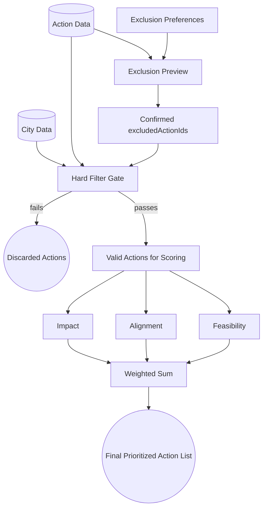

# High-Level Prioritization Architecture

This diagram illustrates the top-level data flow. Exclusion preferences are first resolved into a preview for user review. The ranking call then sends confirmed excluded action IDs, and the Hard Filter Gate prunes those user-confirmed exclusions plus legally blocked actions before scoring.

Current implementation note: sector and co-benefit exclusion preview rules are deterministic. Free-text exclusion preview uses a guarded OpenAI structured-output resolver only when enabled by environment config. The Alignment block also uses `cityStrategicPreferenceOther` through LLM-based co-benefit mapping and `cityStrategicPreferenceTimeframes` through a small timeline-preference component. Prioritization currently owns its run-level artifacts in the orchestrator layer, while exclusion preview currently owns them in the API layer; if preview grows, it will likely want a matching orchestrator layer too.

