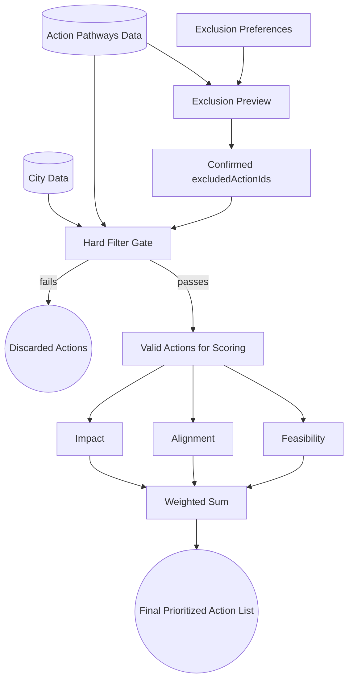

# High-Level Prioritization Architecture

This diagram illustrates the top-level data flow. Exclusion preferences are first resolved into a preview for user review. The ranking call then sends confirmed excluded action IDs, and the Hard Filter Gate prunes those user-confirmed exclusions plus legally blocked actions before scoring.

Current implementation note: exclusion preview and prioritization are separate flows. The preview flow resolves raw exclusion preferences into a reviewable proposal, while the prioritization flow consumes confirmed `excludedActionIds`. Prioritization currently owns its run-level artifacts in the orchestrator layer, while exclusion preview currently writes its artifacts from the API layer.

