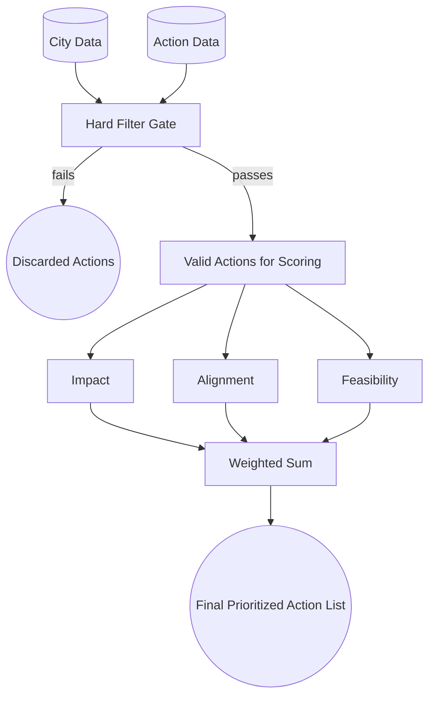

# High-Level Prioritization Architecture

This diagram illustrates the top-level data flow. A Hard Filter Gate prunes ineligible actions before the remaining valid actions enter the ranking stage and are scored across the three pillars.

