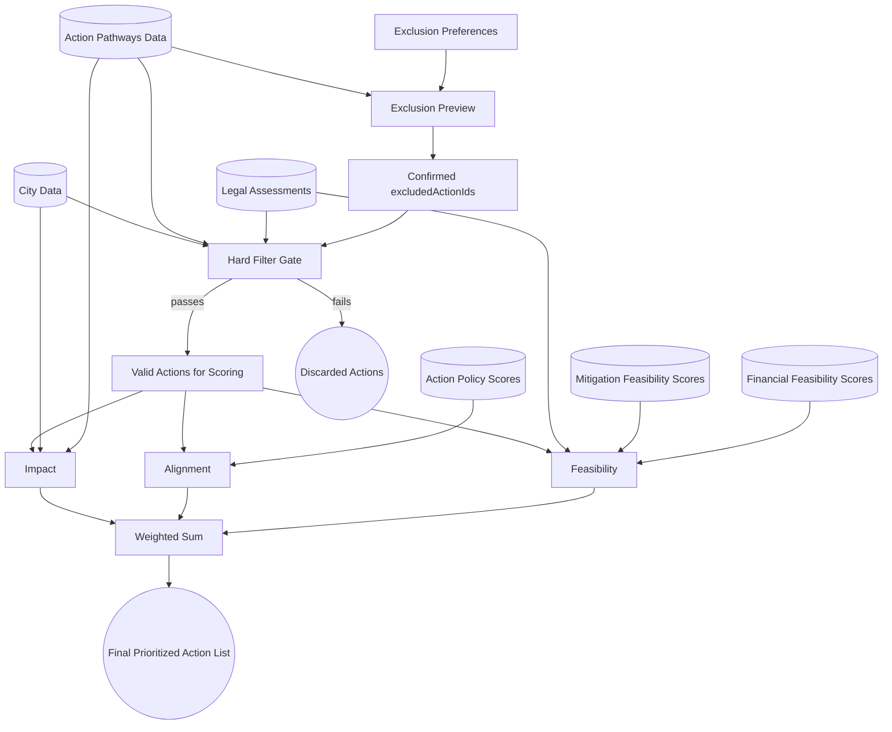

# High-Level Prioritization Architecture

This diagram illustrates the top-level data flow. Exclusion preferences are first resolved into a preview for user review. The ranking call then sends confirmed excluded action IDs, and the Hard Filter Gate prunes those user-confirmed exclusions plus legally blocked actions before scoring.

Current implementation note: exclusion preview and prioritization are separate flows. The preview flow resolves raw exclusion preferences into a reviewable proposal, while the prioritization flow consumes confirmed `excludedActionIds`. Prioritization currently owns its run-level artifacts in the orchestrator layer, while exclusion preview currently writes its artifacts from the API layer.

CityCatalyst-facing reference-data GET routes use the same injected data-client
methods as exclusion preview, prioritization, and output-plan enrichment. Those
methods call the existing endpoint-specific Global API services, so URL
construction, validation, missing-data behavior, and finance selection are not
reimplemented in route handlers or processing workflows. Public response mapping
remains at the HTTP boundary and never exposes internal `raw` payloads or upstream
diagnostic URLs.

Rules that change record membership live in shared service functions. In
particular, `select_prioritizable_actions()` in
`app/services/action_pathways_api.py` supplies the identical action set to the
action GET, exclusion preview, prioritization, and output-plan enrichment.
Response builders may select fields, localizations, aggregates, and display order,
but do not remove normalized source records. Financial rows without a source score
therefore remain visible as `null`; only the prioritization scoring block turns a
missing value into its neutral algorithm fallback.

```mermaid
graph TD
  CityData[(City Data)]
  ActionPathways[(Action Pathways Data)]
  LegalData[(Legal Assessments)]
  PolicyScores[(Action Policy Scores)]
  MitigationFeasibility[(Mitigation Feasibility Scores)]
  FinancialFeasibility[(Financial Feasibility Scores)]

  ExclusionPrefs[Exclusion Preferences]
  Preview[Exclusion Preview]
  Confirmed[Confirmed excludedActionIds]
  HardFilter[Hard Filter Gate]
  Discard((Discarded Actions))
  Valid[Valid Actions for Scoring]

  Impact[Impact]
  Alignment[Alignment]
  Feasibility[Feasibility]

  WeightedSum[Weighted Sum]
  FinalList((Final Prioritized Action List))

  ActionPathways --> Preview
  ExclusionPrefs --> Preview
  Preview --> Confirmed
  CityData --> HardFilter
  ActionPathways --> HardFilter
  LegalData --> HardFilter
  Confirmed --> HardFilter

  HardFilter -- fails --> Discard
  HardFilter -- passes --> Valid

  Valid --> Impact
  Valid --> Alignment
  Valid --> Feasibility

  CityData --> Impact
  ActionPathways --> Impact
  PolicyScores --> Alignment
  LegalData --> Feasibility
  MitigationFeasibility --> Feasibility
  FinancialFeasibility --> Feasibility

  Impact --> WeightedSum
  Alignment --> WeightedSum
  Feasibility --> WeightedSum

  WeightedSum --> FinalList
```
