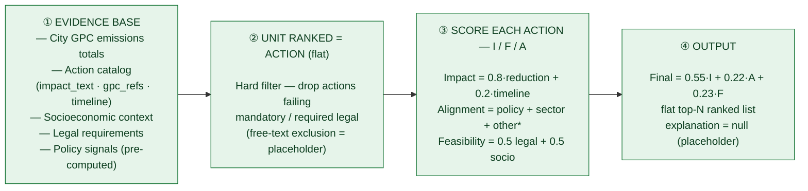
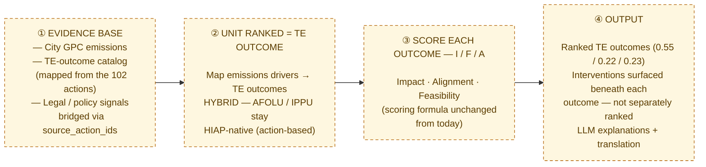
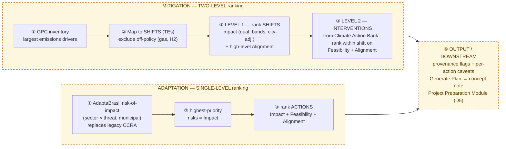
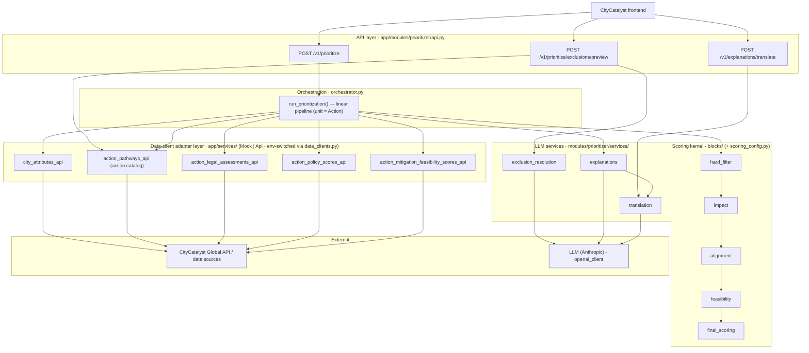
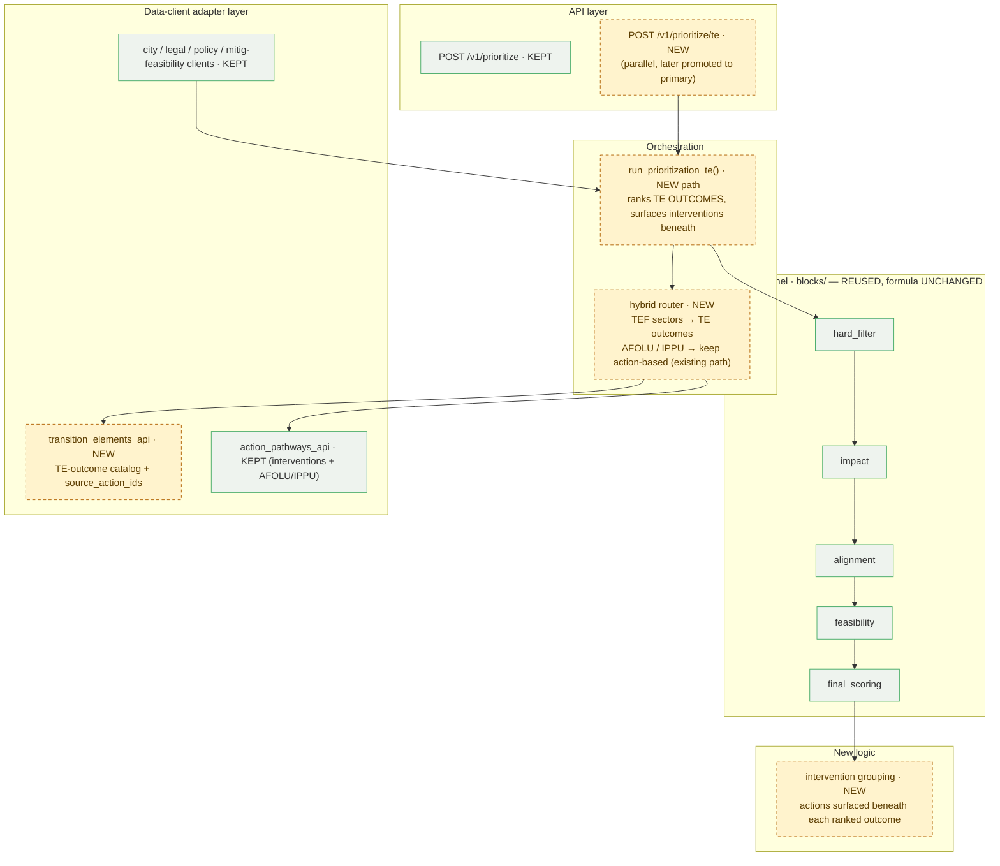
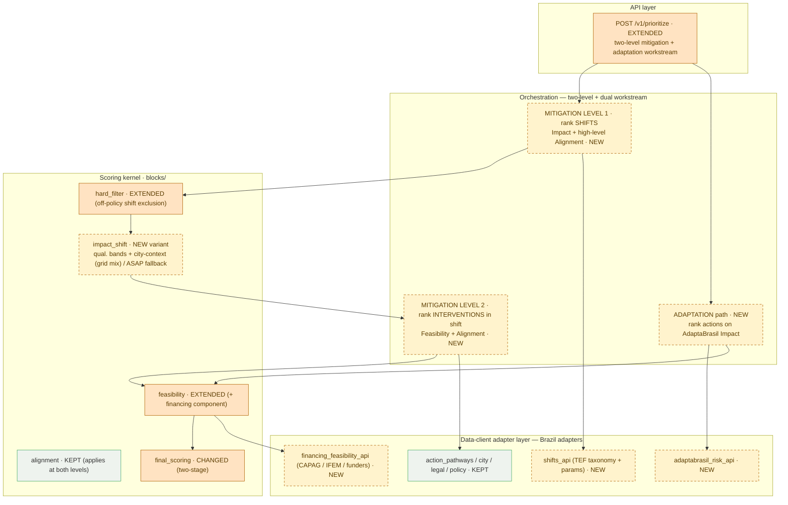

# HIAP / MEED+ — Methodology Variants & Technical Migration

> **Status:** Draft for team review
> **Prepared by:** Martin Wainstein · **Owner:** TBD (proposed: OEF Methodology Owner)
> **Last updated:** 2026-06-16
> **Source of truth:** `hiap-meed` service (as-built diagrams generated from `orchestrator.py` + `api.py`)

This document compares the three live variants of the HIAP prioritization methodology — **what is built today**, the **proposed Chile (MEED+ / Option B)** direction, and the **proposed Brazil (City Climate Compass, Phase 3)** direction — at two levels: the **conceptual methodology** and the **technical architecture / code migration**.

The aim is one shared reference so the team can see where the variants converge, where they diverge, and what actually changes in the codebase to get from here to there.

---

## TL;DR

- **There is one methodology kernel, instanced per country.** All three variants share the same scoring spine — **Impact / Feasibility / Alignment (I/F/A)** — and increasingly the same **Transition Element Framework (TEF)** substrate. They are not three different products.
- **The codebase already mirrors a "kernel + adapter" split.** The scoring `blocks/` are a country-agnostic kernel; the `app/services/*` data clients (Mock | Api, env-switched) are the adapter layer. This makes both migrations **additive — new data clients + orchestrator paths — not rewrites.**
- **One open decision gates both teams:** *where the I/F/A pillars attach.* Chile's Option B scores the full formula **once at the outcome level**; Brazil scores **Impact+Alignment at the shift level, then Feasibility+Alignment at the intervention level** (two-level). This should be decided once, for the kernel.
- **The only refactor that touches the kernel** is generalizing the ranking unit from `Action` to a small protocol that `Action / TEOutcome / Shift / Intervention` all satisfy. Do it once; both instances inherit it.

---

## Current-state diagnostic: a distributed-documentation problem

**Why this document exists.** HIAP's knowledge is real and detailed, but it is **scattered across four homes with no single source of truth.** That makes the project hard to onboard onto, and it creates a standing risk that the Chile and Brazil instances drift apart *by accident* rather than by decision. This document is the first corrective step — one place that puts the variants and the as-built architecture side by side, kept next to the code.

**Where HIAP knowledge currently lives**

| Layer | Home | What's authoritative there |
|---|---|---|
| Code / as-built | repo `hiap-meed/` | the running engine — ground truth for "what is built" |
| Methodology design | Notion (HIAP v3 / MEED+ hub → nested folders, e.g. *Ranking Model Implementation Documents*) | intended methodology, Option B, TEF |
| Product / contract | Google Drive (SSG-owned) | PRD, Model Accuracy Validation Framework, Output Template |
| Data / curation | Google Drive (`03_Modules`, `05_Shared_Reference_Data`) | action bank, the waste-sector Minuta |

**Symptoms observed**

- **Naming proliferation.** *HIAP v3 / MEED+ / Mitigation Accelerator* are used interchangeably; "MEED" has two different expansions plus an unrelated legacy 2021 meaning; "Option B" is defined only in the Knowledge Base; the **DOC-A…H register exists only inside the CORFO Compendium and does not match the actual page titles** — a parallel naming system only one document understands.
- **Doc–code drift.** The as-built `pipeline-description` states alignment as `0.80` (three-term) while `scoring_config.py` is `0.75` (four-term); the `0.50/0.30/0.20` sample request override is sometimes cited as the default instead of the real `0.55/0.22/0.23`.
- **No comparative artifact (until now).** Repo docs cover only the as-built engine; the proposed Chile and Brazil directions live only in Notion/Drive; nothing put them side by side.
- **Distributed methodology authority.** OEF owns the code and platform (AGPL), but the methodology is co-designed per partner — C40 owns the Brazil shifts/parameters/intervention lists; SSG owns the Chile PRD — and the TEF taxonomy originates with C40/ClimateView. So "the methodology" has no single owner.
- **Stale-but-unmarked docs.** Superseded plans (e.g. an earlier 10-city / 13-expert validation design) remain live with no status flag.

**Consequence & direction.** The fix is the **kernel + adapter** model plus basic documentation hygiene: one OEF-owned methodology-kernel spec as the canonical source, country adapters layered on top, a **status header on every doc**, and a **single hub that links rather than duplicates.** Concretely:

1. Declare the naming taxonomy (HIAP = kernel; MEED+ / City Climate Compass = instances) and retire ad-hoc codes.
2. Name an OEF Methodology Owner who owns the kernel spec; partner co-design contributes to the *adapter* layer.
3. Keep the methodology-of-record next to the code (this `docs/` folder); mirror to Notion for partner navigation.
4. Mark stale docs; cite parameters by `file:line` rather than restating them.

This document is item 3 in action: a kernel-vs-adapter view of the methodology and architecture, versioned alongside the engine it describes.

---

## Part 1 — Conceptual methodology (three variants)

Shared backbone for comparison: **① Evidence base → ② Unit ranked → ③ Score (I / F / A) → ④ Output.**
The I/F/A scoring band is the constant (the kernel); what moves between variants is the **unit** the pillars attach to and **how many levels**.

### 1.1 Built today — running now (Chile / Iquique)

\* Alignment sub-weights are the one spot where code (`scoring_config.py`, four-term `0.75/0.15/0.05/0.05`) and the `pipeline-description` doc (three-term `0.80/0.15/0.05`) disagree.

### 1.2 Chile MEED+ — proposed (Option B / TEF)

Same scoring formula; the **unit of ranking** moves from actions to **Transition-Element outcomes**. Interventions are surfaced beneath, not separately ranked. Mitigation-only. Not yet built.

### 1.3 Brazil City Climate Compass — proposed (Phase 3)

Mitigation becomes **two-level** (rank shifts, then interventions beneath); adaptation re-anchored on **AdaptaBrasil** indices (single-level). Co-designed with C40 / I Care. Feasibility (both streams) = legal + financing + socioeconomic.

### 1.4 Where the three diverge (the implications)

| Axis | ① Built today | ② Chile MEED+ (proposed) | ③ Brazil CCC (proposed) |
|---|---|---|---|
| **Unit ranked** | Action (flat) | TE outcome (flat; interventions beneath) | **Shift → intervention (two-level)** + adaptation action (flat) |
| **Where the pillars attach** | All 3 at the action | All 3 at the outcome | **Split:** Impact+Align at shift, Feas+Align at intervention; all 3 at action for adaptation |
| **Scope** | Mitigation | Mitigation only | **Mitigation + adaptation** |
| **Impact basis** | impact_text × matched emissions share | same impact_text, on outcomes | shift-level activity-model bands / ASAP fallback, city-context-adjusted (mit) · AdaptaBrasil indices (adapt) |
| **Feasibility** | legal + socio (financing deferred) | legal + socio | **legal + financing + socio** |
| **TEF role** | none — flat actions | ranking *unit* = TEs | taxonomy **+ two-level structure** |
| **Status** | ✅ running | designed, not built | proposed, in co-design |
| **Partner / authority** | OEF | OEF + SSG | OEF + C40 / I Care |

The two rows that drive the conversation are **"Unit ranked"** and **"Where the pillars attach."** Chile and Brazil both move off flat actions onto the TEF substrate (the convergence) — but Brazil ranks at two levels while Chile's Option B ranks once at the outcome (the open kernel decision).

---

## Part 2 — Technical architecture & migration (from code)

Built from `hiap-meed` (FastAPI). Layers: **API → orchestrator → scoring kernel (`blocks/`) → data-client adapters (`app/services/`, Mock | Api) → external.**
Legend: **KEPT/reused** · **NEW module** · **CHANGED**.

### 2.1 As-built — the running service (call graph)

3 endpoints → `run_prioritization()` linear pipeline (ranking unit = **Action**) → 5 data clients + 5 kernel blocks + 3 LLM services.

### 2.2 Chile MEED+ migration (Option B / TEF) — additive

New `/v1/prioritize/te` + `run_prioritization_te()` rank **TE outcomes**; one new data client (`transition_elements_api`); kernel blocks reused unchanged; interventions grouped beneath; AFOLU/IPPU keep the existing action path (hybrid).

### 2.3 Brazil CCC migration (two-level + adaptation) — larger delta

Two-stage ranking (shifts → interventions), a new `impact_shift` variant, two-stage `final_scoring`, a financing component in feasibility, plus an adaptation branch on AdaptaBrasil — and three Brazil data adapters.

### 2.4 Migration delta — what changes per layer (vs. the as-built code)

| Layer / module | As-built | Chile (Option B) | Brazil (two-level + adaptation) |
|---|---|---|---|
| **API endpoint** | `/v1/prioritize` · `/exclusions/preview` · `/explanations/translate` | **+ `/v1/prioritize/te`** (parallel → primary) | **extend `/v1/prioritize`** (two-level + adaptation) |
| **Orchestrator** | `run_prioritization()` — linear, unit = Action | **+ `run_prioritization_te()`** + hybrid router | **two-level passes** + adaptation branch |
| **Ranking unit** (`internal_models`) | `Action` | **+ `TransitionElementOutcome`** (source_action_ids) | **+ `Shift`, `Intervention`** + adaptation Action |
| **hard_filter** | legal + exclusions | reused | **+ off-policy shift exclusion** |
| **impact** | action-level (impact_text × emissions share) | reused on outcomes | **+ `impact_shift`** (bands + city-context); adaptation = AdaptaBrasil |
| **alignment** | policy + sector + co-benefit + timeframe | reused | applies at shift & intervention |
| **feasibility** | legal + socioeconomic | reused | **+ financing component** |
| **final_scoring** | single weighted top-N | nested outcome → interventions | **two-stage** (shift, then intervention) |
| **Data clients** (adapters) | city · action_pathways · legal · policy · mitig-feasibility | **+ `transition_elements_api`** | **+ `shifts_api` · `adaptabrasil_risk_api` · `financing_feasibility_api`** |
| **LLM services** | exclusion · explanations · translation | reused | reused + Generate-Plan enhancements (downstream) |

---

## Part 3 — Findings & recommendations

1. **Treat the scoring kernel as a shared, OEF-owned asset.** The `blocks/` + `scoring_config.py` + orchestrator contract are the country-agnostic core. Both Chile and Brazil should consume it, not fork it. Partner co-design (C40, SSG) is contribution to the *adapter* layer, not the core.

2. **Make the one kernel decision now: where the pillars attach.** Chile (full I/F/A at the outcome) vs. Brazil (Impact+Align at shift, Feas+Align at intervention). Brazil's split is arguably the better design — feasibility genuinely lives at the intervention level — but it must be a deliberate shared choice, decided once. This is time-sensitive: both teams are building TEF-based ranking in parallel.

3. **The shared refactor that unblocks both:** generalize the ranking unit from `Action` to a protocol (`Action / TEOutcome / Shift / Intervention`), and let the orchestrator rank at one or two levels. Everything else is new adapters bolted onto an unchanged scoring core.

4. **Reconcile the feasibility sub-model.** Three compositions exist today (Chile code: legal + socio; Chile waste Minuta: legal + governance + financing; Brazil: legal + financing + socio). Define feasibility as a composite of *pluggable components* with per-instance configuration, rather than three divergent implementations.

5. **Keep the diagrams next to the code.** This file is the source of truth; mirror to Notion for partner-facing navigation, export to docx only for formal deliverables.

---

## Caveats & provenance

- **The as-built diagram (§2.1) is exact** — read from `orchestrator.py` and `api.py`.
- **The migration diagrams (§2.2, §2.3) are proposed target architectures** — faithful to the specs and to this codebase's structure, but the new module names (`run_prioritization_te`, `impact_shift`, `shifts_api`, etc.) are *suggested*, not existing.
- **Default pillar weights** are `0.55 / 0.22 / 0.23` per `scoring_config.py` (the `0.50/0.30/0.20` seen in some docs is a sample request override, not the default).

### Canonical sources
- Code: `hiap-meed/app/modules/prioritizer/{orchestrator,api,scoring_config}.py`, `blocks/`, `app/services/*`
- Methodology (as-built): `docs/pipeline-description.md` (a.k.a. DOC-A) and its Notion mirror
- Chile Option B: Notion "Transition to TEF-Based Ranking" (DOC-E) + "Integrating TEF into HIAP"
- Brazil: "Advancing Methodological Convergence and Project Structuring for the City Climate Compass" (Phase 3 proposal, Annex B)
- Product/contract: "MEED Mitigation Accelerator Product Requirements v1.0" (Drive)
