# Scoring Weights Overview

This diagram summarizes the scoring weights currently implemented in the `hiap-meed` prioritization pipeline.

```mermaid
%%{init: {"flowchart": {"nodeSpacing": 38, "rankSpacing": 48, "curve": "basis"}, "themeVariables": {"lineColor": "#7a7a7a"}} }%%
flowchart TD
    FS["Final Score"]
    FS -->|0.55| IMP["Impact Pillar"]
    FS -->|0.22| ALN["Alignment Pillar"]
    FS -->|0.23| FEA["Feasibility Pillar"]

    IMP -->|0.80| IMP_RED["Emissions Reduction Share of City Total"]
    IMP -->|0.20| IMP_TIME["Timeline Component"]

    IMP_TIME -->|1.0| IMP_T_SHORT["<5 years"]
    IMP_TIME -->|0.5| IMP_T_MED["5-10 years"]
    IMP_TIME -->|0.0| IMP_T_LONG[">10 years"]
    IMP_TIME -->|0.5| IMP_T_UNKNOWN["Missing / Unknown timeline"]

    IMP_RED --> IMP_BAND["Impact Text Multiplier"]
    IMP_BAND -->|0.2| BAND_VLOW["very low"]
    IMP_BAND -->|0.4| BAND_LOW["low"]
    IMP_BAND -->|0.6| BAND_MED["medium"]
    IMP_BAND -->|0.8| BAND_HIGH["high"]
    IMP_BAND -->|1.0| BAND_VHIGH["very high"]

    ALN -->|0.75| ALN_POL["Policy Component"]
    ALN -->|0.15| ALN_SEC["Sector Match Component"]
    ALN -->|0.05| ALN_COB["Co-benefit Preference Component"]
    ALN -->|0.05| ALN_TIME["Timeframe Preference Component"]

    ALN_POL -->|direct 0..1 input| POL_SCORE["policy_support_score"]
    POL_SCORE -->|fallback 0.0| POL_MISS["Missing policy score"]

    ALN_SEC -->|1.0| SEC_MATCH["Sector overlap with city preference"]
    ALN_SEC -->|0.0| SEC_NO["No sector overlap"]

    ALN_COB -->|normalize from -2..2 to 0..1| COB_NORM["Selected co-benefit impacts"]
    COB_NORM -->|0.0| COB_HARM["Most harmful aggregate"]
    COB_NORM -->|0.5| COB_NEUT["Neutral aggregate"]
    COB_NORM -->|1.0| COB_POS["Most beneficial aggregate"]
    ALN_COB -->|0.5| COB_NONE["No co-benefits selected"]

    ALN_TIME -->|1.0| ALN_TIME_EXACT["Exact timeframe match"]
    ALN_TIME -->|0.5| ALN_TIME_ADJ["Adjacent match"]
    ALN_TIME -->|0.0| ALN_TIME_FAR["Far mismatch"]
    ALN_TIME -->|0.5| ALN_TIME_NOPREF["no_preference / no supported preference"]
    ALN_TIME -->|0.5| ALN_TIME_UNKNOWN["Missing / Unknown action timeline"]

    FEA -->|0.34| FEA_LEG["Legal Verdict Component"]
    FEA -->|0.33| FEA_MIT["Mitigation Feasibility Component"]
    FEA -->|0.33| FEA_FIN["Financial Feasibility Component"]

    FEA_LEG -->|direct 0..1 input| LEG_SCORE["verdictScore"]
    LEG_SCORE -->|0.5 fallback| LEG_MISS["Missing legal row or verdictScore"]

    FEA_MIT -->|direct 0..1 input| MIT_SCORE["action_score"]
    MIT_SCORE -->|0.5 fallback| MIT_MISS["Missing row or action_score"]

    FEA_FIN -->|direct 0..1 input| FIN_SCORE["financial_feasibility"]
    FIN_SCORE -->|route/reason retained| FIN_EVID["Compact finance evidence"]
    FIN_SCORE -->|0.5 fallback| FIN_MISS["Missing row or financial_feasibility"]

```

## Notes

- `0.5` is not universally neutral across all components.
- `0.5` is the intended neutral fallback for missing legal, mitigation feasibility, or financial feasibility rows in the Feasibility block.
- Impact emissions share now uses scoring magnitude rather than raw signed inventory:
  - AFOLU `V.*` contributes `abs(totalEmissions)` in both the numerator and denominator.
  - Non-AFOLU subsectors contribute only when `totalEmissions > 0`.
  - This denominator is not the city's signed net emissions total; it is a ranking-only climate-relevant magnitude.
- Timeline is scored differently in Impact and Alignment:
  - Impact uses intrinsic speed scoring.
  - Alignment uses match-to-city-preference scoring.

## Weight Intuition

These examples use the current default final weights:

- Impact = `0.55`
- Alignment = `0.22`
- Feasibility = `0.23`

### Top-level pillars

- A `+0.10` change in Impact changes the final score by `+0.055`
- A `+0.10` change in Alignment changes the final score by `+0.022`
- A `+0.10` change in Feasibility changes the final score by `+0.023`

This means Impact is a bit more than twice as influential as Alignment or Feasibility in the final ranking.

### Impact examples

- Impact timeline has internal weight `0.20`, so a full `1.0` swing inside that component changes:
  - Impact score by `0.20`
  - Final score by `0.55 * 0.20 = 0.11`

- Example: changing Impact timeline from missing/unknown `0.5` to short `<5 years = 1.0`
  - Impact score change = `+0.10`
  - Final score change = `+0.055`

- Example: changing Impact timeline from long `0.0` to short `1.0`
  - Impact score change = `+0.20`
  - Final score change = `+0.11`

- Impact emissions reduction share has internal weight `0.80`, so a `+0.10` change there changes:
  - Impact score by `+0.08`
  - Final score by `0.55 * 0.08 = 0.044`

### Alignment examples

- Policy support has internal weight `0.75`, so a `+0.10` change in `policy_support_score` changes:
  - Alignment score by `+0.075`
  - Final score by `0.22 * 0.075 = 0.0165`

- Sector match is binary with internal weight `0.15`
  - no match `0.0` -> match `1.0`
  - Alignment score change = `+0.15`
  - Final score change = `0.22 * 0.15 = 0.033`

- Timeframe preference has internal weight `0.05`
  - far mismatch `0.0` -> exact match `1.0`
  - Alignment score change = `+0.05`
  - Final score change = `0.22 * 0.05 = 0.011`

- Co-benefit preference also has internal weight `0.05`
  - harmful aggregate `0.0` -> beneficial aggregate `1.0`
  - Alignment score change = `+0.05`
  - Final score change = `0.011`

### Feasibility examples

- Legal verdict has internal weight `0.34`
  - `0.0` -> `1.0`
  - Feasibility score change = `+0.34`
  - Final score change = `0.23 * 0.34 = 0.0782`

- Mitigation feasibility has internal weight `0.33`
  - `0.5` neutral -> `1.0` very feasible
  - Feasibility score change = `+0.165`
  - Final score change = `0.23 * 0.165 = 0.03795`

- Financial feasibility has internal weight `0.33`
  - `0.5` neutral -> `1.0` very accessible finance route
  - Feasibility score change = `+0.165`
  - Final score change = `0.23 * 0.165 = 0.03795`

### Quick reading guide

- The biggest single driver in the current setup is usually Impact.
- Inside Alignment, Policy support dominates the other Alignment subcomponents.
- Alignment timeframe matters, but its effect on the final score is small relative to Impact timeline.
- Missing Impact timeline is neutral at `0.5`, so actions are not penalized just because the timeline is unknown.
