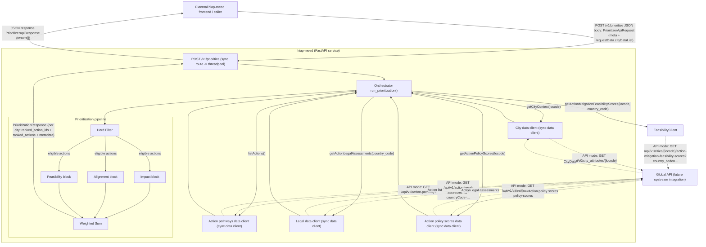
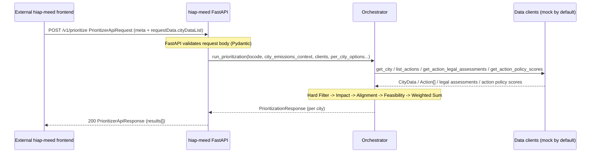

# Service Architecture

This document describes how `hiap-meed` fits into the current caller setup and how a prioritization request flows through the service.

---

## System overview

---

## Concurrency model

The `/v1/prioritize` route is a **synchronous** FastAPI route (`def`, not `async def`). FastAPI automatically offloads sync routes to a threadpool worker, so the event loop thread remains free to accept and dispatch other requests.

This is the right choice as long as the orchestrator and data clients are synchronous. If the data clients are later replaced with async counterparts (e.g. `httpx.AsyncClient`), the orchestrator and route should both be converted to `async def` / `await` end-to-end.

---

## Data client layer (current state)

| Client                    | Method                                | Status                                                                                  | Target upstream |
| ------------------------- | ------------------------------------- | --------------------------------------------------------------------------------------- | --------------- |
| City data client          | `get_city(locode)`                    | Mock/API switch (`HIAP_MEED_CITY_DATA_SOURCE`); `mock` is file-backed, `api` performs synchronous HTTP GET `/api/v0/city_attributes/{locode}` against the shared `CCGLOBAL_API_BASE_URL` (default `https://ccglobal.openearth.dev` locally; overridden in workflows per environment) | configurable city attributes API host |
| Action pathways data client | `list_actions()`                      | Mock/API switch (`HIAP_MEED_ACTION_PATHWAYS_DATA_SOURCE`); `api` performs synchronous HTTP GET `/api/v1/action-pathways` with no query parameters and returns the full upstream catalog; `mock` is file-backed | Global API |
| Legal data client         | `get_action_legal_assessments(country_code)` | Mock/API switch (`HIAP_MEED_LEGAL_DATA_SOURCE`); `mock` is file-backed, `api` performs synchronous HTTP GET `/api/v1/action-legal-assessments?countryCode=...` against the shared `CCGLOBAL_API_BASE_URL` | configurable legal assessments API host |
| Action policy scores data client | `get_action_policy_scores(locode)`    | Mock/API switch (`HIAP_MEED_ACTION_POLICY_SCORES_DATA_SOURCE`); `api` performs synchronous HTTP GET `/api/v1/cities/{locode}/action-policy-scores`; `mock` is file-backed | Global API (future) |
| Action mitigation feasibility scores data client | `get_action_mitigation_feasibility_scores(locode, country_code)` | Mock/API switch (`HIAP_MEED_ACTION_MITIGATION_FEASIBILITY_SCORES_DATA_SOURCE`); `api` performs synchronous HTTP GET `/api/v1/cities/{locode}/action-mitigation-feasibility-scores?country_code=...`; `mock` is file-backed | Global API |

Clients are injected via FastAPI's `Depends()` pattern. The city, action, legal, action policy scores, and mitigation feasibility clients default to their live upstream APIs.

Action API note:
- `GET /api/v1/action-pathways` is called without `limit`, `lang`, or other query parameters
- mitigation feasibility now comes from the separate city-scoped scores endpoint and missing action rows use the neutral `0.5` fallback in Feasibility scoring

---

## Request lifecycle

---

## Pipeline stages summary

| Stage        | Purpose                                                         | Removes / produces                      |
| ------------ | --------------------------------------------------------------- | --------------------------------------- |
| Hard Filter  | Remove ineligible actions (exclusions, blocked legal verdicts) | Discards actions; produces eligible set |
| Impact       | Score emissions reduction potential per city                    | Impact score per action                 |
| Alignment    | Score alignment with city strategy and action policy scores           | Alignment score per action              |
| Feasibility  | Score realistic implementability for the city                   | Feasibility score per action            |
| Weighted Sum | Aggregate pillar scores, sort, apply `top_n`                    | `ranked_action_ids` + `ranked_actions`  |

See [`highlevel-architecture.md`](highlevel-architecture.md) and [`detailed-block-architecture.md`](detailed-block-architecture.md) for the scoring logic inside each block.

Current flow note:
- exclusion preview and prioritization are intentionally separate request flows
- exclusion preview resolves raw exclusion preferences into proposals for user review
- prioritization consumes confirmed `excludedActionIds` and runs the scoring pipeline
- prioritization artifacts are assembled in the orchestrator layer, while exclusion preview artifacts are currently assembled from `api.py`

