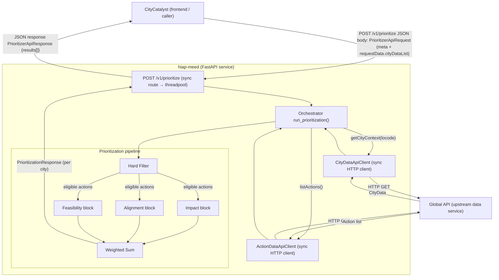
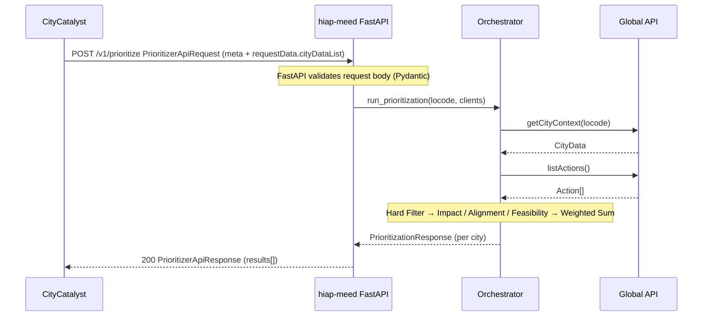

# Service Architecture

This document describes how `hiap-meed` fits into the wider CityCatalyst system and how a prioritization request flows through the service.

---

## System overview

---

## Concurrency model

The `/v1/prioritize` route is a **synchronous** FastAPI route (`def`, not `async def`). FastAPI automatically offloads sync routes to a threadpool worker, so the event loop thread remains free to accept and dispatch other requests.

This is the right choice as long as the orchestrator and data clients are synchronous. If the data clients are later replaced with async counterparts (e.g. `httpx.AsyncClient`), the orchestrator and route should both be converted to `async def` / `await` end-to-end.

---

## Data client layer (current state)

| Client                | Method             | Status         | Target upstream |
| --------------------- | ------------------ | -------------- | --------------- |
| `CityDataApiClient`   | `get_city(locode)` | In-memory stub | Global API      |
| `ActionDataApiClient` | `list_actions()`   | In-memory stub | Global API      |

Stubs are injected via FastAPI's `Depends()` pattern, which makes swapping real implementations straightforward without changing route or orchestrator code.

---

## Request lifecycle

---

## Pipeline stages summary

| Stage        | Purpose                                                         | Removes / produces                      |
| ------------ | --------------------------------------------------------------- | --------------------------------------- |
| Hard Filter  | Remove ineligible actions (exclusions, hard legal requirements) | Discards actions; produces eligible set |
| Impact       | Score emissions reduction potential per city                    | Impact score per action                 |
| Alignment    | Score alignment with city strategy and policy signals           | Alignment score per action              |
| Feasibility  | Score realistic implementability for the city                   | Feasibility score per action            |
| Weighted Sum | Aggregate pillar scores, sort, apply `top_n`                    | Final ranked action list                |

See [`highlevel-architecture.md`](highlevel-architecture.md) and [`detailed-block-architecture.md`](detailed-block-architecture.md) for the scoring logic inside each block.
