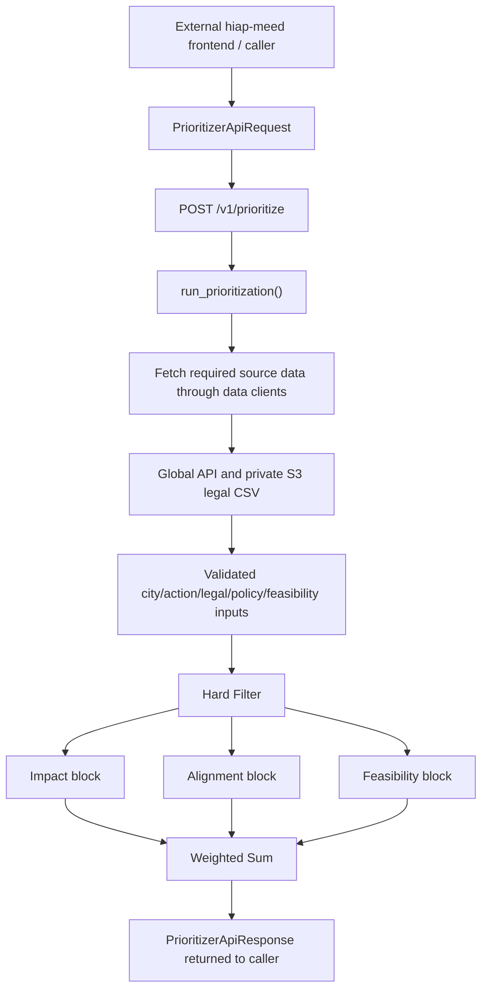
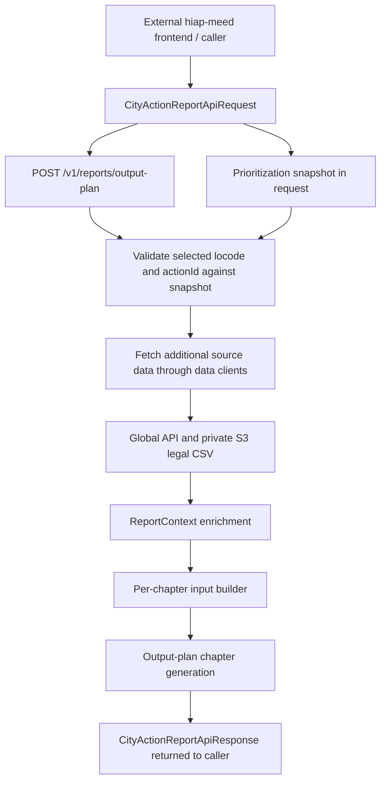
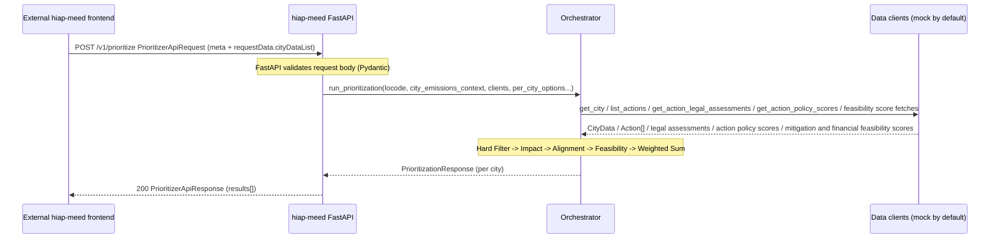
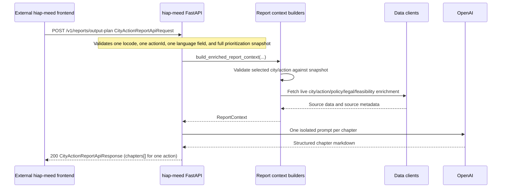

# Service Architecture

This document describes how `hiap-meed` fits into the current caller setup and how prioritization and output-plan report requests flow through the service.

---

## System overview

Prioritization:

Output-plan report:

---

## Concurrency model

The `/v1/prioritize` and `/v1/reports/output-plan` routes are **synchronous** FastAPI routes (`def`, not `async def`). FastAPI automatically offloads sync routes to a threadpool worker, so the event loop thread remains free to accept and dispatch other requests.

This is the right choice as long as the orchestrator, report context enrichment, and data clients are synchronous. If the data clients are later replaced with async counterparts (e.g. `httpx.AsyncClient`), the orchestrator, report path, and routes should be converted to `async def` / `await` end-to-end.

---

## Data client layer (current state)

| Client                    | Method                                | Status                                                                                  | Target upstream |
| ------------------------- | ------------------------------------- | --------------------------------------------------------------------------------------- | --------------- |
| City data client          | `get_city(locode)`                    | Mock/API switch (`HIAP_MEED_CITY_DATA_SOURCE`); `mock` is file-backed, `api` performs synchronous HTTP GET `/api/v0/city_attributes/{locode}` against the shared `CCGLOBAL_API_BASE_URL` (default `https://ccglobal.openearth.dev` locally; overridden in workflows per environment) | configurable city attributes API host |
| Action pathways data client | `list_actions()`                      | Mock/API switch (`HIAP_MEED_ACTION_PATHWAYS_DATA_SOURCE`); `api` performs synchronous HTTP GET `/api/v1/action-pathways` with no query parameters and returns the full upstream catalog plus fetch metadata; `mock` is file-backed and returns the same shape | Global API |
| Legal data client         | `get_action_legal_assessments(country_code)` | S3/mock/deprecated API switch (`HIAP_MEED_LEGAL_DATA_SOURCE`); `s3` is the default and reads the private CSV configured by `HIAP_MEED_LEGAL_S3_BUCKET` and `HIAP_MEED_LEGAL_S3_KEY`; `mock` is file-backed; `api` raises before HTTP as a deprecated guard | private S3 legal classification CSV |
| Action policy scores data client | `get_action_policy_scores(locode)`    | Mock/API switch (`HIAP_MEED_ACTION_POLICY_SCORES_DATA_SOURCE`); `api` performs synchronous HTTP GET `/api/v1/cities/{locode}/action-policy-scores`; `mock` is file-backed | Global API |
| Action mitigation feasibility scores data client | `get_action_mitigation_feasibility_scores(locode, country_code)` | Mock/API switch (`HIAP_MEED_ACTION_MITIGATION_FEASIBILITY_SCORES_DATA_SOURCE`); `api` performs synchronous HTTP GET `/api/v1/cities/{locode}/action-mitigation-feasibility-scores?country_code=...`; `mock` is file-backed | Global API |
| Action financial feasibility scores data client | `get_action_financial_feasibility_scores(locode, country_code)` | Mock/API switch (`HIAP_MEED_ACTION_FINANCIAL_FEASIBILITY_SCORES_DATA_SOURCE`); `api` performs synchronous HTTP GET `/api/v1/cities/{locode}/climate-finance/feasibility?country_code=...`; `mock` is file-backed | Global API |

Clients are injected via FastAPI's `Depends()` pattern. The city, action, action policy scores, mitigation feasibility, and financial feasibility clients default to their live upstream APIs. The legal client defaults to the internal S3-backed CSV source.

Action API note:
- `GET /api/v1/action-pathways` is called without `limit`, `lang`, or other query parameters
- the old live legal endpoint `GET /api/v1/action-legal-assessments?countryCode=...` is intentionally retained only as a deprecated failure path; legal rows now come from the internal S3 CSV and are mapped into the existing legal record contract
- legal S3 fetch failures are fail-closed: missing credentials, access denial, missing bucket/key, or S3 connectivity errors return an upstream dependency error instead of running ranking with neutral legal defaults
- mitigation feasibility now comes from the separate city-scoped scores endpoint and missing action rows use the neutral `0.5` fallback in Feasibility scoring
- financial feasibility comes from the compact climate-finance feasibility batch endpoint; linked opportunity/project detail endpoints are preserved as evidence links but are not fetched by hiap-meed yet

Fetch metadata note:
- city attributes, action pathways, action policy scores, action mitigation feasibility scores, and action financial feasibility scores expose upstream generated-at metadata in their current contracts, so artifacts record `source_metadata.upstream_generated_at_utc`
- successful legal S3 fetch artifacts record the logical `s3:GetObject legal classification CSV` operation, requested country code, object key suffix, ETag, and S3 `LastModified` timestamp when available

Feasibility artifact note:
- the diagnostic artifact `012_feasibility.json` keeps the full grouped feasibility breakdown under `legal`, `mitigation_feasibility`, and `financial_feasibility`
- the API response keeps `ranked_actions[].evidence_summary.feasibility` intentionally smaller: it uses the same grouped top-level component keys, but only returns the compact consumer-facing subset plus `feasibility_score`

---

## Request lifecycle

Prioritization:

Output-plan report:

The output-plan report endpoint is stateless. The frontend currently stores the prioritization snapshot in browser local storage and sends it back with the report request. Later CityCatalyst integration is expected to store that snapshot in the CityCatalyst database. `hiap-meed` does not persist report state; it validates the supplied snapshot and refetches additional source data only where the prioritization response is not detailed enough for the report.

Freshness caveat: the report exactly reflects the prioritization run only if the supplied snapshot is the one used for that run. Frontend/product still need to define staleness checks and user warnings when inputs or upstream source data changed after prioritization.

---

## Pipeline stages summary

| Stage        | Purpose                                                         | Removes / produces                      |
| ------------ | --------------------------------------------------------------- | --------------------------------------- |
| Hard Filter  | Remove ineligible actions (exclusions, blocked legal verdicts) | Discards actions; produces eligible set |
| Impact       | Score emissions reduction potential per city                    | Impact score per action                 |
| Alignment    | Score alignment with city strategy and action policy scores           | Alignment score per action              |
| Feasibility  | Score realistic implementability for the city                   | Feasibility score per action            |
| Weighted Sum | Aggregate pillar scores, sort, apply `top_n`                    | `ranked_action_ids` + `ranked_actions`  |

See [`highlevel-architecture.md`](highlevel-architecture.md) and [`detailed-block-architecture.md`](detailed-block-architecture.md) for the scoring logic inside each block.

Current flow note:
- exclusion preview and prioritization are intentionally separate request flows
- exclusion preview resolves raw exclusion preferences into proposals for user review
- prioritization consumes confirmed `excludedActionIds` and runs the scoring pipeline
- prioritization artifacts are assembled in the orchestrator layer, while exclusion preview artifacts are currently assembled from `api.py`

