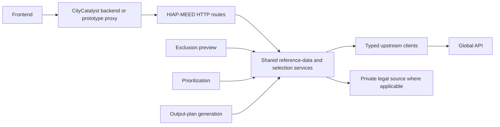

# HIAP-MEED Frontend Data Boundary Implementation Plan

## Purpose

This document proposes how HIAP-MEED becomes the only service that reads MEED-related data from Global API for frontend use. It is intended for product, frontend, full-stack, and HIAP-MEED backend discussion before contracts and routes are implemented.

The desired outcome is:

- the frontend never calls Global API directly
- HIAP-MEED owns upstream URLs, query parameters, validation, normalization, fallbacks, and post-fetch selection
- frontend reads, prioritization, exclusion preview, and output-plan generation reuse the same internal Python services
- the existing processing APIs keep their current request/response contracts and behavior

This is a proposal, not an implemented API. Example payloads are in [`frontend-data-endpoint-examples.md`](frontend-data-endpoint-examples.md).

## Scope and ticket boundary

The live CC-594 description asks for stable contracts for frontend consumption. A prior team clarification narrowed CC-594 to consumer-facing Pydantic contracts inside `hiap-meed`, with route and shared-service implementation handed to CC-603. This plan spans the complete product outcome but recommends retaining that delivery split:

1. **CC-594:** agree and implement strict consumer-facing Pydantic contracts, examples, and contract tests.
2. **CC-603:** implement the shared services and HIAP-MEED routes, refactor internal callers to reuse them, and coordinate the caller/proxy migration.

The ticket ownership can be changed by the team, but the contract decision should precede route implementation.

## Current state

The prototype sends these processing requests through its Express proxy to HIAP-MEED:

- `POST /v1/prioritize/exclusions/preview` (the current pre-flight/exclusion-preview flow)
- `POST /v1/prioritize`
- `POST /v1/reports/output-plan`
- `POST /v1/explanations/translate`

It still reads seven data families directly from Global API:

| Data family            | Prototype behavior                                                                                                 | Existing HIAP-MEED capability                                                                                                                                                                                                 | Current divergence                                                                          |
| ---------------------- | ------------------------------------------------------------------------------------------------------------------ | ----------------------------------------------------------------------------------------------------------------------------------------------------------------------------------------------------------------------------- | ------------------------------------------------------------------------------------------- |
| City attributes        | Repeated `GET /api/v0/city_attributes/{locode}` calls; pages derive display values and indicator counts            | `CityAttributesApiService.get_city()` validates and normalizes the response                                                                                                                                                   | The browser reads raw fields and repeats transformations instead of using the backend model |
| Action pathways        | `GET /api/v1/action-pathways`, then overlays results on bundled `actions.json` and uses the bundle as fallback     | `ActionPathwaysApiService.list_actions()` requests `lang=all` and returns normalized `Action` records                                                                                                                         | Query parameters and fallback behavior differ                                               |
| Policy scores          | `GET .../action-policy-scores?top_evidence_limit=5`; the browser calculates aggregates                             | `ActionPolicyScoresApiService.get_scores_by_action_id()` calls the endpoint without that query parameter and validates/maps all returned evidence                                                                             | URL and evidence selection differ                                                           |
| Mitigation feasibility | `GET .../action-mitigation-feasibility-scores?country_code=...`; missing scores become neutral in frontend scoring | The corresponding HIAP-MEED service uses the same city/country boundary; the prioritizer applies its own neutral scoring default                                                                                              | Fetching is close, but the browser duplicates mapping and fallback logic                    |
| Financial feasibility  | `GET .../climate-finance/feasibility?country_code=...`; pages filter numeric rows and sort them                    | The corresponding HIAP-MEED service validates and maps rows by action ID                                                                                                                                                      | Display filtering and ordering live in the browser                                          |
| Funding opportunities  | Pages follow Global API links directly, with different filters between screens                                     | `ClimateFinanceOpportunitiesApiService` applies country, sector, municipal eligibility, a screening limit of 50, status/recurrence rules, climate/application priority, finance-route handling, and a 5-current/5-monitor cap | The frontend can show different opportunities from the generated output plan                |
| Comparable projects    | Pages follow Global API links and request up to 100 rows                                                           | `ClimateFinanceProjectsApiService` queries by country and action and returns up to 5 report-ready rows                                                                                                                        | Query limit and result selection differ                                                     |

The underlying backend clients already provide most of the correct single-source-of-truth boundary. The missing pieces are strict external response contracts, frontend-oriented GET routes, and a shared orchestration layer used by both those routes and existing processing flows.

### Current code touchpoints

The direct browser reads are currently concentrated in:

- `app/artifacts/hiap/src/hooks/use-city-attributes.ts`
- `app/artifacts/hiap/src/lib/actionCatalog.ts`
- `app/artifacts/hiap/src/lib/scoringPipeline.ts`
- `app/artifacts/hiap/src/pages/SocioeconomicContext.tsx`
- `app/artifacts/hiap/src/pages/PolicyAlignment.tsx`
- `app/artifacts/hiap/src/pages/FinancialFeasibility.tsx`
- `app/artifacts/hiap/src/pages/Recommendations.tsx`

The prototype caller boundary is `app/artifacts/api-server/src/routes/hiapProxy.ts`, which currently defines only the existing POST proxies. On the backend, the main touchpoints are `app/modules/prioritizer/api.py`, `models.py`, `internal_models.py`, `orchestrator.py`, `services/report_context_enrichment.py`, and the endpoint-specific clients under `app/services/`.

## Target architecture

The HTTP routes are adapters, not the source of truth. Internal HIAP-MEED workflows call the shared Python services directly; HIAP-MEED must not call its own HTTP endpoints.

## Recommended new endpoints

Create one HIAP-MEED endpoint for each of the seven Global API data families currently read by the frontend. The paths should remain recognizably mapped to the upstream resources so migration and ownership are unambiguous.

These are controlled proxy endpoints, not transparent passthroughs. HIAP-MEED validates the allowed inputs, adds or overrides canonical upstream query parameters, validates the upstream response, applies shared post-fetch logic, and returns a stable HIAP-MEED contract.

| Current Global API request                                                           | New HIAP-MEED endpoint                                                                  | Backend-owned behavior                                                                                                                                      |
| ------------------------------------------------------------------------------------ | --------------------------------------------------------------------------------------- | ----------------------------------------------------------------------------------------------------------------------------------------------------------- |
| `GET /api/v0/city_attributes/{locode}`                                               | `GET /v1/city_attributes/{locode}`                                                      | Normalize locode, validate/map the city response, and return stable city fields and indicators                                                              |
| `GET /api/v1/action-pathways`                                                        | `GET /v1/action-pathways`                                                               | Add `lang=all`, validate/map actions, and apply the agreed catalogue fallback policy                                                                        |
| `GET /api/v1/cities/{locode}/action-policy-scores?top_evidence_limit=5`              | `GET /v1/cities/{locode}/action-policy-scores`                                          | Use the canonical backend evidence query, validate/map rows, enforce duplicate-ID handling, and compute any agreed evidence-scope aggregates in the backend |
| `GET /api/v1/cities/{locode}/action-mitigation-feasibility-scores?country_code={CC}` | `GET /v1/cities/{locode}/action-mitigation-feasibility-scores?country_code={CC}`        | Validate that country code matches the locode, construct the upstream query, validate/map rows, and preserve no-release warnings                            |
| `GET /api/v1/cities/{locode}/climate-finance/feasibility?country_code={CC}`          | `GET /v1/cities/{locode}/climate-finance/feasibility?country_code={CC}`                 | Validate city/country consistency, map rows by action ID, and apply the agreed valid-score filtering and ordering before returning records                  |
| `GET /api/v1/climate-finance/opportunities?...`                                      | `GET /v1/climate-finance/opportunities?country_code={CC}&sector={sector}&route={route}` | Allow only domain inputs, force municipal eligibility and the screening limit, then apply the shared current/monitor and finance-route selector             |
| `GET /api/v1/climate-finance/projects?...`                                           | `GET /v1/climate-finance/projects?country_code={CC}&action_id={action_id}`              | Allow only country/action inputs, force the canonical result limit, validate/map rows, and return the shared selected project set                           |

### Why use seven explicit endpoints

- Every current frontend Global API read has an obvious HIAP-MEED substitute.
- Frontend migration can happen call by call without introducing an additional aggregation contract.
- Each upstream dependency keeps its existing cache and failure boundary.
- Prioritization and output-plan generation can reuse the same endpoint-specific Python services without depending on a frontend-oriented bundle.
- Product can discuss query and post-filter behavior per data family.

The paths intentionally resemble the upstream resource names, but callers receive normalized HIAP-MEED contracts rather than raw Global API payloads. Endpoint names and exact fields remain subject to API review.

## Contract principles

### Consumer contracts are not upstream DTOs

Keep two model layers:

- **Tolerant upstream DTOs** validate what Global API returns and may ignore unknown upstream fields.
- **Strict consumer contracts** define exactly what HIAP-MEED promises to callers and reject accidental additions or malformed internal assembly.

Do not return `raw` payloads or ask the frontend to interpret upstream metadata, relative links, or provider-specific field names. Public records should use stable HIAP-MEED names and include only fields that have an agreed frontend use.

The strict contracts belong with the current endpoint models in `app/modules/prioritizer/models.py`, unless the implementation introduces a separately owned module with its own `models.py`. Normalized records shared inside the pipeline remain in `internal_models.py`.

### Inputs express business intent

The new routes accept only stable domain inputs and presentation choices:

- `locode`
- `country_code`, `sector`, `route`, and `action_id` only where the mapped data family requires them
- an optional supported `language`/localization choice if product decides not to always return all localized strings

They must not accept:

- a Global API hostname or relative link
- a country code that does not match the city locode
- upstream screening limits such as `top_evidence_limit`, opportunity `limit`, or project `limit`
- arbitrary upstream query parameters

HIAP-MEED should validate domain query values and override all technical selection parameters. For example, the opportunities route may accept the action-derived `country_code`, `sector`, and `route`, but it must always add `eligible_actor=municipality`, force the canonical screening limit, and run the shared selector. This prevents the caller from recreating the divergence through a different combination of technical parameters.

### Stable metadata and warnings

Each response should include small HIAP-MEED metadata containing a generated timestamp and warnings. Debug-only source URLs and raw upstream payloads should remain in logs/artifacts rather than the browser contract.

Recommended behavior:

- malformed identifiers: `422`
- well-formed but unknown city/action: `404`
- required upstream dependency failure or invalid payload: `502`
- a dataset with the existing “no release” semantics: `200` with an empty section and an explicit warning
- each finance proxy route reports its own upstream failure; output-plan enrichment continues to isolate opportunity and project failures from each other

The response must distinguish “valid but no data” from “data source failed.”

## Shared internal implementation

### 1. Keep URL construction in the existing upstream clients

Continue using the endpoint-specific services in `app/services/`:

- `city_attributes_api.py`
- `action_pathways_api.py`
- `action_policy_scores_api.py`
- `action_mitigation_feasibility_scores_api.py`
- `action_financial_feasibility_scores_api.py`
- `climate_finance_opportunities_api.py`
- `climate_finance_projects_api.py`

These services remain the only place that knows Global API paths and query parameters.

### 2. Expose shared endpoint-specific operations

Expose the existing endpoint-specific data services through small shared operations used by routes and processing workflows. Suggested operations are:

- `list_action_pathways()`
- `get_city_attributes(locode)`
- `get_action_policy_scores(locode)`
- `get_action_mitigation_feasibility_scores(locode, country_code)`
- `get_action_financial_feasibility_scores(locode, country_code)`
- `get_climate_finance_opportunities(country_code, sector, route)`
- `get_climate_finance_projects(country_code, action_id)`

These functions should receive injected data clients so mock/API source switching and existing FastAPI dependency overrides continue to work.

The mitigation- and financial-feasibility operations should normalize locode/country inputs and reject mismatches before making upstream calls. Policy, mitigation, and financial results should retain deterministic ordering and expose no-release warnings without inventing scores. Policy evidence-scope aggregates and financial valid-score filtering/sorting should move out of the browser into tested backend projections.

Neutral `0.5` defaults are scoring rules, not source data. They stay inside the prioritization blocks and should not be emitted as if they came from Global API.

The opportunities operation must own the forced `eligible_actor=municipality` and screening limit, plus the current/monitor, recurrence, climate relevance, application route, and technical-assistance post-filtering. The projects operation must own its country/action query and canonical limit. Output-plan enrichment should call these same two operations instead of maintaining private selection orchestration.

### 3. Reuse the assembly functions from existing workflows

After characterization tests are in place:

- exclusion preview should obtain action pathways through the shared action-catalogue operation
- prioritization should obtain city, action, policy, mitigation-feasibility, and financial-feasibility data through the same endpoint-specific operations used by the GET routes
- output-plan enrichment should reuse those operations and the exact opportunity/project selectors used by the corresponding GET routes

This is internal Python reuse. No processing workflow should make an HTTP request back into HIAP-MEED.

### 4. Keep presentation-only operations at the edge

Formatting numbers, choosing how many already-selected rows are initially visible, and translating UI labels remain frontend responsibilities. Upstream filtering, domain selection, fallback values used by scoring, and evidence ranking remain backend responsibilities.

For example, the projects endpoint may return five selected comparable projects while the UI initially displays three with a “show more” control. The UI must not request 100 different projects to create its own selection.

## Known decisions and behavior differences

The migration cannot reproduce every current frontend behavior while also guaranteeing parity with the backend. Product and engineering should explicitly approve these choices.

### Action catalogue fallback

The prototype overlays live action rows on bundled `actions.json` and silently uses the bundle on failure. HIAP-MEED currently uses its configured data source and requests `lang=all`.

**Recommendation:** make the backend-selected catalogue the contract and remove the browser merge/fallback. If an offline prototype mode is still required, implement it as an explicit backend data-source configuration so all consumers see the same catalogue.

This changes frontend fallback/display behavior but does not require a change to the existing processing contracts.

### Policy evidence limit

The prototype explicitly requests `top_evidence_limit=5`; the backend currently omits it.

**Recommendation:** preserve the backend query used by prioritization and output-plan generation. If the frontend needs only five evidence entries, define a deterministic consumer projection in HIAP-MEED without changing the underlying fetch result used by existing processing flows.

Adding `top_evidence_limit=5` to the shared upstream client would change evidence available to prioritization and output-plan generation. That is the clearest case where the “existing behavior must not change” requirement would be violated and should require a separate, explicitly approved behavior change.

### Finance opportunity selection

The existing backend selector returns up to five current and five recurring closed programmes, gives priority to climate relevance and direct municipal application, and can narrow current rows to technical assistance when the action route indicates it.

**Recommendation:** use this exact selector for both the new frontend route and output-plan generation. This intentionally changes the prototype screens that currently follow raw or differently filtered links.

### Comparable-project volume

The prototype requests up to 100 projects, while output-plan generation requests five action-matched rows.

**Recommendation:** return the same five selected records to both frontend and output-plan consumers. If product needs a catalogue-browsing experience, define a separately named paginated browse endpoint with its own product semantics; do not overload finance evidence with two selection rules.

## Existing endpoint compatibility

The following contracts and outputs must remain unchanged during this work:

- `POST /v1/prioritize/exclusions/preview`
- `POST /v1/prioritize`
- `POST /v1/reports/output-plan`
- `POST /v1/explanations/translate`

Specifically, the work must not change:

- request or response field names
- action eligibility and hard-filter rules
- neutral score defaults
- scoring weights, ranking, or `top_n`
- explanation or report generation behavior
- partial-failure behavior already used by output-plan finance enrichment
- mock/API/S3 data-source configuration semantics

Internal refactoring is allowed only when regression tests show identical outputs for fixed inputs. Any necessary deviation should be proposed separately with a before/after example and explicit product approval.

## Delivery plan

### Phase 1: agree contracts

1. Review the seven endpoint mappings with product, frontend, full-stack, and backend owners.
2. Agree the frontend-required fields and remove upstream/debug-only fields.
3. Decide the action-catalogue fallback and policy-evidence projection.
4. Agree empty, warning, partial, and error semantics.
5. Implement strict Pydantic request/response models and OpenAPI examples.
6. Add schema/serialization tests using current fixtures.

### Phase 2: expose shared data operations

1. Add the shared endpoint-specific operations with dependency-injected clients.
2. Move opportunity and project query/post-filter logic behind their shared operations.
3. Add deterministic ordering and the agreed policy/financial response projections.
4. Add unit tests for exact upstream URLs, normalization, duplicate IDs, missing records, warnings, and finance selection.

### Phase 3: add HIAP-MEED routes

1. Add the seven GET routes to the existing FastAPI router or a dedicated router included by `app/main.py`.
2. Map internal records to strict consumer DTOs; never serialize `raw` fields.
3. Add integration tests with dependency overrides for success, empty data, partial data, unknown action/city, and upstream failure.
4. Confirm the generated OpenAPI document contains all seven contracts and examples.

### Phase 4: refactor internal consumers with parity protection

1. Capture current outputs for exclusion preview, prioritization, and output-plan fixtures.
2. Change those workflows to call the shared Python operations.
3. Assert byte-equivalent or model-equivalent responses for the fixed fixtures.
4. Keep the existing route handlers and external DTOs untouched.

### Phase 5: migrate the caller and frontend

The prototype Express proxy currently implements explicit POST routes only. It will need explicit GET proxy routes (including query-string forwarding if localization is approved) or a safe allow-listed generic `/v1` proxy.

1. Add typed same-origin caller methods for the seven new routes.
2. Replace the prototype's direct Global API reads by use case.
3. Stop following `links.opportunities` and `links.projects` in the browser.
4. Remove the browser action-catalogue merge after its fallback decision is implemented in the backend.
5. Add a repository check that fails if new frontend code contains the Global API hostname or `/api/v0`/`/api/v1` Global API routes.
6. For the CityCatalyst-native frontend, implement the corresponding CityCatalyst backend adapters; do not expose the HIAP-MEED service URL to the browser.

### Phase 6: rollout and observe

1. Deploy backend endpoints before switching frontend reads.
2. Migrate one use case at a time, comparing action IDs, counts, warnings, and selected finance evidence in test/QA.
3. Log endpoint latency, upstream failures, empty datasets, and selection counts without logging sensitive request data.
4. Remove direct Global API browser access after parity/product acceptance.
5. Where infrastructure allows it, prevent browser-origin traffic to Global API so the boundary cannot regress silently.

## Test and acceptance strategy

The work is complete when all of the following are true:

- no production frontend code calls Global API directly
- each current direct Global API data family has one clearly mapped HIAP-MEED endpoint
- frontend routes and processing workflows call the same internal data/selection operations
- policy, mitigation-feasibility, financial-feasibility, opportunities, and projects use the same canonical queries and post-filtering as prioritization or output-plan generation where those workflows consume them
- upstream URLs and query parameters are asserted in unit tests
- consumer contracts contain no raw Global API links or payloads
- empty, partial, and failed source states are distinguishable in responses
- fixed-input regression tests show no behavior or contract change for the four existing processing endpoints
- the prototype/CityCatalyst caller proxies only the allow-listed HIAP-MEED routes
- OpenAPI-generated types can be consumed by the frontend without handwritten duplicates

## Product and engineering questions to close

1. Should the action endpoint always return all supported localizations, or accept one presentation language?
2. Is the backend's current action catalogue authoritative, including when Global API is unavailable, or is an explicit offline mode required?
3. Should policy evidence expose all evidence returned by the canonical backend query or a backend-projected top five?
4. Is the output-plan selection of five current plus five monitor opportunities the desired frontend product view?
5. Are five comparable projects sufficient for the frontend, or is a separately paginated browsing experience required?
6. Which fields in source metadata are useful to users versus diagnostics only?
7. Will CityCatalyst proxy each route explicitly, or expose an authenticated allow-listed HIAP-MEED adapter?

## Explicitly out of scope

- changing prioritization, exclusion-preview, output-plan, or explanation contracts
- changing ranking or report-generation methodology
- exposing raw Global API routes through HIAP-MEED
- moving CityCatalyst inventory storage into HIAP-MEED
- migrating bundled frontend legal data unless product expands the scope beyond direct Global API reads
- implementing a general climate-finance catalogue browser unless product approves it as a separate use case
- adding persistence to HIAP-MEED
