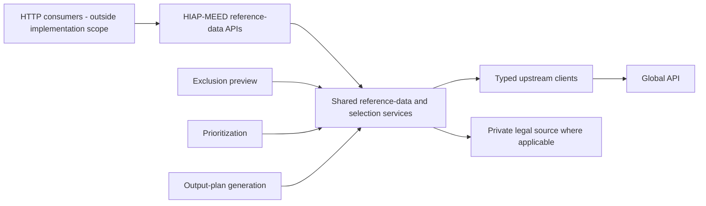

# HIAP-MEED Reference-Data Backend Implementation Plan

## Purpose

This document records the backend work inside `hiap-meed` used to expose stable MEED reference-data APIs backed by Global API. It remains the implementation rationale for product, frontend, full-stack, and HIAP-MEED backend review.

The prototype and CityCatalyst are referenced only to identify consumer requirements and the existing system boundary. This plan does not include changes to the CityCatalyst frontend, CityCatalyst backend, or their integration code.

All implementation deliverables described here are inside `hiap-meed`: Pydantic contracts, shared Python operations, upstream-client reuse, FastAPI routes, tests, and backend observability.

The desired outcome is:

- HIAP-MEED exposes seven stable reference-data APIs for the MEED data families currently consumed outside the backend
- HIAP-MEED owns upstream URLs, query parameters, validation, normalization, fallbacks, and post-fetch selection
- the new reference-data routes, prioritization, exclusion preview, and output-plan generation reuse the same internal Python services
- the existing processing APIs keep their current request/response contracts and behavior

Implementation status: the strict public contracts, seven GET routes, reuse of existing data-client operations, and automated tests are implemented on the CC-603 branch. Deployment and CityCatalyst consumer integration remain separate work. The lightweight product contract is in [`reference-data-api-product-contract.md`](reference-data-api-product-contract.md); full example payloads are in [`frontend-data-endpoint-examples.md`](frontend-data-endpoint-examples.md).

### Governing implementation rule

For every data family, use this precedence order:

1. **Existing HIAP-MEED behavior is authoritative.** Reuse its upstream URL construction, query parameters, validation, normalization, missing-data behavior, filtering, ordering, and post-fetch selection.
2. **Use current prototype behavior only where HIAP-MEED has no equivalent behavior yet.** Treat it as input to the backend contract and move required behavior into a tested HIAP-MEED function.
3. **Expose one implementation through multiple callers.** The new GET route, prioritization, exclusion preview, and output-plan generation call the same Python function wherever they consume the same data. Internal workflows never call the new HTTP routes.
4. **Keep presentation outside the domain operation.** Public DTO serialization may project localized or display-ready fields, but upstream queries and domain filtering/selection remain in the shared HIAP-MEED implementation.
5. **Centralize Global API access in HIAP-MEED.** The new routes and existing processing workflows access Global API only through the endpoint-specific HIAP-MEED clients.

## Scope and ticket boundary

The live CC-594 description asks for stable contracts for frontend consumption. A prior team clarification narrowed CC-594 to consumer-facing Pydantic contracts inside `hiap-meed`, with route and shared-service implementation handed to CC-603. Both parts of this implementation remain backend-only:

1. **CC-594:** agree and implement strict consumer-facing Pydantic contracts, examples, and contract tests.
2. **CC-603:** implement the shared services and HIAP-MEED routes and refactor internal callers to reuse them.

The ticket ownership can be changed by the team, but the contract decision should precede route implementation.

## Current state

The current prototype sends these processing requests through its Express proxy to HIAP-MEED:

- `POST /v1/prioritize/exclusions/preview` (the current pre-flight/exclusion-preview flow)
- `POST /v1/prioritize`
- `POST /v1/reports/output-plan`
- `POST /v1/explanations/translate`

It still reads seven data families directly from Global API:

| Data family            | Prototype behavior                                                                                                 | Existing HIAP-MEED capability                                                                                                                                                                                                 | Current divergence                                                                          |
| ---------------------- | ------------------------------------------------------------------------------------------------------------------ | ----------------------------------------------------------------------------------------------------------------------------------------------------------------------------------------------------------------------------- | ------------------------------------------------------------------------------------------- |
| City attributes        | Repeated `GET /api/v0/city_attributes/{locode}` calls; pages derive display values and indicator counts            | `CityAttributesApiService.get_city()` validates and normalizes the response                                                                                                                                                   | The browser reads raw fields and repeats transformations instead of using the backend model |
| Action pathways        | `GET /api/v1/action-pathways`, then overlays results on bundled `actions.json` and uses the bundle as fallback     | `ActionPathwaysApiService.list_actions()` requests `lang=all` and returns normalized `Action` records                                                                                                                         | Query parameters and fallback behavior differ                                               |
| Policy scores          | `GET .../action-policy-scores?top_evidence_limit=5`; the browser calculates aggregates                             | `ActionPolicyScoresApiService.get_scores_by_action_id()` calls the endpoint without that query parameter and validates/maps all returned evidence                                                                             | URL and evidence selection differ                                                           |
| Mitigation feasibility | `GET .../action-mitigation-feasibility-scores?country_code=...`; missing scores become neutral in frontend scoring | The corresponding HIAP-MEED service uses the same city/country boundary; the prioritizer applies its own neutral scoring default                                                                                              | Fetching is close, but the browser duplicates mapping and fallback logic                    |
| Financial feasibility  | `GET .../climate-finance/feasibility?country_code=...`; pages filter numeric rows and sort them                    | The corresponding HIAP-MEED service validates and maps rows by action ID                                                                                                                                                      | Display filtering and ordering live in the browser                                          |
| Funding opportunities  | Pages follow Global API links directly, with different filters between screens                                     | `ClimateFinanceOpportunitiesApiService` applies country, sector, municipal eligibility, a screening limit of 50, status/recurrence rules, climate/application priority, finance-route handling, and a 5-current/5-monitor cap | The frontend can show different opportunities from the generated output plan                |
| Comparable projects    | Pages follow Global API links and request up to 100 rows                                                           | `ClimateFinanceProjectsApiService` queries by country and action and returns up to 5 report-ready rows                                                                                                                        | Query limit and result selection differ                                                     |

The underlying backend clients already provide most of the correct single-source-of-truth boundary. The missing pieces are strict external response contracts, public reference-data GET routes, and a shared orchestration layer used by both those routes and existing processing flows.

The prototype is reference evidence for required public data, not a compatibility target. Prototype-only fallback and duplicated filtering should not become part of the HIAP-MEED production contract.

### Current code touchpoints

The direct browser reads are currently concentrated in:

- `app/artifacts/hiap/src/hooks/use-city-attributes.ts`
- `app/artifacts/hiap/src/lib/actionCatalog.ts`
- `app/artifacts/hiap/src/lib/scoringPipeline.ts`
- `app/artifacts/hiap/src/pages/SocioeconomicContext.tsx`
- `app/artifacts/hiap/src/pages/PolicyAlignment.tsx`
- `app/artifacts/hiap/src/pages/FinancialFeasibility.tsx`
- `app/artifacts/hiap/src/pages/Recommendations.tsx`

The prototype caller boundary is `app/artifacts/api-server/src/routes/hiapProxy.ts`, which currently defines only the existing POST proxies. On the backend, the main touchpoints are `app/modules/prioritizer/api.py`, `models.py`, `internal_models.py`, `orchestrator.py`, `services/report_context_enrichment.py`, and the endpoint-specific clients under `app/services/`.

## Target architecture

External caller integration is shown only to define the HTTP boundary. The HIAP-MEED HTTP routes are adapters, not the source of truth. Internal HIAP-MEED workflows call the shared Python services directly; HIAP-MEED must not call its own HTTP endpoints.

## Recommended new endpoints

Create one HIAP-MEED endpoint for each of the seven Global API data families identified from current consumer behavior. The paths should remain recognizably mapped to the upstream resources so ownership is unambiguous.

These are HIAP-MEED reference-data APIs; they do not expose or mirror raw Global API contracts. HIAP-MEED validates the allowed inputs, adds or overrides canonical upstream query parameters, validates the upstream response, applies shared post-fetch logic, and returns a stable HIAP-MEED contract.

| Current Global API request                                                           | New HIAP-MEED endpoint                                                                  | Backend-owned behavior                                                                                                                                      |
| ------------------------------------------------------------------------------------ | --------------------------------------------------------------------------------------- | ----------------------------------------------------------------------------------------------------------------------------------------------------------- |
| `GET /api/v0/city_attributes/{locode}`                                               | `GET /v1/cities/{locode}/attributes`                                                    | Normalize locode, validate/map the city response, and return stable city fields and indicators                                                              |
| `GET /api/v1/action-pathways`                                                        | `GET /v1/action-pathways?language={language}`                                            | Keep the current backend `lang=all` fetch, apply the shared prioritizable-action selector, then project the requested localization set                       |
| `GET /api/v1/cities/{locode}/action-policy-scores?top_evidence_limit=5`              | `GET /v1/cities/{locode}/action-policy-scores`                                          | Use the canonical backend evidence query, validate/map rows, enforce duplicate-ID handling, and compute the current frontend evidence-scope aggregates in the backend |
| `GET /api/v1/cities/{locode}/action-mitigation-feasibility-scores?country_code={CC}` | `GET /v1/cities/{locode}/action-mitigation-feasibility-scores?country_code={CC}`        | Forward the caller-selected city/country scope after validation, construct the canonical backend query, validate/map rows, and preserve no-release warnings |
| `GET /api/v1/cities/{locode}/climate-finance/feasibility?country_code={CC}`          | `GET /v1/cities/{locode}/climate-finance/feasibility?country_code={CC}`                 | Forward the caller-selected city/country scope after validation, retain every normalized row, and order scored rows before rows with no source score        |
| `GET /api/v1/climate-finance/opportunities?...`                                      | `GET /v1/climate-finance/opportunities?country_code={CC}&sector={sector}&route={route}` | Forward caller-selected domain scope, force municipal eligibility and the backend screening limit, then apply the existing backend selector                |
| `GET /api/v1/climate-finance/projects?...`                                           | `GET /v1/climate-finance/projects?country_code={CC}&action_id={action_id}`              | Forward caller-selected country/action scope, force the current backend result limit, validate/map rows, and return the existing backend-selected set       |

### Why use seven explicit reference-data endpoints

- Every identified direct Global API read has an obvious HIAP-MEED substitute.
- Downstream consumers can migrate call by call without requiring an additional aggregation contract.
- Each upstream dependency keeps its existing cache and failure boundary.
- Prioritization and output-plan generation can reuse the same endpoint-specific Python services without depending on a consumer-specific bundle.
- Product can discuss query and post-filter behavior per data family.

The paths intentionally resemble the upstream resource names, but callers receive normalized HIAP-MEED contracts rather than raw Global API payloads. Endpoint names and exact fields remain subject to API review.

### Canonical logic and reuse by endpoint

| New endpoint | Shared backend implementation | Canonical query, filtering, and mapping | Existing internal consumers to reuse it |
| --- | --- | --- | --- |
| `GET /v1/cities/{locode}/attributes` | Existing city data client and `CityAttributesApiService.get_city()` | Normalize locode; use the current city-attributes URL/version behavior and Pydantic mapping; expose each indicator's value, unit, and upstream category from the same normalized city result | Prioritization and output-plan context enrichment |
| `GET /v1/action-pathways` | Existing action pathways data client, `ActionPathwaysApiService.list_actions()`, and `select_prioritizable_actions()` | Production always fetches Global API with `lang=all`; the shared selector keeps only actions whose normalized type is `mitigation`; project requested languages plus source emissions and co-benefits in the public DTO | Exclusion preview, prioritization, and output-plan context enrichment |
| `GET /v1/cities/{locode}/action-policy-scores` | Existing policy data client and `ActionPolicyScoresApiService.get_scores_by_action_id()` | Keep the current backend query without `top_evidence_limit`; preserve duplicate-ID validation and 404-as-empty warning behavior; pass through source document type, signal, and relevance fields without combining them; derive scope only for recognized document types and keep unknown types with null scope; compute the frontend's evidence-scope aggregates from this same normalized result | Prioritization alignment and output-plan context enrichment |
| `GET /v1/cities/{locode}/action-mitigation-feasibility-scores` | Existing mitigation data client and `ActionMitigationFeasibilityScoresApiService.get_scores_by_action_id()` | Normalize and validate caller-provided locode/country; keep the current query, action-ID mapping, and 404-as-empty warning; do not add neutral scoring defaults to the source response | Prioritization feasibility and output-plan context enrichment |
| `GET /v1/cities/{locode}/climate-finance/feasibility` | Existing financial data client and `ActionFinancialFeasibilityScoresApiService.get_scores_by_action_id()` | Normalize and validate caller-provided locode/country; keep the current query, mapping, every normalized row, typed explanation inputs, and 404-as-empty warning; order numeric scores descending and missing scores last without changing membership | Prioritization feasibility and output-plan context enrichment |
| `GET /v1/climate-finance/opportunities` | Existing `ClimateFinanceOpportunitiesApiService.get_opportunities()` and `_screen_report_opportunities()` | Normalize caller-provided country, sector, and route; force `eligible_actor=municipality` and the backend limit; reuse current status, recurrence, climate-relevance, city-application, route, technical-assistance, ordering, and 5-current/5-monitor rules | Output-plan finance enrichment |
| `GET /v1/climate-finance/projects` | Existing `ClimateFinanceProjectsApiService.get_projects()` | Normalize caller-provided country/action scope; reuse the current query, validation, mapping, and limit of five; project source names, sector, cost/unit, funding sources, and action-match confidence for display | Output-plan finance enrichment |

“Reuse” means the route and internal workflow receive results from the same Python implementation. Route-specific serialization, including localization projection and public metadata, wraps that shared result but must not refetch, re-filter, or alter the information used by prioritization or output-plan generation.

## Contract principles

### Consumer contracts are not upstream DTOs

Keep two model layers:

- **Tolerant upstream DTOs** validate what Global API returns and may ignore unknown upstream fields.
- **Strict consumer contracts** define exactly what HIAP-MEED promises to callers and reject accidental additions or malformed internal assembly.

Do not return `raw` payloads or require API consumers to interpret upstream metadata, relative links, or provider-specific field names. Public records should use stable HIAP-MEED names and include only agreed consumer fields.

The strict public contracts live in `app/modules/reference_data/models.py`. Additive-tolerant upstream DTOs remain in `app/modules/prioritizer/models.py`, and normalized records shared inside the pipeline remain in `internal_models.py`.

### Inputs express business intent

The caller owns the domain scope of each request. The new routes accept the domain inputs needed to construct the canonical backend request:

- `locode`
- `country_code`, `sector`, `route`, and `action_id` where the mapped data family requires them
- zero or more repeated `language` values where the response contains localized fields

Language behavior is deterministic:

- no `language` query: return every localization supplied by the backend's current `lang=all` fetch
- one `language` value: return only that localization alongside canonical identifiers/fields
- multiple repeated values, for example `?language=en&language=es`: return exactly those localizations
- normalize, deduplicate, and reject unsupported values using the same supported-language catalogue and validation style as existing HIAP-MEED request models

HIAP-MEED normalizes and validates caller-provided domain scope but does not replace it with inferred or hardcoded filters. For example, a caller can send `country_code=CL`, but the route remains caller-controlled and can support another valid country value when the product scope expands. Where both locode and country are supplied, apply the same consistency validation already used by prioritization.

They must not accept:

- a Global API hostname or relative link
- upstream screening limits such as `top_evidence_limit`, opportunity `limit`, or project `limit`
- arbitrary upstream query parameters

HIAP-MEED validates domain query values and owns technical selection parameters. For example, the opportunities route accepts caller-selected `country_code`, `sector`, and `route`, always adds `eligible_actor=municipality`, forces the current backend screening limit, and runs the existing backend selector. This preserves caller control over the requested scope without allowing callers to redefine backend selection policy.

Implement route query inputs as strict Pydantic query models with `extra="forbid"`, matching the strictness of current caller request models. Unsupported technical parameters such as `top_evidence_limit`, `eligible_actor`, and `limit` should produce the normal FastAPI `422` validation response rather than being silently ignored.

In short:

- **Caller-controlled scope:** city/locode, country, requested languages, action, sector, and route where relevant.
- **HIAP-MEED-controlled behavior:** Global API host/path construction, fixed technical parameters, limits, validation/mapping, missing-data handling, ordering, selection, and post-filtering.

### Metadata, validation, and errors follow existing endpoint conventions

Do not introduce a second API style for these GET routes. Use the current FastAPI/Pydantic and HIAP-MEED conventions:

- declare a strict `response_model` and document `200`, `404`, `422`, `502`, and `500` where applicable
- let Pydantic/FastAPI reject malformed or unsupported query values consistently with existing request models
- translate `UpstreamApiError` through the existing request-trace error helpers rather than defining a new error envelope
- retain current source-specific missing-data behavior, including `200` plus warnings where the existing client treats a missing release as empty data
- use the shared business-response metadata model across the seven endpoints:
  server-owned `requestId`, `generatedAtUtc`, and `totalRecords`
- keep warnings in the same response position and naming style chosen for the shared reference-data contracts
- keep raw payloads and diagnostic source details in existing logs/artifacts; expose only source/provenance fields already considered part of a public contract

The same shared function must produce the data and metadata used by an HTTP response and by an internal processing caller. Route handlers should only validate route/query inputs, call the function, and serialize its public DTO.

### Proposed consistency guarantee: same rules and current data

This implementation guarantees **logical consistency**: for the same caller-provided domain scope, the new reference-data routes and processing workflows use the same canonical upstream query construction, normalization, filtering, ordering, and selection functions.

It does not guarantee that two requests made at different times use an identical Global API snapshot. If Global API changes between a public reference-data read and later plan generation, the later request may use newer data even though both requests apply the same rules. `generated_at_utc` records when a response was assembled; it is not a reusable snapshot identifier.

The recommended scope is **same rules and current data**, because it removes the current filtering divergence without changing the existing prioritize or output-plan contracts and without adding persistence to HIAP-MEED.

If product instead requires **exactly the data the user previously saw**, that is a separate contract decision. It would require a versioned data context or snapshot identifier, retention of the normalized source data, and a way for prioritization/output-plan requests to reference it. That would affect existing processing contracts or orchestration and must be proposed with explicit product approval before implementation.

## Shared internal implementation

### 1. Keep URL construction in the existing upstream clients

Continue using the endpoint-specific services in `app/services/`:

- `city_attributes_api.py`
- `action_pathways_api.py`
- `action_policy_scores_api.py`
- `action_mitigation_feasibility_scores_api.py`
- `action_financial_feasibility_scores_api.py`
- `climate_finance_opportunities_api.py`
- `climate_finance_projects_api.py`

These services remain the only place that knows Global API paths and query parameters.

### 2. Use existing data-client methods as the shared operations

The existing methods in `app/services/data_clients.py` are the shared boundary used by the new routes and processing workflows:

- `get_city(locode)`
- `list_actions()`
- `get_action_policy_scores(locode)`
- `get_action_mitigation_feasibility_scores(locode, country_code)`
- `get_action_financial_feasibility_scores(locode, country_code)`
- `get_report_finance_opportunities(country_code, sector, route)`
- `get_report_finance_projects(country_code, action_id)`

The route dependencies inject the same mock/API clients already used by prioritization and output-plan generation. No additional forwarding service is needed: it would add indirection without adding validation, filtering, or data ownership.

The city-scoped and finance-catalogue operations normalize caller-provided domain inputs and use them consistently in their upstream queries. Policy, mitigation, and financial results retain every normalized source record and expose no-release warnings without inventing scores. Public projections may calculate policy evidence-scope aggregates and apply deterministic display ordering, but they must not remove records used by processing workflows.

Neutral `0.5` defaults are scoring rules, not source data. They stay inside the prioritization blocks and should not be emitted as if they came from Global API.

The opportunities operation must reuse the current HIAP-MEED `ClimateFinanceOpportunitiesApiService` query and `_screen_report_opportunities()` behavior: municipal eligibility, screening limit, current/monitor split, recurrence rules, climate relevance, application route, technical-assistance handling, ordering, and caps. The projects operation must reuse the current `ClimateFinanceProjectsApiService` country/action query and limit. The new GET routes and output-plan enrichment must call these exact functions; neither path may maintain a second selector.

### 3. Reuse the shared data-client methods from existing workflows

After characterization tests are in place:

- exclusion preview should obtain action pathways through the shared action-catalogue operation
- prioritization should obtain city, action, policy, mitigation-feasibility, and financial-feasibility data through the same endpoint-specific operations used by the GET routes
- output-plan enrichment should reuse those operations and the exact opportunity/project selectors used by the corresponding GET routes

This is internal Python reuse. No processing workflow should make an HTTP request back into HIAP-MEED.

### 4. Keep presentation-only operations at the edge

Formatting numbers, choosing how many already-selected rows a consumer displays, and translating UI labels are outside this backend plan. Upstream filtering, domain selection, fallback values used by scoring, and evidence ranking remain HIAP-MEED responsibilities.

For example, the projects endpoint may return five selected comparable projects while the UI initially displays three with a “show more” control. The UI must not request 100 different projects to create its own selection.

## Resolved implementation decisions

### Action catalogue fallback

The prototype overlays live action rows on bundled `actions.json` and silently uses the bundle on failure. HIAP-MEED currently uses its configured data source and requests `lang=all`.

The production contract uses Global API through the current HIAP-MEED action-pathways client. Do not add the prototype's browser catalogue merge or an offline production fallback to the HIAP-MEED public contract. Existing mock data/source switching remains available for tests and configured local mock runs; it is not a production fallback.

### Action catalogue membership

`select_prioritizable_actions()` in `app/services/action_pathways_api.py` is the
single membership rule. It keeps only actions whose normalized action type is
`mitigation`. Other and missing action types are excluded, while prioritization
artifacts retain missing-type diagnostics. The action GET, exclusion preview, prioritization,
and output-plan enrichment all call this selector.

### Financial rows without a source score

The shared financial operation retains every normalized row. The GET response
orders numeric scores from highest to lowest and places missing scores last, with
`financial_feasibility: null`. Prioritization may interpret a missing score as its
existing neutral `0.5` fallback, but that algorithm value is never presented as
Global API data.

### Policy evidence limit

The prototype explicitly requests `top_evidence_limit=5`; the backend currently omits it.

Preserve the current HIAP-MEED policy query used by prioritization and output-plan generation; do not add the prototype's `top_evidence_limit=5`. The new GET route returns the current backend result. Any smaller display is presentation-only and must not change the shared source result.

### Finance opportunity selection

The existing backend selector returns up to five current and five recurring closed programmes, gives priority to climate relevance and direct municipal application, and can narrow current rows to technical assistance when the action route indicates it.

Use this exact selector for both the new reference-data route and output-plan generation. The public response may expose the selected programme's user-facing `source_url`, but it must not expose upstream API URLs or raw link maps that require a consumer to reproduce the selector.

### Comparable-project volume

The prototype requests up to 100 projects, while output-plan generation requests five action-matched rows.

Return the same five selected records from the public reference-data route and to output-plan generation. The current scope does not add a separate paginated browsing contract.

### Metadata

Use the current HIAP-MEED metadata/error approach and a single shared reference-data metadata model for all seven routes where their data allows it. Do not invent per-endpoint metadata variants without a source-specific need.

## Existing endpoint compatibility

The following contracts and outputs must remain unchanged during this work:

- `POST /v1/prioritize/exclusions/preview`
- `POST /v1/prioritize`
- `POST /v1/reports/output-plan`
- `POST /v1/explanations/translate`

Specifically, the work must not change:

- request or response field names
- action eligibility and hard-filter rules
- neutral score defaults
- scoring weights, ranking, or `top_n`
- explanation or report generation behavior
- partial-failure behavior already used by output-plan finance enrichment
- mock/API/S3 data-source configuration semantics

Internal refactoring is allowed only when regression tests show identical outputs for fixed inputs. Any necessary deviation should be proposed separately with a before/after example and explicit product approval.

## Delivery record

### Phase 1: agree contracts - implemented

1. Review the seven endpoint mappings with product, frontend, full-stack, and backend owners.
2. Agree the frontend-required fields and remove upstream/debug-only fields.
3. Confirm the **same rules and current data** consistency guarantee, or explicitly expand the scope to versioned snapshots before contracts are finalized.
4. Encode the resolved localization, production source, policy evidence, finance selection, and metadata decisions in the contracts.
5. Reuse existing empty, warning, and error semantics.
6. Implement strict Pydantic request/response models and OpenAPI examples.
7. Add schema/serialization tests using current fixtures.

### Phase 2: reuse shared data-client operations - implemented

1. Inject and call the existing endpoint-specific data clients from the new routes.
2. Keep opportunity and project query/post-filter logic in their existing services.
3. Add deterministic ordering and the agreed policy/financial response projections.
4. Add unit tests for exact upstream URLs, normalization, duplicate IDs, missing records, warnings, and finance selection.

### Phase 3: add HIAP-MEED routes - implemented

1. Add the seven GET routes to the existing FastAPI router or a dedicated router included by `app/main.py`.
2. Map internal records to strict consumer DTOs; never serialize `raw` fields.
3. Add integration tests with dependency overrides for success, empty data, partial data, unknown action/city, and upstream failure.
4. Confirm the generated OpenAPI document contains all seven contracts and examples.

### Phase 4: refactor internal consumers with parity protection - implemented

1. Capture current outputs for exclusion preview, prioritization, and output-plan fixtures.
2. Change those workflows to call the shared Python operations.
3. Assert byte-equivalent or model-equivalent responses for the fixed fixtures.
4. Keep the existing route handlers and external DTOs untouched.

### Phase 5: deploy and observe HIAP-MEED - pending deployment

1. Deploy the new HIAP-MEED contracts and routes using the shared data clients.
2. Exercise each route in test/QA and compare action IDs, counts, warnings, and selected finance evidence with the corresponding internal processing operation for fixed inputs.
3. Log route latency, upstream failures, empty datasets, and selection counts without logging sensitive request data.
4. Verify that every new route reaches Global API only through the canonical endpoint-specific HIAP-MEED client.

## Test and acceptance strategy

The work is complete when all of the following are true:

- each current direct Global API data family has one clearly mapped HIAP-MEED endpoint
- the new reference-data routes and processing workflows call the same internal data/selection operations
- policy, mitigation-feasibility, financial-feasibility, opportunities, and projects use the same canonical queries and post-filtering as prioritization or output-plan generation where those workflows consume them
- upstream URLs and query parameters are asserted in unit tests
- consumer contracts contain no raw Global API request URLs or payloads; agreed user-facing programme source links remain allowed
- empty, partial, and failed source states are distinguishable in responses
- fixed-input regression tests show no behavior or contract change for the four existing processing endpoints
- for the same domain scope and fixed upstream data, the public route and processing workflow produce the same normalized and selected records
- the generated OpenAPI document exposes the agreed strict contracts for downstream type generation

## Implemented contract details

- Public field subsets are encoded as strict models in `app/modules/reference_data/models.py`; internal `raw`, score-input, finance diagnostic-link maps, and upstream request details are not serialized. The selected opportunity `source_url` remains an agreed user-facing field.
- Action localization uses repeated `language` query parameters. Omitting the parameter returns all available localizations; one or more values project exactly the requested supported languages.
- All successful routes use `ApiResponseMeta` with server-owned `requestId`,
  `generatedAtUtc`, and `totalRecords`, plus a top-level `warnings` list.

## Explicitly out of scope

- changing prioritization, exclusion-preview, output-plan, or explanation contracts
- changing ranking or report-generation methodology
- exposing raw Global API routes through HIAP-MEED
- modifying the CityCatalyst frontend, CityCatalyst backend, or their authentication/routing integration
- implementing the downstream migration from direct Global API reads to the new HIAP-MEED routes
- moving CityCatalyst inventory storage into HIAP-MEED
- migrating bundled frontend legal data unless product expands the scope beyond direct Global API reads
- implementing a general climate-finance catalogue browser unless product approves it as a separate use case
- adding persistence to HIAP-MEED
