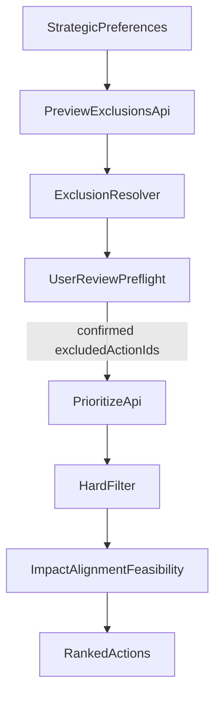

# Exclusion Preflight Plan

## Terminology

Use these terms consistently throughout the implementation:

- `exclusion preferences`:
  - the raw user inputs collected before ranking
  - includes `excludedSectorTags`, `excludedCoBenefitKeys`, and `excludedActionsFreeText`
- `proposed exclusions`:
  - the action IDs and reasons returned by API 1 after resolving the exclusion preferences
  - this is a preview for user review and can still be edited or rejected
- `confirmed exclusions`:
  - the final `excludedActionIds` sent into API 2 after user review
  - this is the authoritative input for user-driven exclusions during ranking
- `hard filter`:
  - the ranking-stage filter that removes confirmed excluded actions and legally blocked actions
  - it does not resolve or reinterpret exclusion preferences in API 2

## Goal

Replace the current stub in [hiap-meed/app/modules/prioritizer/blocks/hard_filter.py](hiap-meed/app/modules/prioritizer/blocks/hard_filter.py) with a backend flow that matches the agreed product direction:

- exclusions are configured before ranking
- sector and co-benefit exclusions are deterministic
- free-text exclusions use an LLM only for clear action/activity matches such as incineration or fossil-fuel infrastructure
- the user reviews the proposed excluded actions before the final ranking call

Current stub to replace:

```python
def _resolve_excluded_action_ids_from_text(... ) -> set[str]:
    return set()
```

The current request contract also only exposes free-text exclusions on the ranking endpoint via [hiap-meed/app/modules/prioritizer/models.py](hiap-meed/app/modules/prioritizer/models.py), where `FrontendCityInput` has `excludedActionsFreeText: str | None = None`.

## Proposed Technical Direction

### 1. Split exclusions into a preview API and a ranking API

Add a new preview endpoint in [hiap-meed/app/modules/prioritizer/api.py](hiap-meed/app/modules/prioritizer/api.py) and keep [hiap-meed/app/modules/prioritizer/orchestrator.py](hiap-meed/app/modules/prioritizer/orchestrator.py) focused on ranking with confirmed exclusions.

Recommended contracts:

- `POST /v1/prioritize/exclusions/preview`
  - Input per city:
    - `locode`
    - `excludedSectorTags: list[str]`
    - `excludedCoBenefitKeys: list[str]`
    - `excludedActionsFreeText: str | None`
  - Output per city:
    - `proposedExcludedActions: list[{ actionId, actionName, reasons, matchedBy }]`
    - `exclusionSummary: { totalProposed, byReasonType }`
      - where `byReasonType` groups actions by exclusion source such as `sector`, `co_benefit`, and `free_text_llm`
      - include counts and grouped action IDs so the frontend can render collapsed sections like "23 actions excluded from waste sector" with per-action review/undo
    - `warnings` for unmatched/ambiguous free text (to be included in the response)

- `POST /v1/prioritize`
  - Extend `FrontendCityInput` with `excludedActionIds: list[str]`
  - Treat `excludedActionIds` as the authoritative input for user-confirmed exclusions
  - Do not re-interpret `excludedActionsFreeText` or other exclusion preferences in API 2
  - Continue running the hard-filter stage in API 2, but limit its responsibilities to:
    - discarding actions explicitly listed in `excludedActionIds`
    - discarding actions blocked by legal hard requirements
  - Keep raw exclusion preferences off this endpoint unless they are explicitly needed for logging/debug output; avoid dual resolution paths in ranking

This keeps the implementation simple and avoids hidden re-interpretation of exclusion preferences during scoring.

### 2. Move exclusion resolution out of the hard-filter block

Keep [hiap-meed/app/modules/prioritizer/blocks/hard_filter.py](hiap-meed/app/modules/prioritizer/blocks/hard_filter.py) in the ranking pipeline as a pure filter-application step.

Move only the exclusion-resolution responsibility into a shared resolver service under [hiap-meed/app/modules/prioritizer/services/](hiap-meed/app/modules/prioritizer/services/):

- deterministic sector resolution
- deterministic co-benefit resolution
- LLM-backed free-text resolution
- merge + dedupe + reason assembly

Resulting responsibility split:

- API 1 preview flow:
  - resolve exclusion preferences into a proposed exclusion set
  - return proposed excluded actions plus reasons for user review
- API 2 ranking flow:
  - accept confirmed `excludedActionIds`
  - run the hard-filter block to apply confirmed exclusions and legal blocking rules
  - do not perform any new LLM or semantic resolution of exclusion preferences

That matches `AGENTS.md` guidance to separate orchestration, services, prompts, and models, and avoids packing too much behavior into one block file.

### 3. Implement deterministic exclusions first

Use existing `Action` metadata from [hiap-meed/app/modules/prioritizer/internal_models.py](hiap-meed/app/modules/prioritizer/internal_models.py) and the current action loading path in [hiap-meed/app/services/data_clients.py](hiap-meed/app/services/data_clients.py).

Planned deterministic rules:

- Sector exclusions:
  - resolve from action metadata already available on `Action`, primarily `emissions`, `action_category`, and `action_subcategory`
  - introduce one canonical mapping utility so frontend sector names map to backend action sectors in exactly one place

- Co-benefit exclusions:
  - resolve from `Action.co_benefits`
  - exclude an action when any selected co-benefit has a negative score (`impact_numeric < 0`), matching the product wording “exclude actions with any negative impact on …”

This gives immediate value without depending on the LLM path.

### 4. Add a guarded LLM resolver for free text

Reuse the existing OpenAI structured-output pattern already present in [hiap-meed/app/modules/prioritizer/services/explanations.py](hiap-meed/app/modules/prioritizer/services/explanations.py) instead of inventing a second integration style.

Implementation shape:

- add a dedicated exclusion-resolution service, for example `services/exclusion_resolution.py`
- add prompt files under [hiap-meed/app/modules/prioritizer/prompts/](hiap-meed/app/modules/prioritizer/prompts/)
- add a small structured response model in [hiap-meed/app/modules/prioritizer/models.py](hiap-meed/app/modules/prioritizer/models.py) or a module-level internal model file
- send the model a compact action catalog per request with:
  - `action_id`
  - `action_name`
  - `description`
  - `action_category`
  - `action_subcategory`
  - relevant co-benefit keys / text
- instruct the model to:
  - return only exact `action_id` values from the provided catalog
  - exclude only on clear matches
  - ignore ambiguous or subjective requests
  - provide a short reason per excluded action
- validate the model output server-side and drop any unknown IDs or low-confidence/ambiguous rows

This aligns with the Slack guidance that free text should handle activity-style objections such as “nothing involving incineration” or “no fossil fuel infrastructure”, but not subjective filters like cost or political sensitivity. No separate structured “action type” input is needed.

### 5. Keep ranking based on confirmed exclusions only

Update [hiap-meed/app/modules/prioritizer/orchestrator.py](hiap-meed/app/modules/prioritizer/orchestrator.py) and the main API path so ranking uses confirmed `excludedActionIds` supplied by the client after preview review.

Plumbing changes:

- thread confirmed `excluded_action_ids` from `api.py` into `run_prioritization(...)`
- update [hiap-meed/app/modules/prioritizer/blocks/hard_filter.py](hiap-meed/app/modules/prioritizer/blocks/hard_filter.py) so `run(...)` accepts explicit IDs and applies them before legal filtering
- update input snapshots / hard-filter metadata so artifacts clearly show:
  - confirmed excluded IDs
  - discard reason per action (`user_excluded` vs `legal_hard_requirement_failed`)
  - source metadata when available (`sector`, `co_benefit`, `free_text`)

This preserves transparent diagnostics and supports the later pre-flight UI.

## Suggested Flow



## Main File Areas

- [hiap-meed/app/modules/prioritizer/models.py](hiap-meed/app/modules/prioritizer/models.py)
  - add preview request/response models
  - add `excludedActionIds` to the ranking request model
- [hiap-meed/app/modules/prioritizer/api.py](hiap-meed/app/modules/prioritizer/api.py)
  - add the preview endpoint
  - return `exclusionSummary` alongside proposed exclusions
  - pass confirmed exclusions into ranking
- [hiap-meed/app/modules/prioritizer/orchestrator.py](hiap-meed/app/modules/prioritizer/orchestrator.py)
  - accept confirmed exclusions in the pipeline input snapshot and hard-filter stage
- [hiap-meed/app/modules/prioritizer/blocks/hard_filter.py](hiap-meed/app/modules/prioritizer/blocks/hard_filter.py)
  - stop owning semantic resolution; apply explicit exclusions + legal blocking
- [hiap-meed/app/modules/prioritizer/services/explanations.py](hiap-meed/app/modules/prioritizer/services/explanations.py)
  - remove/update the current “free-text exclusion is stub” limitation once exclusions are live
- [hiap-meed/tests/unit/test_prioritizer_blocks.py](hiap-meed/tests/unit/test_prioritizer_blocks.py)
- [hiap-meed/tests/integration/test_prioritize_smoke.py](hiap-meed/tests/integration/test_prioritize_smoke.py)
- [hiap-meed/README.md](hiap-meed/README.md)
- [hiap-meed/docs/pipeline-description.md](hiap-meed/docs/pipeline-description.md)
- [hiap-meed/docs/highlevel-architecture.md](hiap-meed/docs/highlevel-architecture.md)
- [hiap-meed/future-work.md](hiap-meed/future-work.md)

## Testing Plan

Add focused tests rather than broad end-to-end coverage only:

- unit tests for sector resolution mapping
- unit tests for co-benefit negative-impact exclusion
- unit tests for free-text LLM output validation and ambiguous-match rejection
- integration test for the new preview endpoint returning proposed exclusions + reasons
- integration test for `/v1/prioritize` honoring confirmed `excludedActionIds`
- regression update for the current hard-filter stub tests, since exclusion behavior will no longer always be zero

## Rollout Notes

- Start with deterministic sector + co-benefit filtering and the preview API contract first
- add free-text LLM resolution behind its own config flags in [hiap-meed/app/modules/prioritizer/config.py](hiap-meed/app/modules/prioritizer/config.py), mirroring the explanations configuration style
- keep the code path explicit and single-purpose; avoid backwards-compatibility branches where the ranking endpoint sometimes re-resolves exclusion preferences and sometimes trusts confirmed IDs
- return enough structured reasoning now so the frontend can later implement the pre-flight review and per-action undo flow without another backend redesign
