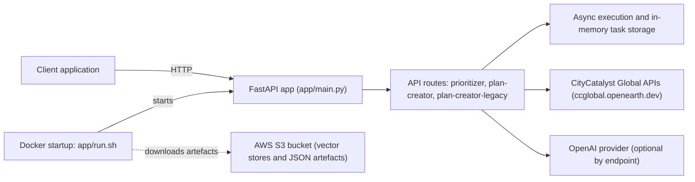

## High Impact Actions Prioritizer (HIAP)

HIAP is the **backend API** inside the [`CityCatalyst`](../README.md) mono-repo that:

- **Prioritizes** climate actions for a city (`/prioritizer/*`)
- **Generates** action implementation plans (`/plan-creator/*`)
- Keeps a **legacy plan creator** API for older clients (`/plan-creator-legacy/*`)

### Repository layout (this folder)

```
hiap/
├── app/                   # FastAPI application code (run from inside this folder)
│   ├── main.py            # FastAPI entry point (defines `app`)
│   ├── run.sh             # Docker entrypoint (downloads artefacts from S3, then runs uvicorn)
│   ├── prioritizer/       # Prioritizer API, models and pipeline logic
│   ├── plan_creator_bundle/
│   │   ├── plan_creator/          # Current plan-creator endpoints
│   │   └── plan_creator_legacy/   # Legacy plan-creator endpoints
│   ├── services/          # HTTP clients to upstream CityCatalyst “global” APIs
│   ├── scripts/           # Maintenance utilities (S3 downloads, uploads, translations, etc.)
│   └── cap_off_app/       # Optional: data refresh for a legacy “cap off” prototype
├── docs/                  # Architecture notes and diagrams (see below)
├── tests/                 # Unit and integration tests
├── k8s/                   # Kubernetes manifests
├── Dockerfile             # Container image definition (uses `uv` + `uv.lock`)
├── pyproject.toml         # Python dependencies (source of truth)
├── uv.lock                # Locked dependency set used by Docker
└── .env.example           # Example environment variables (DO NOT commit real secrets)
```

## Architecture (high level)



- For a larger diagram and notes, see `docs/architecture.md`.

## Getting started (local dev)

### Prerequisites

- **Python 3.12+**
- Internet access to `ccglobal.openearth.dev` (HIAP fetches actions/context/CCRA data at runtime)

### 1) Create `.env`

Copy `.env.example` to `.env` and fill in what you need.

- If you only want to start the server and browse `/docs`, you can often leave keys blank.
- Endpoints that use LLMs or S3 downloads will require the relevant credentials.
- Never commit `.env` (it can contain secrets). Use `.env.example` to document required variables.

Windows (cmd.exe):

```bat
copy .env.example .env
```

macOS / Linux:

```bash
cp .env.example .env
```

### Environment variables (what they do)

The service loads `.env` at startup (see `app/main.py`). The variables below come from `hiap/.env.example`.

- **OpenAI / LLM**
  - **`OPENAI_API_KEY`**: API key used by endpoints that call the LLM (plan creation, explanations, translations).
  - **`OPENAI_MODEL_NAME_EXPLANATIONS`**: Model for generating prioritization explanations.
  - **`OPENAI_MODEL_NAME_EXPLANATIONS_TRANSLATION`**: Model for translating explanations.
  - **`OPENAI_MODEL_NAME_PLAN_CREATOR`**: Model for the current plan creator.
  - **`OPENAI_MODEL_NAME_PLAN_CREATOR_LEGACY`**: Model for the legacy plan creator.
  - **`OPENAI_MODEL_NAME_PLAN_TRANSLATION`**: Model for translating plans.
  - **`OPENAI_TIMEOUT_SECONDS`**: Timeout (seconds) for OpenAI calls.
  - **`OPENAI_MAX_RETRIES`**: Retry count for OpenAI calls.

- **LangSmith / LangChain tracing (optional)**
  - **`LANGCHAIN_TRACING_V2`**: Set to `true` to enable tracing; `false` (or empty) to disable.
  - **`LANGCHAIN_ENDPOINT`**: LangSmith endpoint.
  - **`LANGCHAIN_API_KEY`**: LangSmith API key.
  - **`LANGCHAIN_PROJECT`**: Base LangSmith project name.
  - **`LANGCHAIN_PROJECT_NAME_PRIORITIZER`**: Project name override for prioritizer traces.
  - **`LANGCHAIN_PROJECT_NAME_PLAN_TRANSLATION`**: Project name override for plan translation traces.

- **AWS / S3 (used by Docker startup + some scripts)**
  - **`AWS_ACCESS_KEY_ID` / `AWS_SECRET_ACCESS_KEY`**: Credentials for reading artefacts from S3.
  - **`S3_BUCKET_NAME`**: Bucket containing vector stores / artefacts.

- **FastAPI runtime**
  - **`API_HOST`**: Host to bind to (default is `0.0.0.0`).
  - **`API_PORT`**: Port to bind to (default is `8000`).

- **Docker startup behavior**
  - **`HIAP_SKIP_S3_DOWNLOADS`**: Set to `true` (or `1`) to skip S3 downloads in `app/run.sh` and start the API immediately.
    - Useful when S3 access is not available.
    - See the Docker section below for endpoint-level impact.

- **Prioritizer performance / behavior**
  - **`BULK_CONCURRENCY`**: Max worker processes for bulk prioritization (default: CPU count).
  - **`SUBTASK_TIMEOUT_SECONDS`**: Timeout (seconds) per bulk city subtask (default: 300).
  - **`XGBOOST_NUM_THREADS`**: Threads used per XGBoost prediction.
  - **`EXPLANATIONS_ENABLED`**: Set to `false` to disable explanation generation (useful for debugging).
  - **`LOG_PARALLELISM`**: Enables extra logging around parallel execution (value `1` = on).

- **Logging**
  - **`LOG_LEVEL`**: Logging level (e.g. `INFO`, `DEBUG`).

### 2) Install dependencies

HIAP uses `uv` with `pyproject.toml` (and `uv.lock`) as the single source of truth.

`uv` is typically installed **once** (globally) and then used per-project.

- Install `uv` by following the official instructions: [uv documentation](https://docs.astral.sh/uv/)
- (Optional) Verify your install: `uv --version`

Then, from `hiap/`, run `uv sync`. It will create and manage a local virtual environment (usually `.venv`) automatically.

Windows (cmd.exe):

```bat
uv sync --dev
```

macOS / Linux:

```bash
uv sync --dev
```

### 3) Run the API

Important: `app/` is not a Python package (no `__init__.py`), so **run from inside `hiap/app`**.

Windows (cmd.exe):

```bat
cd app
python main.py
```

macOS / Linux:

```bash
cd app
python main.py
```

Once running:

- **Swagger UI**: `http://localhost:8000/docs`
- **Health**: `http://localhost:8000/`

## Docker (note about S3 downloads)

The Docker image runs `app/run.sh`, which by default **downloads vector stores / JSON artefacts from S3 on startup** and will fail if AWS credentials + bucket name are not configured.

If you just want to start the API without S3 access, set `HIAP_SKIP_S3_DOWNLOADS=true`. The API will start, but **some features may degrade or fail** if they require those artefacts.

```bash
docker build -t hiap-app .
docker run -it --rm -p 8000:8000 --env-file .env hiap-app
```

Example (skip S3 downloads):

```bash
docker run -it --rm -p 8000:8000 --env-file .env -e HIAP_SKIP_S3_DOWNLOADS=true hiap-app
```

If you don’t have access to the S3 bucket, prefer the **local dev** run above (it does not auto-download from S3).

### Feature impact when S3 downloads are skipped

If `HIAP_SKIP_S3_DOWNLOADS=true` and no local vector stores are present under `app/runtime_data/vector_stores/`:

- **Works as expected (no vector store dependency)**
  - Prioritization endpoints (`/prioritizer/v1/start_prioritization`, `/prioritizer/v1/start_prioritization_bulk`)
  - Progress/result polling endpoints
  - Explanation translation endpoint (`/prioritizer/v1/translate_explanations`)

- **Works, but with reduced context quality**
  - Explanation creation endpoint (`/prioritizer/v1/create_explanations`)
  - It attempts to retrieve national strategy context from vector stores; when unavailable, it falls back to empty context and still generates explanations.

- **Most likely degraded and may fail depending on request/model behavior**
  - Plan creator endpoints (`/plan-creator/v1/start_plan_creation`, `/plan-creator-legacy/start_plan_creation`)
  - These flows rely on retriever tools backed by vector stores for sub-actions, strategy context, and indicators.
  - Without those stores, output quality can drop significantly and some runs may fail.

## What upstream data HIAP uses

- **Actions**: `https://ccglobal.openearth.dev/api/v0/climate_actions`
- **City context**: `https://ccglobal.openearth.dev/api/v0/city_context/city/{locode}`
- **CCRA**: `https://ccglobal.openearth.dev/api/v0/ccra/risk_assessment/city/{locode}/{scenario}`
- **LLM (optional per endpoint)**: OpenAI via env vars in `.env`
- **S3 artefacts (Docker startup + some scripts)**: `AWS_ACCESS_KEY_ID`, `AWS_SECRET_ACCESS_KEY`, `S3_BUCKET_NAME`

## Testing

From `hiap/`:

```bash
pytest
```

To skip long-running scenarios:

```bash
pytest -m "not slow"
```

## Optional: “cap off” artefacts

`app/cap_off_app/` exists to regenerate artefacts for a legacy proof-of-concept frontend.

If you need it, start at `app/cap_off_app/README.md`.
