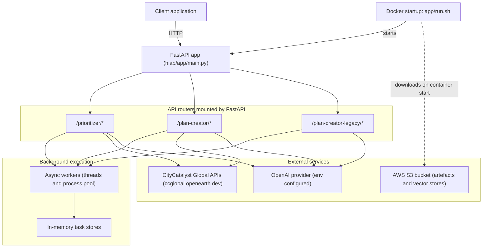

## HIAP architecture (overview)

This document complements `hiap/README.md` with a slightly more detailed view of how HIAP is structured and what it depends on.

### Component diagram

### Operational notes

- **Docs-first usage**: once the server is running, the canonical interface is `GET /docs` (Swagger UI).
- **Async workflow**: many endpoints return a `taskId` and require polling a progress endpoint before fetching results.
- **Task persistence**: task state is stored **in memory**, so restarting the server loses tasks.
- **Upstream dependencies**:
  - Actions/context/CCRA data is fetched from `ccglobal.openearth.dev`.
  - LLM functionality requires OpenAI-related env vars from `.env`.
  - Docker startup downloads artefacts from S3; if you don’t have bucket access, run locally via `python main.py` instead of Docker.
